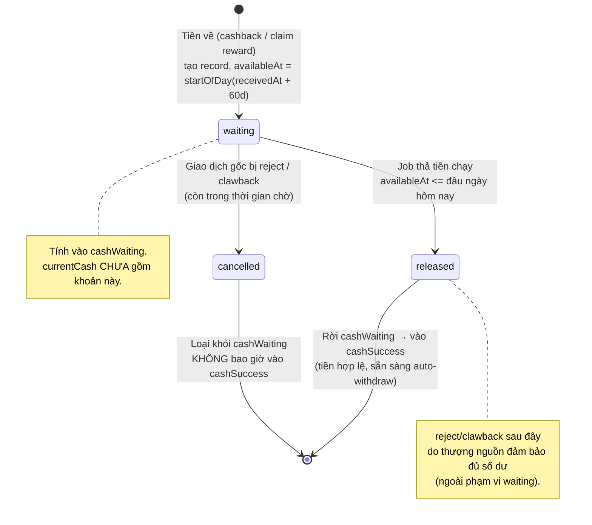
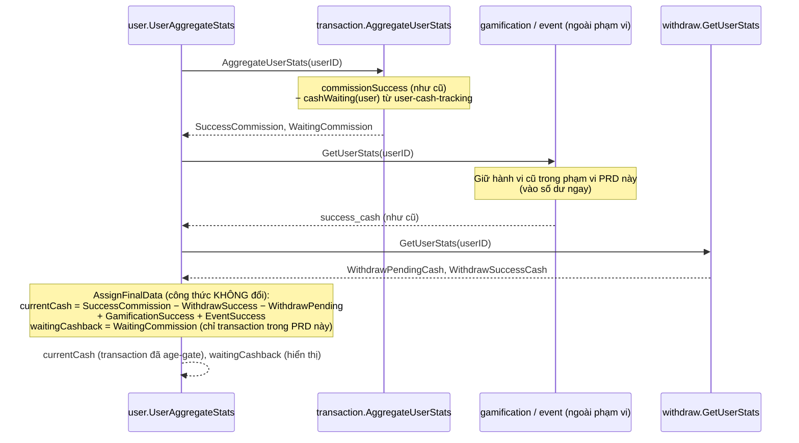
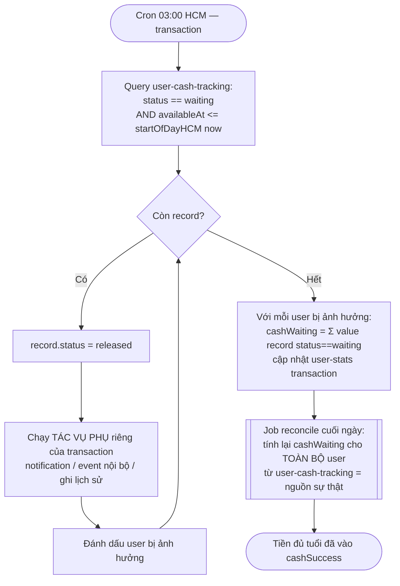
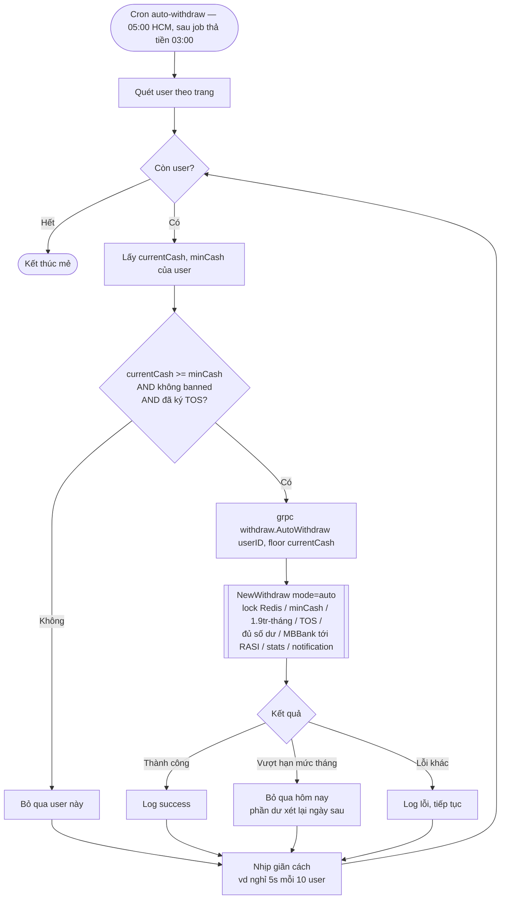

# PRD: Tự động chuyển tiền về tài khoản người dùng (holding 60 ngày)

- **Ngày**: 2026-06-23
- **Trạng thái**: ready-for-agent
- **Design doc**: [2026-06-23-auto-withdraw-60d-holding-design.md](./2026-06-23-auto-withdraw-60d-holding-design.md)

## Problem Statement

Hiện tại tiền cashback/reward về số dư người dùng (`currentCash`) ngay khi giao dịch chuyển sang `cashback`, và người dùng phải **tự bấm rút** thủ công. Điều này tạo hai vấn đề từ góc nhìn người dùng và vận hành:

1. Người dùng phải thao tác tay mỗi lần muốn nhận tiền về tài khoản ngân hàng — trải nghiệm rườm rà.
2. Tiền có thể được rút ngay sau khi cashback, trong khi giao dịch gốc vẫn có thể bị hoàn/huỷ (reject/clawback) trong một khoảng thời gian sau đó. Khi tiền đã bị rút rồi mới bị thu hồi, hệ thống rơi vào tình huống "đã chi rồi mới thu hồi" rất khó xử lý.

## Solution

Hệ thống **tự động chuyển tiền** về tài khoản ngân hàng người dùng mỗi ngày, và **chỉ chuyển phần tiền đã đủ điều kiện**: một khoản cash chỉ hợp lệ để chuyển khi đã đủ **60 ngày** kể từ thời điểm nó về với người dùng (holding period).

Trong 60 ngày chờ, tiền được phân loại là **tiền đang chờ** (`cashWaiting`) — hiển thị cho người dùng nhưng chưa rút được. Sau 60 ngày, tiền tự động trở thành tiền hợp lệ (`cashSuccess`) và vào `currentCash`; một cronjob hằng ngày sẽ gom toàn bộ tiền hợp lệ của từng user và thực hiện chuyển khoản tự động.

Vì service `transaction` khi "đi tiền" còn phải chạy các **tác vụ phụ riêng** của nó, transaction tự quản phần tiền-đang-chờ của mình bằng bảng `user-cash-tracking` và một bảng user-stats riêng (`cashWaiting`/`cashSuccess`). `currentCash` ở service `user` giữ nguyên công thức nhưng tự co lại, vì transaction đã trừ `cashWaiting` trước khi trả về. (Mô hình này về sau có thể nhân rộng cho gamification/event — nằm ngoài phạm vi PRD.)

> **Phạm vi PRD này: CHỈ làm cho service `transaction`.** Bảng theo dõi cash mới tên là **`user-cash-tracking`**. Gamification và event áp dụng cùng mô hình ở giai đoạn sau, **ngoài phạm vi PRD này**.

Hệ quả quan trọng: nếu một khoản bị reject/clawback **trước** khi đủ 60 ngày, record waiting bị huỷ và tiền chưa từng vào `cashSuccess` — bài toán "đã chi rồi mới thu hồi" biến mất.

## Chi tiết nghiệp vụ & Sơ đồ flow

### Khái niệm & thuật ngữ

| Thuật ngữ | Ý nghĩa |
|---|---|
| **Khoản cash (cash record)** | Một lần tiền về với user. Phạm vi PRD: 1 giao dịch cashback của `transaction`. Mỗi khoản = 1 document trong bảng **`user-cash-tracking`**. |
| **`receivedAt`** | Thời điểm tiền "về" với user. Transaction: `EstimateCashbackAt`. |
| **`availableAt`** | Mốc khoản đó đủ điều kiện chuyển = `startOfDayHCM(receivedAt + 60 ngày)`. Đưa về đầu ngày theo `Asia/Ho_Chi_Minh`. |
| **`cashWaiting`** | Tổng các khoản đang chờ (chưa đủ 60 ngày) của 1 user, theo từng service. |
| **`cashSuccess`** | Tiền hợp lệ đã đủ tuổi của 1 user, theo từng service = `aggregate_cashback_như_cũ − cashWaiting`. |
| **`currentCash`** | Số dư rút được ở service `user`, công thức giữ nguyên, tự co lại vì transaction đã trừ `cashWaiting`. |
| **Holding period** | 60 ngày (đặt ở config, env override). |

### Quy tắc tuổi tiền (HoldingClock)

- Một khoản về ngày `D` (giờ HCM) → `availableAt = startOfDayHCM(D + 60 ngày)`.
- Tại ngày chạy job `T`: khoản **đủ điều kiện** khi `availableAt <= startOfDayHCM(T)`.
- Dùng đầu ngày HCM cho cả hai vế để biên giới ngày nhất quán với scheduler (chạy theo timezone HCM).

### Bảng `user-cash-tracking` (service `transaction`)

Mỗi document = một khoản cashback đang trong vòng đời holding của một user. Đây là **nguồn sự thật** của `cashWaiting`.

| Field | Kiểu | Mô tả |
|---|---|---|
| `_id` | ObjectID | Khoá chính. |
| `user` | ObjectID | User nhận tiền. |
| `value` | float64 | Số tiền của khoản (dương) = `commission.cashback` của giao dịch. |
| `action` | string | Nguồn phát sinh. Phạm vi PRD: `cashback`. |
| `targetId` | ObjectID | ID giao dịch gốc (transaction `_id`) — dùng đối chiếu reject/clawback & đảm bảo idempotent. |
| `receivedAt` | time | Thời điểm tiền về = `EstimateCashbackAt` của giao dịch. |
| `availableAt` | time | `= startOfDayHCM(receivedAt + 60 ngày)`. Mốc đủ điều kiện chuyển. |
| `status` | string | `waiting` \| `released` \| `cancelled`. |
| `createdAt` | time | Thời điểm tạo record. |
| `updatedAt` | time | Lần cập nhật gần nhất. |

**Ý nghĩa `status`:**
- `waiting`: đang chờ đủ 60 ngày → tính vào `cashWaiting`, KHÔNG nằm trong `currentCash`.
- `released`: đã đủ tuổi, job đã thả (đã chạy tác vụ phụ) → rời `cashWaiting`, tiền thuộc `cashSuccess` → vào `currentCash`.
- `cancelled`: giao dịch gốc bị reject/clawback khi còn chờ → loại khỏi `cashWaiting`, không bao giờ thành `cashSuccess`.

**Index:**
- `availableAt` — cho job thả tiền quét nhanh khoản đủ tuổi.
- `(status, availableAt)` — lọc record `waiting` đủ tuổi.
- `user` — recompute `cashWaiting` theo user.
- `(targetId, action)` unique — đảm bảo idempotent khi tạo & đối chiếu reject/clawback.

**Bất biến:** `cashWaiting(user) = Σ value các record có status == waiting của user`. Recompute từ chính bảng này là nguồn sự thật; cập nhật realtime chỉ để nhanh, job reconcile cuối ngày để chắc.

### Sơ đồ 1 — Vòng đời một khoản cash (state machine)



**Diễn giải các chuyển trạng thái:**
- `→ waiting`: tạo khi tiền về, idempotent theo `(targetId, action)` (gọi lại không tạo trùng khi grpc retry).
- `waiting → cancelled`: reject/clawback khi khoản còn chờ. Tiền chưa vào số dư → chỉ giảm `cashWaiting`, không phải thu hồi gì. **Đây là điểm khiến mô hình an toàn.**
- `waiting → released`: job hằng ngày thả khoản đủ tuổi; chạy tác vụ phụ của service; khoản rời `cashWaiting`, tự xuất hiện trong `cashSuccess`.

### Sơ đồ 2 — Luồng tính `currentCash` (sequence)



**Điểm mấu chốt:** `user` không cần biết về holding — `transaction` đã tự trừ `cashWaiting` trước khi trả về, nên công thức `AssignFinalData` giữ nguyên. Trong phạm vi PRD này chỉ `transaction` được age-gate; gamification/event giữ hành vi cũ. `waitingCashback` chỉ để hiển thị.

### Sơ đồ 3 — Job thả tiền + reconcile (flowchart, service `transaction`)



**Lưu ý thứ tự:** job reconcile cuối ngày là lưới an toàn — recompute từ `user-cash-tracking` là nguồn sự thật cuối cùng, chống lệch do cập nhật realtime lỗi/race. Auto-withdraw (Sơ đồ 4) chạy **sau** khi job thả tiền của transaction hoàn tất.

### Sơ đồ 4 — Cronjob auto-withdraw (flowchart, ở service `user`)



**Xử lý lỗi quan trọng:** một user lỗi (vượt hạn mức / MBBank từ chối) **không chặn cả mẻ** — log và tiếp tục. Phần tiền vượt hạn mức vẫn nằm trong `currentCash` và tự được xét lại ở lần chạy ngày sau.

## User Stories

1. As a người dùng, I want tiền cashback hợp lệ được tự động chuyển về tài khoản ngân hàng của tôi mỗi ngày, so that tôi không phải bấm rút thủ công.
2. As a người dùng, I want chỉ phần tiền đã giữ đủ 60 ngày mới được chuyển, so that tiền của tôi ổn định và không bị thu hồi sau khi đã nhận.
3. As a người dùng, I want nhìn thấy số "tiền đang chờ về" (`cashWaiting`) tách biệt với số dư rút được, so that tôi biết bao nhiêu tiền sắp đủ điều kiện.
4. As a người dùng, I want số dư rút được (`currentCash`) luôn phản ánh đúng số tiền tôi thực sự có thể nhận ngay, so that tôi không bị hiểu nhầm về số tiền khả dụng.
5. As a người dùng, I want khoản tiền chuyển tự động tuân thủ hạn mức 1.900.000đ/tháng, so that tài khoản của tôi không vi phạm giới hạn ngân hàng.
6. As a người dùng, I want phần tiền vượt hạn mức tháng được giữ lại và chuyển vào kỳ sau, so that tôi không mất tiền khi vượt hạn mức.
7. As a người dùng, I want khoản tiền dưới ngưỡng tối thiểu (`minCash`) được giữ lại tới khi đủ ngưỡng, so that mỗi lần chuyển đều hợp lệ.
8. As a người dùng, I want tiền được chuyển về đúng tài khoản STK RASI (`RasiAccountNumber`) của tôi, so that tôi không phải nhập lại thông tin nhận tiền.
8b. As a người dùng chưa ký TOS, I want hệ thống không tự động chuyển tiền cho tôi và giữ tiền lại tới khi tôi ký, so that giao dịch của tôi tuân thủ điều khoản dịch vụ.
9. As a người dùng, I want nhận thông báo khi tiền được chuyển tự động, so that tôi biết tiền đã về tài khoản.
10. As a người dùng bị khoá (banned), I want hệ thống không tự động chuyển tiền cho tôi, so that tài khoản của tôi tuân thủ quy định.
11. As a người dùng có giao dịch bị hoàn trong thời gian chờ, I want khoản tiền tương ứng bị loại khỏi tiền đang chờ, so that tôi không nhận phần tiền không thuộc về mình.
12. As a hệ thống transaction, I want tạo bản ghi tiền-đang-chờ mỗi khi một giao dịch chuyển sang cashback, so that khoản tiền đó được tính holding 60 ngày.
13. As a hệ thống transaction, I want trừ `cashWaiting` khỏi `cashSuccess` khi trả stats qua grpc, so that `currentCash` ở user chỉ gồm tiền đủ tuổi.
14. As a hệ thống transaction, I want huỷ bản ghi tiền-đang-chờ khi giao dịch gốc bị reject/clawback trong thời gian chờ, so that tiền chưa đủ tuổi bị thu hồi sạch mà không cần thu hồi tiền đã chi.
15. As a hệ thống transaction, I want chạy job hằng ngày để "thả" các bản ghi đủ 60 ngày và thực hiện các tác vụ phụ của mình, so that tiền đủ tuổi chuyển sang hợp lệ đúng hạn.
16. As a hệ thống transaction, I want tạo/cập nhật record trong bảng `user-cash-tracking` cho mỗi khoản cashback, so that vòng đời holding của khoản tiền được theo dõi đầy đủ.
17. As a service user, I want đọc `cashWaiting` từ transaction để hiển thị tổng tiền đang chờ, so that người dùng thấy con số tiền chờ về.
18. As a cronjob auto-withdraw, I want quét mỗi ngày các user có `currentCash >= minCash`, so that chỉ user đủ điều kiện được xử lý.
19. As a cronjob auto-withdraw, I want gọi luồng rút tiền hiện có (`NewWithdraw`) qua một entrypoint grpc mới, so that mọi ràng buộc rủi ro được tái sử dụng nguyên vẹn.
20. As a cronjob auto-withdraw, I want khi một user gặp lỗi vượt hạn mức thì bỏ qua user đó hôm nay và thử lại ngày sau, so that một user lỗi không chặn cả mẻ.
21. As a cronjob auto-withdraw, I want có nhịp giãn cách giữa các lần gọi để không spam MBBank, so that hệ thống ngân hàng không bị quá tải.
22. As a đội vận hành, I want một job reconcile cuối ngày tính lại `cashWaiting` từ bảng `user-cash-tracking`, so that số liệu không bị lệch do lỗi/race trong cập nhật realtime.
24. As a đội vận hành, I want auto-withdraw chạy sau khi các job thả tiền hoàn tất, so that tiền đủ tuổi đã vào `currentCash` trước khi chuyển.

## Implementation Decisions

### Hướng kiến trúc
- **Phạm vi PRD: chỉ service `transaction`.** transaction tự giữ bảng `user-cash-tracking` + bảng user-stats (`cashWaiting`, `cashSuccess`) + job thả tiền + tác vụ phụ riêng. Không gom về service `user`. Gamification/event áp dụng cùng mô hình sau, ngoài phạm vi.
- Công thức then chốt: `cashSuccess (trả cho user) = cashback_aggregate_như_cũ − cashWaiting`. `currentCash` ở user **giữ nguyên công thức** trong `AssignFinalData`, tự co lại vì transaction đã trừ waiting.
- Không tạo collection/thuật toán thu hồi FIFO/recall-debt. Reject/clawback trước 60 ngày chỉ huỷ record waiting.

### Module sẽ xây/sửa (deep modules)
1. **HoldingClock** — đóng gói quy tắc thời gian: `availableAt = startOfDay(receivedAt + 60 ngày)` theo timezone `Asia/Ho_Chi_Minh`; hàm kiểm tra một mốc đã đủ tuổi so với đầu ngày hôm nay. Thuần hàm, không phụ thuộc DB. Holding days đặt ở config (env override).
2. **CashWaitingLedger** — đóng gói vòng đời record waiting và tổng `cashWaiting` theo user: tạo record (idempotent theo `(targetId, action)`), huỷ/giảm record khi reject/clawback, recompute `cashWaiting` của một user (= Σ value record `status=waiting`). Đây là lõi nghiệp vụ.
3. **WaitingReleaseJob** — job hằng ngày: chuyển record `waiting → released` khi `availableAt <= đầu ngày hôm nay`, gọi tác vụ phụ của service, rồi recompute `cashWaiting` cho các user bị ảnh hưởng.
4. **AutoWithdrawScanner** (service `user`) — quét user theo trang, lọc `currentCash >= minCash`, gọi grpc `AutoWithdraw`, xử lý lỗi (vượt hạn mức → bỏ qua), nhịp giãn cách.
5. **AutoWithdraw grpc entrypoint** (service `withdraw`) — bọc `NewWithdraw` với mode `auto`, không nhân bản logic ràng buộc.

### Interface các module sâu (mô tả hành vi, không ràng buộc file/cú pháp)

**HoldingClock** — thuần hàm, không phụ thuộc DB:
```
AvailableAt(receivedAt) -> time      // = startOfDayHCM(receivedAt + HoldingDays)
IsMatured(availableAt, now) -> bool  // = availableAt <= startOfDayHCM(now)
HoldingDays                          // đọc từ config, mặc định 60
```

**CashWaitingLedger** — lõi nghiệp vụ, đóng gói bảng `user-cash-tracking` + cashWaiting:
```
Upsert(user, action, targetId, value, receivedAt)
    // idempotent theo (targetId, action): đã tồn tại thì không tạo trùng
    // tạo record status=waiting, availableAt = HoldingClock.AvailableAt(receivedAt)
    // sau đó RecomputeWaiting(user)

Cancel(user, action, targetId, amount)
    // tìm record (targetId, action) status=waiting
    //   còn waiting  -> status=cancelled (hoặc giảm value), RecomputeWaiting(user)
    //   không còn / đã released -> no-op ở tầng waiting (đi luồng trừ cũ ở caller)

RecomputeWaiting(user) -> cashWaiting
    // cashWaiting = Σ value các record status=waiting của user
    // ghi vào user-stats của transaction; là NGUỒN SỰ THẬT của cashWaiting
```

**WaitingReleaseJob** — job hằng ngày:
```
Run(now)
    // affected = {}
    // for record in waiting where IsMatured(record.availableAt, now):
    //     record.status = released
    //     RunSideEffects(record)        // tác vụ phụ riêng của service
    //     affected.add(record.user)
    // for user in affected: ledger.RecomputeWaiting(user)
```

**AutoWithdrawScanner** (service `user`):
```
Run(now)
    // for page in users (phân trang):
    //   for user in page:
    //     if user.banned or not user.isSignedTOS: continue
    //     stats = UserAggregateStats(user)       // currentCash đã = tiền đủ tuổi
    //     minCash = GetWithdrawConfig(user)
    //     if stats.currentCash < minCash: continue
    //     err = grpc.AutoWithdraw(user, floor(currentCash))
    //     log(err); pace()                        // nghỉ giãn cách chống spam MBBank
```

**AutoWithdraw grpc entrypoint** (service `withdraw`):
```
AutoWithdraw(userID, cash) -> (remainingCash, err)
    // return NewWithdraw(ctx, userID, WithdrawBody{Cash: cash, Mode: ModelAuto})
    // KHÔNG thêm/bỏ check nào — toàn bộ ràng buộc ở NewWithdraw
```

### Schema changes
- Bảng mới `user-cash-tracking` (service `transaction`): `user`, `value`, `action`, `targetId`, `receivedAt`, `availableAt`, `status` (`waiting|released|cancelled`), `createdAt`, `updatedAt`. Index: `availableAt`, `(status, availableAt)`, `user`, `(targetId, action)` unique. **Chi tiết đầy đủ ở mục "Bảng `user-cash-tracking`" phía trên.**
- Bảng user-stats của transaction: thêm field `cashWaiting` (và `cashSuccess` cache). Nếu transaction chưa có bảng user-stats riêng thì tạo mới.
- `user.UserStats`: thêm field `WaitingCashback` (hiển thị tổng tiền chờ).
- `withdraw`: thêm hằng số mode `ModelAuto = "auto"`.

### API contracts
- **transaction** `AggregateUserStatsResponse`: `SuccessCommission` trả ra = `commissionSuccess (như cũ) − cashWaiting`; thêm field `WaitingCommission = cashWaiting`.
- **withdraw** grpc node: thêm method `AutoWithdraw(userID, cash)` → gọi `NewWithdraw(WithdrawBody{Cash, Mode: auto})`. Tài khoản nhận = `RasiAccountNumber`.
- gamification/event: KHÔNG đổi trong phạm vi PRD này — giữ proto/hành vi hiện tại (tiền vào số dư ngay).

### Cơ chế cập nhật
- `cashWaiting` cập nhật **realtime** mỗi khi phát sinh docs cho một user (recompute riêng user đó), cộng thêm **job reconcile cuối ngày** tính lại toàn bộ từ bảng `user-cash-tracking` làm nguồn sự thật cuối cùng.
- Auto-withdraw chạy **sau** job thả tiền của transaction.

### Tái sử dụng ràng buộc rủi ro
- `NewWithdraw` giữ nguyên: lock Redis theo user (chống double-withdraw), `minCash` động theo ICB event, hạn mức **1.900.000đ/tháng**, check đủ số dư, gọi MBBank, cập nhật stats, push notification.
- **Mode `auto` áp thêm check TOS**: hiện `NewWithdraw` chỉ chặn TOS khi `mode==manual`; cần mở rộng để `mode==auto` cũng yêu cầu `IsSignedTOS`. User chưa ký bị bỏ qua, tiền giữ lại.
- **Tài khoản nhận**: STK RASI (`RasiAccountNumber`) của user. Người triển khai tự wiring field này vào payload grpc/MBBank.

### Giờ chạy (đã chốt)
- Job thả tiền của transaction: **03:00** HCM. Cron auto-withdraw: **05:00** HCM.

## Testing Decisions

**Nguyên tắc**: chỉ test **hành vi bên ngoài** (đầu vào → đầu ra/observable state), không test chi tiết triển khai nội bộ. Ưu tiên test các module thuần/lõi nghiệp vụ có thể chạy độc lập với MBBank/grpc thật.

Các module sẽ được test, kèm ca cụ thể:

**HoldingClock** (thuần hàm — test ưu tiên cao nhất):

| Ca | Đầu vào | Kỳ vọng |
|---|---|---|
| Mốc cơ bản | `receivedAt = 2026-01-01 10:00 HCM` | `availableAt = 2026-03-02 00:00 HCM` (đầu ngày, +60d) |
| Về cuối ngày | `receivedAt = 2026-01-01 23:59 HCM` | `availableAt` vẫn = đầu ngày `2026-03-02` (không lệch sang ngày khác) |
| Chưa đủ tuổi | `availableAt = mai`, `now = hôm nay` | `IsMatured = false` |
| Đúng ngày đủ tuổi | `availableAt = đầu ngày hôm nay`, `now = hôm nay 08:00` | `IsMatured = true` |
| Đầu vào UTC | `receivedAt` lưu UTC | quy đổi HCM trước khi tính đầu ngày, không lệch ±1 ngày |

**CashWaitingLedger** (lõi nghiệp vụ):

| Ca | Hành động | Kỳ vọng |
|---|---|---|
| Tạo mới | `Upsert(u, cashback, tx1, 100, t)` | 1 record `waiting`, `cashWaiting(u) = 100` |
| Idempotent | gọi `Upsert(...tx1...)` lần 2 | vẫn 1 record, `cashWaiting(u) = 100` (không nhân đôi) |
| Reject trước 60 ngày | `Cancel(u, reject, tx1, 100)` khi record `waiting` | record → `cancelled`, `cashWaiting(u) = 0` |
| Reject sau release | record đã `released`, gọi `Cancel` | tầng waiting no-op, `cashWaiting` không đổi |
| Recompute nhiều record | 3 record waiting 100/200/300, 1 cancelled | `cashWaiting = 600` |
| Cancel một phần | `Cancel` với amount < value | giảm value, `cashWaiting` giảm đúng phần đó |

**WaitingReleaseJob**:

| Ca | Tình huống | Kỳ vọng |
|---|---|---|
| Thả đúng | record `waiting`, `availableAt <= đầu ngày now` | → `released`, chạy side-effect 1 lần, `cashWaiting` giảm |
| Chưa tới hạn | record `waiting`, `availableAt > now` | giữ `waiting`, không side-effect |
| Bỏ qua cancelled | record `cancelled` đủ tuổi | không thả, không side-effect |
| Recompute sau thả | nhiều user bị ảnh hưởng | mỗi user được recompute `cashWaiting` đúng |

(AutoWithdrawScanner và AutoWithdraw grpc entrypoint: không bắt buộc test tự động ở pha này — phụ thuộc grpc/MBBank. Hành vi "một user lỗi không chặn cả mẻ" và "lọc minCash/banned" nên test ở mức scanner nếu tách được DAO/grpc qua interface; còn lại xác minh qua chạy thực tế và log.)

**Prior art**: bám theo pattern test sẵn có trong các service Go của repo (cùng cấu trúc `internal/...` và DAO). Test ledger/job nên dùng DB test/mock DAO theo cách các `_test.go` hiện hữu trong từng service đang làm.

## Out of Scope

- Thuật toán thu hồi tiền đã chi trả (FIFO/recall-debt) — không cần vì reject trước 60 ngày huỷ record waiting; reject sau release đã được thượng nguồn đảm bảo đủ số dư.
- Thay đổi luồng rút tiền thủ công (`manual`) và batch transfer hiện có.
- **gamification & event**: hoàn toàn ngoài phạm vi PRD này. Hai nguồn này giữ hành vi cũ (tiền vào số dư ngay), áp dụng holding ở giai đoạn riêng sau này.
- **Migration số dư cũ** (tiền đã về trước go-live): đội sản phẩm tự viết migration riêng.
- Thay đổi cách MBBank xử lý/đối soát giao dịch chuyển tiền.
- UI/UX chi tiết hiển thị `cashWaiting` phía client (chỉ định nghĩa field stats trả ra).

## Further Notes

### Phạm vi triển khai (chỉ transaction)
- **transaction**: bảng `user-cash-tracking` + user-stats `cashWaiting` + sửa `AggregateUserStats` (trừ `cashWaiting`) + hook tạo/huỷ record + WaitingReleaseJob (thả 03:00) + tác vụ phụ riêng.
- **user**: thêm `WaitingCashback` (đọc `WaitingCommission` từ transaction).
- **withdraw**: mode `auto` (áp check TOS) + grpc `AutoWithdraw` (nhận về `RasiAccountNumber`).
- **user**: AutoWithdrawScanner cron (05:00).
- **Ngoài phạm vi**: gamification, event, migration số dư cũ.

### Quyết định vận hành (đã chốt)
1. **Giờ chạy** (giờ HCM): job thả tiền của transaction chạy **03:00**; cron auto-withdraw chạy **05:00**. Khoảng cách 2h đảm bảo tiền đủ tuổi đã vào `currentCash` trước khi quét chuyển.
2. **TOS cho mode auto**: **Có** — auto-withdraw yêu cầu user đã ký TOS (`IsSignedTOS`). User chưa ký bị bỏ qua, tiền giữ lại tới khi ký. → `NewWithdraw` cần áp check TOS cho cả `mode==auto` (hiện chỉ áp `manual`).
3. **Số dư cũ / holding hồi tố**: **đội sản phẩm tự viết migration cho số dư cũ** — ngoài phạm vi PRD này. PRD không đặc tả backfill số dư cũ.
4. **Tài khoản nhận**: dùng **STK RASI (`RasiAccountNumber`)** của user (không phải `ChrgAcctCd`). Việc truyền đúng field vào grpc do người triển khai tự wiring — PRD chỉ chốt nguồn tài khoản nhận.

### Migration / Backfill

- **Số dư cũ của user (tiền đã về trước go-live)**: **đội sản phẩm tự viết migration riêng**, NẰM NGOÀI phạm vi PRD này. PRD không đặc tả cách xử lý/backfill số dư cũ.
- Phạm vi PRD chỉ gồm: tạo bảng `user-cash-tracking` + cơ chế cho **tiền phát sinh từ go-live trở đi**.
- Mọi job/backfill (nếu có) nên idempotent theo khoá `(targetId, action)`, chạy theo trang, dừng/tiếp tục được — bám pattern migration hiện hữu (`user/app/migration`, `transaction/crawl/services/migration.go`).

### Rủi ro & giảm thiểu

| Rủi ro | Giảm thiểu |
|---|---|
| `cashWaiting` lệch do race/lỗi realtime | Job reconcile cuối ngày recompute toàn bộ từ `user-cash-tracking` (nguồn sự thật). |
| Auto-withdraw chạy trước khi tiền đủ tuổi vào `currentCash` | Lập lịch auto-withdraw **sau** các job thả tiền; tách giờ rõ ràng (§ câu hỏi mở 1). |
| Double-withdraw cùng user | Lock Redis theo user trong `NewWithdraw` (tái dùng nguyên vẹn). |
| Spam MBBank khi quét nhiều user | Nhịp giãn cách trong AutoWithdrawScanner (vd nghỉ 5s mỗi 10 user). |
| User chưa ký TOS vẫn bị auto-chuyển | Mode `auto` áp check `IsSignedTOS`; chưa ký thì bỏ qua, giữ tiền. |
| Sai tài khoản nhận | Dùng STK RASI (`RasiAccountNumber`); người triển khai wiring đúng field vào grpc. |
| gamification/event chưa làm holding | Ngoài phạm vi PRD; 2 nguồn này giữ hành vi cũ, không chặn việc làm transaction trước. |

### Bất biến an toàn
- `cashSuccess` mỗi nguồn = aggregate − `cashWaiting` ⇒ `currentCash` = tiền rút được hợp lệ tại mọi thời điểm.
- `cashWaiting` luôn = Σ record `status=waiting` (realtime để nhanh, reconcile cuối ngày để chắc).
- Reject/clawback trước 60 ngày → record `cancelled`, tiền chưa từng vào success.
