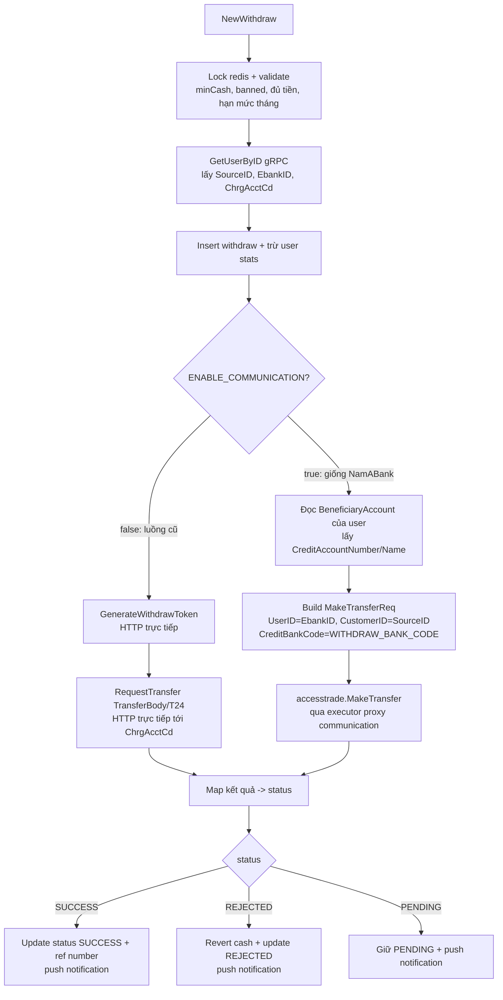
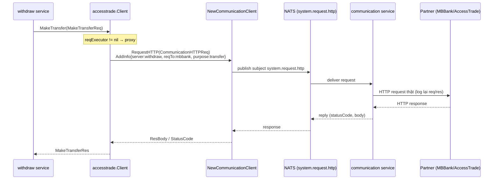
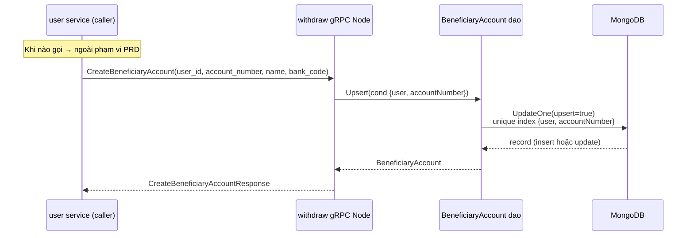

# PRD: CB-MBBank Withdraw — Proxy qua Communication theo cờ env + BeneficiaryAccount qua gRPC

> Trạng thái: `ready-for-agent`
> Phạm vi repo: `CB-MBBank/withdraw` (chính) + 1 thay đổi nhỏ ở `CB-MBBank/user`.

## Problem Statement

Hiện tại module `withdraw` của CB-MBBank gọi thẳng HTTP tới partner MBBank (lấy access token rồi `RequestTransfer` với `TransferBody`/T24 INHOUSE). Các project bank khác đã chuẩn hóa: mọi request rút tiền ra đối tác đều đi **qua service `communication`** (NATS subject `system.request.http`) để tập trung logging và quản lý outbound. CB-MBBank đứng ngoài chuẩn này, nên không có log tập trung tại communication và không đồng nhất với 5 project đã proxy (NamABank, LPBank, PVCombank, SeaBank, VietinBank).

Cần một cách để CB-MBBank cũng chạy theo chuẩn "giống NamABank" — nhưng phải **bật/tắt được** để rollout an toàn, và khi tắt thì hành vi cũ không đổi một chút nào.

## Solution

Thêm một cờ env `ENABLE_COMMUNICATION` cho `CB-MBBank/withdraw`:

- **Bật (`true`)**: luồng rút tiền chạy **y hệt NamABank** — dùng `accesstrade.MakeTransfer` (package `partnerapi/accesstrade` đã có sẵn trong repo, giống hệt NamABank), request HTTP được proxy qua `natsio.NewCommunicationClient`. Tài khoản người nhận lấy từ **BeneficiaryAccount** (record được service user tạo qua một gRPC mới).
- **Tắt (mặc định / không set)**: giữ **nguyên xi** luồng MBBank cũ (`GenerateWithdrawToken` + `RequestTransfer` + `TransferBody`), không sửa gì.

Đi kèm là hạ tầng còn thiếu để "đi giống NamABank": kết nối NATS, field `EbankID` trên user, và collection/gRPC `BeneficiaryAccount`.

## Flow Diagrams

### 1. Luồng `NewWithdraw` rẽ nhánh theo cờ `ENABLE_COMMUNICATION`

### 2. Sequence khi BẬT cờ — request đi qua Communication

### 3. Luồng tạo BeneficiaryAccount (gRPC, server bên withdraw)

## User Stories

1. As một DevOps engineer, I want một cờ env `ENABLE_COMMUNICATION` mặc định tắt, so that tôi có thể bật proxy communication cho từng pod/môi trường mà không ảnh hưởng pod đang chạy.
2. As một backend engineer, I want khi tắt cờ thì luồng rút tiền MBBank cũ chạy y nguyên, so that việc thêm tính năng mới không tạo regression cho giao dịch tiền thật.
3. As một backend engineer, I want khi bật cờ thì luồng rút tiền dùng `accesstrade.MakeTransfer` giống NamABank, so that CB-MBBank đồng nhất với các project đã proxy.
4. As một backend engineer, I want request HTTP khi bật cờ đi qua `NewCommunicationClient` với `AdditionalInfo{Server:"withdraw", PartnerID, ReqTo:"mbbank", Purpose:"transfer"}`, so that communication service log và định tuyến được outbound của MBBank.
5. As một operations analyst, I want mọi request rút tiền MBBank (khi bật cờ) được log tập trung tại service communication, so that tôi có một nơi duy nhất để tra soát giao dịch ra đối tác.
6. As một backend engineer, I want NATS chỉ được kết nối khi `ENABLE_COMMUNICATION=true`, so that pod chạy luồng cũ không cần cấu hình NATS và không crash khi thiếu config.
7. As một backend engineer, I want field `EbankID` xuất hiện trên user của MBBank giống NamABank (gán bằng `SourceID`), so that `MakeTransferReq.UserID` được điền đúng như NamABank.
8. As một service user của MBBank, I want `getUserInfo` trả về `ebank_id`, so that withdraw service đọc được `EbankID` qua gRPC.
9. As một withdraw service, I want đọc `EbankID` từ gRPC user (`info.GetEbankId()`) vào `UserInfo` model, so that nhánh bật cờ build được `MakeTransferReq` đầy đủ.
10. As một backend engineer, I want `CreditBankCode` của MBBank được cấu hình qua env `WITHDRAW_BANK_CODE` ở `common.env`, so that mã bank code không bị hardcode và có thể đổi theo môi trường.
11. As một withdraw service, I want một collection `BeneficiaryAccount` (model + dao giống NamABank), so that tôi lưu được tài khoản người nhận cho luồng liên ngân hàng.
12. As một service user, I want gọi gRPC `CreateBeneficiaryAccount` trên withdraw service, so that tôi tạo/cập nhật tài khoản người nhận cho user.
13. As một backend engineer, I want `CreateBeneficiaryAccount` hoạt động theo cơ chế **upsert** trên cặp khóa `(user, accountNumber)`, so that gọi lại nhiều lần không tạo bản ghi trùng.
14. As một backend engineer, I want một **unique compound index** `{user, accountNumber}` trên collection BeneficiaryAccount, so that ràng buộc duy nhất được đảm bảo ở tầng database.
15. As một withdraw service ở nhánh bật cờ, I want lấy `CreditAccountNumber`/`CreditAccountName` từ BeneficiaryAccount của user, so that lệnh chuyển tiền có thông tin người nhận đúng (vì `WithdrawBody` của MBBank không nhập account number).
16. As một backend engineer, I want `CustomerID = u.SourceID` và `UserID = u.EbankID` trong `MakeTransferReq`, so that mapping field khớp đúng cách NamABank làm.
17. As một backend engineer, I want việc map status trả về từ AccessTrade (pending/success/rejected) theo đúng bảng mapping của NamABank, so that trạng thái withdraw nhất quán giữa các project.
18. As một QA engineer, I want có cờ để kiểm thử cả hai nhánh (bật/tắt) độc lập, so that tôi xác nhận nhánh cũ không đổi và nhánh mới đúng hành vi NamABank.
19. As một backend engineer, I want KHÔNG phải sửa proto `UserInfo` (vì `ebank_id` đã tồn tại sẵn ở cả user và withdraw service), so that thay đổi tối thiểu và không phải regen các stub không liên quan.
20. As một backend engineer, I want phần client/trigger gọi `CreateBeneficiaryAccount` ở phía service user KHÔNG nằm trong phạm vi này, so that tôi tập trung dựng server-side trước và bên user tự tích hợp sau.

## Implementation Decisions

### Cấu hình & kết nối (CB-MBBank/withdraw)
- Thêm `ENABLE_COMMUNICATION` (bool, default `false`) vào ENV. Đây là cờ duy nhất quyết định rẽ nhánh.
- Thêm nhóm `Nats { URI, User, Password }` vào ENV (MBBank withdraw hiện chưa có; copy hình dạng từ NamABank: `NATS_URI`, `NATS_USER`, `NATS_PASSWORD`).
- Thêm `WITHDRAW_BANK_CODE` vào ENV (nhóm `Withdraw`) và khai báo ở `common.env`; dùng làm `CreditBankCode` cho `MakeTransferReq`.
- Tạo package init NATS mới: chỉ thực hiện `natsio.Connect(...)` (Namespace = `PartnerID`), không đăng ký server handler. Gọi init này **chỉ khi** cờ bật.

### Luồng rút tiền (module service withdraw)
- Tái sử dụng package `partnerapi/accesstrade` đã có sẵn trong repo (giống hệt NamABank, đã xác minh không khác biệt) — không tạo mới.
- Thêm `getWithdrawClient()` copy từ NamABank: tạo `accesstrade.Client` và gắn `SetRequestExecutor` proxy qua `NewCommunicationClient().RequestHTTP(...)` với `AdditionalInfo{Server:"withdraw", PartnerID: env.PartnerID, ReqTo:"mbbank", Purpose:"transfer"}`.
- `NewWithdraw` rẽ nhánh tại điểm gọi đối tác:
  - `if EnableCommunication`: build `MakeTransferReq` theo NamABank — `UserID=u.EbankID`, `CustomerID=u.SourceID`, `CreditBankCode=env.Withdraw.BankCode`, `CreditAccountNumber/Name` từ BeneficiaryAccount của user, `TransferAmount`, `RequestID`, `TxnID`, `Remark` theo NamABank; gọi `accesstrade.MakeTransfer`; map status theo bảng `atStatusMapping` của NamABank; cập nhật stats + push notification theo NamABank.
  - `else`: luồng cũ (`GenerateWithdrawToken` + `RequestTransfer`) — không sửa.
- Nguyên tắc bất biến: nhánh tắt không thay đổi hành vi; code cũ được giữ nguyên, chỉ bọc trong `else`.

### EbankID (cross-service, được phép đụng service user ở mức tối thiểu)
- `CB-MBBank/user` `getUserInfo`: thêm gán `u.EbankId = user.SourceID` (đúng như NamABank). Proto `UserInfo` đã có `ebank_id = 14` nên không regen.
- `CB-MBBank/withdraw`: thêm field `EbankID` vào `UserInfo` model và map `EbankID = info.GetEbankId()` trong adapter gRPC user.

### BeneficiaryAccount (chỉ bên withdraw)
- Model `BeneficiaryAccountBSON`: copy hình dạng từ NamABank (`ID, User, Name, BankCode, AccountNumber, Verified, CreatedAt, ...`).
- Dao: copy CRUD từ NamABank; bổ sung thao tác **upsert** theo cond `{user, accountNumber}` dùng `UpdateOne(upsert=true)`.
- Index: tạo **unique compound index** `{user:1, accountNumber:1}` tại chỗ khởi tạo index của project.

### gRPC CreateBeneficiaryAccount (server bên withdraw)
- Proto `Withdraw`: thêm `rpc CreateBeneficiaryAccount(CreateBeneficiaryAccountRequest) returns (CreateBeneficiaryAccountResponse)` với message chứa các field cần thiết (user_id, account_number, name, bank_code, ...). Regen `.pb.go`.
- Node handler: thêm `createBeneficiaryAccount` gọi dao upsert; đăng ký vào server đã có (`RegisterWithdrawServer`).
- API contract: upsert idempotent theo `(user, account_number)`; trả về thông tin bản ghi sau upsert (hoặc xác nhận thành công).

## Testing Decisions

**Tiêu chí test tốt**: chỉ kiểm thử hành vi quan sát được từ bên ngoài (đầu vào → đầu ra/side-effect), không bám vào chi tiết triển khai. Test phải sống sót qua refactor nội bộ.

**Module được đề xuất test**:
- **BeneficiaryAccount upsert dao**: gọi lần đầu → insert; gọi lại cùng `(user, accountNumber)` → update, không tạo bản ghi mới; ràng buộc unique được tôn trọng. Đây là deep module, interface đơn giản (`upsert(user, accountNumber, data) → record`), dễ test cô lập.
- **gRPC `CreateBeneficiaryAccount` handler**: request hợp lệ → bản ghi tồn tại đúng; request lặp → idempotent. Test ở mức hành vi gRPC, không bám handler nội bộ.
- **Rẽ nhánh `NewWithdraw` theo cờ** (nếu có hạ tầng mock partner/communication): cờ tắt → đi đúng đường cũ; cờ bật → build `MakeTransferReq` đúng field mapping. Có thể tách phần build `MakeTransferReq` thành hàm thuần để test mapping mà không cần network.

**Prior art**: tham chiếu các project đã proxy (NamABank/SeaBank) cho mapping `MakeTransferReq` và bảng status; tham chiếu dao BeneficiaryAccount của NamABank cho hình dạng CRUD.

> Cần xác nhận với người dùng: module nào thực sự muốn viết test trong vòng này (mục tiêu hiện tại tập trung server-side).

## Out of Scope

- **Client/trigger phía service user**: việc khi nào và ở đâu service user gọi `CreateBeneficiaryAccount` — người dùng tự quyết ("khi nào call thì kệ"). PRD này chỉ dựng server-side gRPC bên withdraw.
- **Sửa luồng MBBank cũ**: nhánh tắt cờ không được thay đổi.
- **Các project bank khác**: chỉ CB-MBBank.
- **Sửa proto `UserInfo`**: không cần, `ebank_id` đã tồn tại.
- **Bất kỳ refactor không liên quan** nào ngoài việc bọc nhánh và copy hạ tầng cần thiết.

## Further Notes

- `partnerapi/accesstrade` của CB-MBBank đã được xác minh **giống hệt** NamABank (toàn thư mục không có diff), nên "đi giống NamABank" tận dụng được hạ tầng có sẵn — chi phí chủ yếu là wiring (env, NATS, BeneficiaryAccount, EbankID) chứ không phải viết lại client.
- Lý do BeneficiaryAccount là bắt buộc: `WithdrawBody` của MBBank chỉ có `Cash` (không nhập account number); luồng cũ chuyển INHOUSE vào chính `ChrgAcctCd` của user. Để dùng `accesstrade.MakeTransfer` (cần `CreditAccountNumber` người nhận), nguồn dữ liệu người nhận là BeneficiaryAccount do service user tạo trước.
- `WITHDRAW_BANK_CODE` cần giá trị mã bank code MB do người dùng cung cấp khi cấu hình `common.env`.
- Default cờ tắt là quyết định rollout an toàn: triển khai code không đổi hành vi cho tới khi env được bật chủ động.
