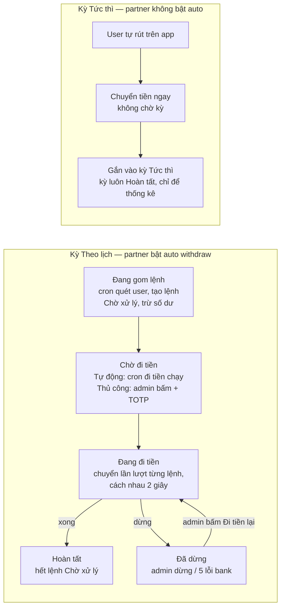

# Kỳ chuyển khoản — PRD & Hướng dẫn sử dụng cho Admin

Cập nhật: 02/10/2026

## 1. Tổng quan

Mỗi ngày hệ thống tạo một **kỳ chuyển khoản**. Mọi lệnh rút tiền trong ngày được gắn vào kỳ đó để admin theo dõi, thống kê và quyết định thời điểm chi tiền.

**Vấn đề trước đây:** với partner bật rút tiền tự động, hệ thống vừa tạo lệnh vừa chuyển tiền ngay trong một lần chạy. Admin không xem trước được các lệnh sẽ chi, không dừng được giữa chừng và không có nơi tổng hợp số lệnh, số tiền theo ngày.

**Mục tiêu:**

- Tách bước *gom lệnh* và bước *đi tiền*: lệnh được tạo trước ở trạng thái chờ, tiền chỉ chuyển khi kỳ được chạy.
- Admin chọn chạy tự động theo lịch hoặc bấm nút **Đi tiền** thủ công (có xác thực TOTP), và có thể **dừng** kỳ đang chạy.
- Mỗi kỳ có thống kê số lệnh và tổng tiền theo trạng thái, xuất được file CSV.
- Dùng chung cho mọi partner: partner không bật auto vẫn có kỳ để xem thống kê các lệnh người dùng tự rút.
- Người dùng trên app không thấy khác biệt: lệnh đang chờ chuyển vẫn hiển thị là "Đang xử lý" (pending).

## 2. Khái niệm

Mỗi ngày có đúng một kỳ, tên dạng "Kỳ chuyển khoản dd/mm/yyyy". Kỳ có loại, chế độ và trạng thái. Mỗi lệnh rút tiền trong kỳ có trạng thái riêng.

### Loại kỳ

| Loại kỳ (trên web-admin) | Khi nào xuất hiện | Admin được làm gì |
| --- | --- | --- |
| Theo lịch (auto withdraw) | Partner bật rút tiền tự động | Xem, đổi chế độ, đi tiền, dừng, từ chối lệnh, export |
| Tức thì (user tự rút) | Partner không bật auto: user bấm rút trên app, tiền chuyển ngay | Chỉ xem thống kê, từ chối lệnh, export. Kỳ luôn ở trạng thái Hoàn tất |

### Chế độ (chỉ với kỳ Theo lịch)

| Chế độ | Ý nghĩa |
| --- | --- |
| Tự động | Đến giờ đi tiền theo lịch, hệ thống tự chuyển tiền các lệnh chờ |
| Thủ công | Hệ thống không tự chuyển; chỉ chuyển khi admin bấm **Đi tiền** |

Chế độ chỉ đổi được khi kỳ còn ở *Đang gom lệnh* hoặc *Chờ đi tiền*.

### Trạng thái kỳ

| Trạng thái | Ý nghĩa |
| --- | --- |
| Đang gom lệnh | Hệ thống đang quét user và tạo lệnh chờ cho kỳ |
| Chờ đi tiền | Gom xong; các lệnh đang chờ chuyển tiền |
| Đang đi tiền | Hệ thống đang chuyển từng lệnh; trang chi tiết tự làm mới mỗi 5 giây |
| Đã dừng | Admin dừng, hoặc hệ thống tự dừng do lỗi liên tiếp (xem cột Lý do dừng) |
| Hoàn tất | Đã đi hết lệnh chờ, hoặc kỳ Tức thì |

### Trạng thái lệnh

| Trạng thái | Ý nghĩa | User thấy trên app |
| --- | --- | --- |
| Chờ xử lý | Đã trừ số dư user, chưa gửi bank | Đang xử lý |
| Đang xử lý | Đã gửi lệnh sang bank, chờ kết quả | Đang xử lý |
| Thành công | Bank đã chuyển tiền | Thành công |
| Từ chối | Lệnh bị huỷ, tiền đã hoàn lại số dư user | Từ chối |

**Số dư còn lại** của mỗi lệnh = số dư của user tại lúc tạo lệnh trừ đi số tiền rút.

## 3. Luồng hoạt động

Kỳ Theo lịch đi qua bốn trạng thái; admin quyết định ở bước Chờ đi tiền. Kỳ Tức thì chỉ ghi nhận lệnh người dùng tự rút.

Kỳ Đã dừng chỉ chạy tiếp khi admin bấm Đi tiền lại. Hệ thống tự động không chạy lại kỳ đã dừng hoặc đã hoàn tất.

## 4. Hướng dẫn sử dụng trên web-admin

Mọi thao tác nằm ở trang chi tiết partner, tab **Kỳ chuyển khoản**. Mọi thao tác thay đổi đều được ghi vào **Lịch sử thao tác**.

### 4.1. Xem danh sách kỳ

1. Vào **Partner** → chọn partner → tab **Kỳ chuyển khoản**.
2. Lọc theo: ô tìm kiếm (tên kỳ hoặc ngày, ví dụ `28/09`), **Trạng thái**, **Loại kỳ**, **Chế độ**, **Từ ngày** / **Đến ngày**.
3. Mỗi dòng hiển thị thống kê số lệnh và số tiền theo trạng thái. Bấm vào kỳ để mở trang chi tiết, hoặc bấm **Export CSV** ngay trên dòng.

### 4.2. Đọc trang chi tiết kỳ

- **Thông tin kỳ:** ngày, loại kỳ, chế độ, trạng thái, lý do dừng, thời điểm bắt đầu đi tiền và kết thúc.
- **Thống kê hiện tại:** Tổng, Chờ xử lý, Đang xử lý, Thành công, Từ chối — số lệnh và tổng tiền, tính trực tiếp từ danh sách lệnh.
- **Đã gom (lúc gom xong):** ảnh chụp thống kê ngay khi hệ thống gom xong lệnh, dùng để so với số hiện tại.
- Khi kỳ **Đang đi tiền**, trang tự làm mới mỗi 5 giây. Có thể bấm **Làm mới** bất cứ lúc nào.

### 4.3. Đi tiền thủ công

Nút **Đi tiền** chỉ hiện với kỳ Theo lịch, còn lệnh Chờ xử lý và không đang đi tiền.

1. Kiểm tra số lệnh **Chờ xử lý** và tổng tiền trong thống kê.
2. Bấm **Đi tiền** → xác nhận → nhập mã **TOTP** (Google Authenticator của tài khoản admin).
3. Hệ thống báo "Đã bắt đầu đi tiền" và xử lý nền; kỳ chuyển sang **Đang đi tiền**.
4. Theo dõi số Chờ xử lý giảm dần. Xong hết, kỳ chuyển sang **Hoàn tất**.

Hệ thống chuyển lần lượt từng lệnh, cách nhau 2 giây. User bị khoá hoặc số dư âm sẽ bị bỏ qua; lệnh của họ vẫn ở Chờ xử lý.

### 4.4. Dừng đi tiền

1. Khi kỳ Đang đi tiền, bấm **Dừng đi tiền** → xác nhận.
2. Lệnh đang gửi bank sẽ chạy xong; các lệnh còn lại giữ Chờ xử lý. Kỳ chuyển sang **Đã dừng** (Lý do: Admin dừng).
3. Muốn chạy tiếp: bấm lại **Đi tiền**. Hệ thống tự động **không** chạy lại kỳ đã dừng.

### 4.5. Đổi chế độ Tự động / Thủ công

1. Khi kỳ đang **Đang gom lệnh** hoặc **Chờ đi tiền**, chọn chế độ mới → xác nhận.
2. Chuyển sang **Thủ công** nếu muốn kiểm tra danh sách trước khi chi; khi đó chỉ nút Đi tiền mới chuyển tiền.

### 4.6. Tra cứu lệnh trong kỳ

Phần **Danh sách lệnh** có các bộ lọc:

- **Trạng thái** lệnh.
- **User:** gõ tên user (từ 2 ký tự) rồi chọn trong danh sách gợi ý.
- **Mã lệnh:** nhập mã lệnh, mã giao dịch hoặc mã tham chiếu AT Core.

Các cột: Mã lệnh, User (tên + ID), Tài khoản nhận, Số tiền, Phí, Thực nhận, **Số dư còn lại**, Trạng thái, Chế độ, Mã giao dịch, Mã tham chiếu AT Core, Ngày tạo, Ngày cập nhật.

### 4.7. Xem Log AT của một lệnh

Bấm **Log AT** trên dòng lệnh để xem request/response gửi bank: HTTP status, Mã kết quả, Trạng thái chuyển, Mã tham chiếu. Dùng để đối soát trước khi từ chối lệnh.

### 4.8. Từ chối lệnh

1. Chỉ áp dụng cho lệnh **Chờ xử lý** hoặc **Đang xử lý**. Trạng thái duy nhất có thể chuyển sang là **Từ chối**.
2. Bấm **Từ chối** → xác nhận. Tiền được hoàn vào số dư user và user nhận thông báo.
3. Với lệnh **Đang xử lý** (đã gửi bank): **xem Log AT trước**, tránh hoàn tiền cho khoản bank đã chuyển thật.
4. Lệnh đang trong lúc gọi bank sẽ không từ chối được; đợi vài phút rồi thử lại.

### 4.9. Export CSV

Bấm **Export CSV** trên trang chi tiết hoặc trên dòng kỳ. File tên `transfer-period_<YYYY-MM-DD>_all.csv`, chứa mọi lệnh của kỳ, mở được bằng Excel (đúng tiếng Việt).

Các cột: User ID, Tên khách hàng, CIF, Tài khoản nhận, Số tiền rút, Phí, Thực nhận, **Số dư còn lại**, Trạng thái, Mode lệnh, Mã giao dịch, Mã tham chiếu AT Core, Người cập nhật, Ngày tạo, Ngày cập nhật.

### 4.10. Lịch sử thao tác

Bấm **Lịch sử thao tác** để xem ai đã làm gì với kỳ hoặc lệnh: đổi chế độ, đi tiền, dừng, export, từ chối lệnh. Thao tác do hệ thống tự động chạy cũng được ghi.

## 5. Quy tắc an toàn & lưu ý vận hành

Hệ thống chặn chi trùng và tự dừng khi bank lỗi liên tiếp; admin chỉ cần theo dõi và xử lý các trường hợp dưới đây.

- **Mỗi kỳ chỉ một tiến trình đi tiền.** Bấm Đi tiền khi kỳ đang chạy sẽ báo lỗi; mỗi lệnh chỉ được gửi bank một lần.
- **Tự dừng do lỗi liên tiếp:** nếu bank lỗi liên tiếp 5 lần (mặc định), kỳ chuyển sang Đã dừng với lý do "Tự dừng do lỗi liên tiếp". Kiểm tra Log AT của các lệnh lỗi, báo kỹ thuật nếu cần, rồi bấm Đi tiền lại.
- **Kỳ đã dừng hoặc hoàn tất không được chạy tự động lại.** Chỉ admin bấm Đi tiền mới chạy tiếp các lệnh còn chờ.
- **Kỳ không còn lệnh chờ** thì không đi tiền được (nút ẩn). Kỳ tự động mà đến giờ chạy không còn lệnh chờ sẽ tự chuyển Hoàn tất.
- **Kỳ kẹt ở Đang gom lệnh** quá 2 giờ tính từ lúc bắt đầu gom vẫn đi tiền được, để các lệnh đã tạo không bị treo.
- **Từ chối lệnh Đang xử lý** có rủi ro hoàn tiền cho khoản bank đã chuyển thật. Luôn xem Log AT trước.
- **Lệnh Đang xử lý** được hệ thống định kỳ hỏi lại bank để cập nhật Thành công / Từ chối, chỉ với lệnh tạo trong 15 ngày gần nhất. Lệnh cũ hơn còn Đang xử lý cần admin đối soát và xử lý tay.
- **Giờ chạy** gom lệnh và đi tiền tự động do kỹ thuật cấu hình theo từng partner (mặc định gom 04:00, đi tiền 10:00). Muốn đổi giờ, liên hệ kỹ thuật.

## 6. Câu hỏi thường gặp

**Vì sao không thấy nút Đi tiền?**
Kỳ là loại Tức thì, đang đi tiền, hoặc không còn lệnh Chờ xử lý.

**Vì sao không đổi được chế độ?**
Chế độ bị khoá khi kỳ đã bắt đầu đi tiền (Đang đi tiền, Đã dừng, Hoàn tất) hoặc kỳ là loại Tức thì.

**Nhập TOTP báo sai?**
Kiểm tra đồng hồ điện thoại và dùng mã mới nhất của đúng tài khoản admin đang đăng nhập.

**User báo đã bị trừ tiền nhưng chưa nhận được?**
Tìm lệnh bằng bộ lọc User hoặc Mã lệnh. Chờ xử lý = chưa đến lượt đi tiền; Đang xử lý = đã gửi bank, xem Log AT.

**Lệnh Chờ xử lý vẫn còn sau khi kỳ chạy xong?**
User của lệnh đó bị khoá hoặc số dư âm nên bị bỏ qua. Xử lý tình trạng user rồi bấm Đi tiền lại, hoặc Từ chối lệnh để hoàn tiền.

**Số "Đã gom" khác số "Tổng" hiện tại?**
Đã gom là ảnh chụp lúc gom xong. Sau đó có thể có lệnh bị từ chối hoặc đã chuyển trạng thái, nên số hiện tại thay đổi theo.
