# Luồng kiểm tra của job cảnh báo bất thường dữ liệu view

**Ngày:** 2026-08-14
**Nhánh:** `feature/alert` · PR #136 → `develop` · 23 commit · 169 test xanh
**Mã nguồn:** `backend/pkg/admin/service/view_anomaly_*.go`, `backend/pkg/admin/schedule/init.go`
**Liên quan:** [PRD](2026-08-13-view-anomaly-alert-prd.md) · [Tech spec](2026-08-13-view-anomaly-alert-tech-spec.md) · [Việc còn treo](2026-08-13-view-anomaly-alert-followups.md) · [Danh mục 36 case](case.md)

---

## Mục lục

1. [Nguyên tắc chi phối toàn bộ thiết kế](#1-nguyên-tắc-chi-phối-toàn-bộ-thiết-kế)
2. [Điểm vào và khoá chống chạy chồng](#2-điểm-vào-và-khoá-chống-chạy-chồng)
3. [Cửa sổ thời gian](#3-cửa-sổ-thời-gian)
4. [Luồng tổng thể của job](#4-luồng-tổng-thể-của-job)
5. [Tầng scanner — nạp dữ liệu và cổng lỗi](#5-tầng-scanner--nạp-dữ-liệu-và-cổng-lỗi)
6. [Cổng loại trừ nhóm D](#6-cổng-loại-trừ-nhóm-d)
7. [Bảy detector](#7-bảy-detector)
8. [Gom báo cáo](#8-gom-báo-cáo)
9. [Vân tay và khoảng lặng](#9-vân-tay-và-khoảng-lặng)
10. [Gửi email](#10-gửi-email)
11. [Lịch sử chạy job](#11-lịch-sử-chạy-job)
12. [API sandbox](#12-api-sandbox)
13. [Cấu hình](#13-cấu-hình)
14. [Collection đọc và ghi](#14-collection-đọc-và-ghi)
15. [Điểm mù đã biết](#15-điểm-mù-đã-biết)

---

## 1. Nguyên tắc chi phối toàn bộ thiết kế

Ba nguyên tắc dưới đây quyết định hình dạng của mọi luồng trong tài liệu này. Đọc chúng trước, các quyết định phía sau sẽ tự giải thích.

**Bỏ sót thì chấp nhận được, bịa ra thì không.**
Phần lớn chênh lệch giữa view và thưởng là **đúng thiết kế** — nhiệm vụ tắt, hết budget, chạm cap, ngoài hiệu lực, content chưa duyệt. Một alert bắn vào những trường hợp đó sẽ bị Ops tắt trong vòng một tuần, và sau đó nó không bắt được gì, kể cả case thật. Vì vậy mọi nhánh mơ hồ đều chọn phía **im lặng**.

**Truy vấn hỏng không bao giờ được đọc thành "không có dữ liệu".**
Detector coi sự vắng mặt là bằng chứng. Nếu `RewardsFor` lỗi và trả map rỗng, `reward_missing` sẽ bắn vào **mọi** content-ngày vốn dĩ có thưởng. Một sự cố hạ tầng biến thành một trận lũ cảnh báo sai.

**Job chỉ đọc dữ liệu nghiệp vụ.**
Nó chỉ ghi vào hai collection của chính nó. Không sửa trạng thái content, không sinh thưởng bù, không đánh dấu bản ghi nào.

---

## 2. Điểm vào và khoá chống chạy chồng

Có hai đường vào cùng một thân job. Chúng chỉ khác nhau ở giá trị `triggeredBy` ghi vào lịch sử chạy.

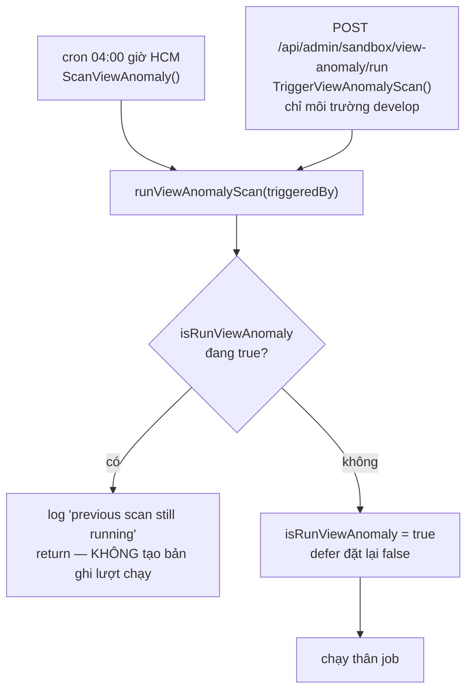

**Khoá là biến package-level `isRunViewAnomaly`**, theo đúng pattern `isRunAnalyticDaily` đã có sẵn trong `shedule.go`. Job này đọc nặng hơn mọi job hiện có, chạy chồng là nhân đôi tải database.

**Hệ quả cần biết khi test:** nếu tester bấm API sandbox trong lúc cron đang chạy, lượt bấm đó **bị bỏ qua hoàn toàn** — không có bản ghi lượt chạy nào được tạo, chỉ có một dòng log. API vẫn trả `200` kèm `triggered: true`, nên tester không biết. Đây là hạn chế đã ghi nhận.

**Lịch 04:00 trùng khung với `AuditContentAnalytic`** (`0 0 4 * * *`). Job đó **ghi** `auditStatus` lên `content-analytic-daily`, job này **đọc** chính collection đó. Hai job không điều phối với nhau nên sẽ chạy song song và cộng dồn tải.

---

## 3. Cửa sổ thời gian

Đây là phần dễ sai nhất và ảnh hưởng tới mọi detector, nên tách riêng.

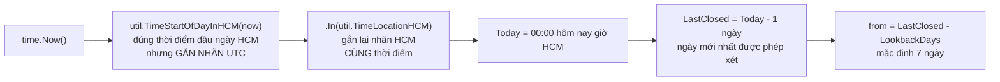

### Vì sao `LastClosed` là hôm qua

Dữ liệu của ngày đang chạy **chưa đầy đủ theo định nghĩa**. Mọi alert dựa trên nó đều là báo động giả. Không có ngoại lệ nào cho quy tắc này.

### Vì sao phải gắn lại nhãn múi giờ

`util.TimeStartOfDayInHCM` tính đúng thời điểm đầu ngày HCM rồi gọi `.UTC()` ở cuối, nên giá trị trả về mang **nhãn UTC**. Đọc `Hour()` sẽ ra 17 chứ không phải 0.

`.In(util.TimeLocationHCM)` chỉ **đổi cách hiển thị, không đổi thời điểm**. Nếu bỏ bước này, `Today`/`LastClosed` sẽ đọc sai khi log và khi định dạng ngày trong email.

### Hệ quả với `Format` — bẫy lệch một ngày

`content-analytic-daily.date` được ghi bằng chính `TimeStartOfDayInHCM`, tức là mang nhãn UTC của thời điểm `17:00Z hôm trước`. Nếu format thẳng giá trị đó sẽ ra **lùi một ngày**.

Vì vậy cả `Finding.dateKey()` (dùng trong vân tay) lẫn `formatAnomalyDate()` (dùng trong email) đều gọi `.In(util.TimeLocationHCM)` trước khi format. Không có bước này thì:
- một email mang **hai quy ước ngày lệch nhau một ngày**;
- vân tay lưu **sai ngày vĩnh viễn** trong database.

### Bảng cửa sổ theo từng tầng

| Nơi dùng | Cửa sổ | Ghi chú |
|---|---|---|
| `AnalyticsFor` | `date >= from, <= LastClosed` | 7 ngày |
| `RewardsFor` | `date >= from, <= LastClosed` | 7 ngày |
| `CallbacksFor` | `createdAt >= now - 30 ngày` | hằng cứng `callbackLookbackDays` |
| `RewardedViewByUser` | **không lọc ngày** | luỹ kế cả chiến dịch |
| `MilestoneRewardedUsers` | **không lọc ngày** | luỹ kế cả chiến dịch |
| `reward_missing` | bỏ ngày > `LastClosed - 24h` | thực tế chỉ xét tới D−2 |
| `reward_lag` | cùng cutoff D−2 | |
| `view_duplicated` | bỏ ngày > `LastClosed` | |
| `vendor_outage` | `LastClosed - VendorWindowHours` (24h) | |
| `crawl_not_queued` | `Today - CrawlSilentDays` (3 ngày) | neo vào `Today`, không phải `LastClosed` |
| `callback_empty` | không theo ngày | đếm chuỗi N callback mới nhất |
| `milestone_missing` | không theo ngày | luỹ kế |

**Hai query cấp user cố ý bỏ qua `from`/`to`.** Mốc thưởng là trạng thái luỹ kế cả chiến dịch. Lọc 7 ngày ở đó là đem tổng một tuần so với ngưỡng cả chiến dịch — không bao giờ chạm tới.

---

## 4. Luồng tổng thể của job

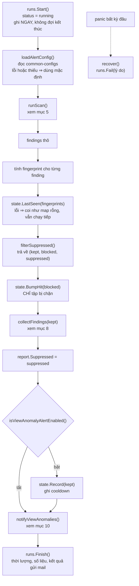

### Bốn điểm dễ hiểu sai

**`BumpHit` chỉ nhận tập bị chặn.**
Tập được báo đã được `Record` tăng `hitCount` bằng `$inc` trong cùng lượt quét. Truyền cả danh sách vào `BumpHit` sẽ **cộng đôi**. Đây từng là một lỗi thật, được vòng review cuối bắt.

**`Record` bị bỏ qua khi tắt gửi mail.**
Khi đang ở giai đoạn hiệu chỉnh ngưỡng, nếu vẫn ghi cooldown thì mọi phát hiện sẽ bị đánh dấu "đã báo". Tới lúc bật mail, hộp thư im lặng một cách khó hiểu.

**Khi bật, `Record` chạy TRƯỚC khi gửi và không phụ thuộc kết quả gửi.**
Đánh đổi có chủ ý: phát hiện sẽ không bắn lại ở lần quét kế tiếp dù admin chưa nhận được email. Phương án ngược lại — chỉ ghi khi gửi thành công — khiến một sự cố mail kéo dài tích tụ thành một email khổng lồ khi mail hồi phục.

**`recover` phải đóng lượt chạy ở trạng thái `failed`.**
Nếu không, bản ghi nằm mãi ở `running` và không phân biệt được với một lượt đang chạy thật.

---

## 5. Tầng scanner — nạp dữ liệu và cổng lỗi

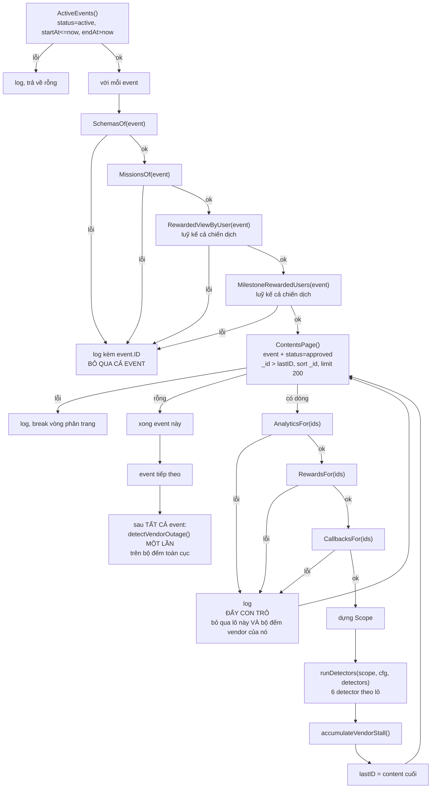

### Mọi nhánh `continue` đều phải đẩy con trỏ

Nếu một nhánh bỏ qua lô mà không gán lại `lastID`, vòng lặp sẽ quay **vô tận** vào database. Đây là điều duy nhất trong tầng này có thể làm sập production, và nó được kiểm chứng bằng test riêng.

### Cô lập lỗi ở tầng detector

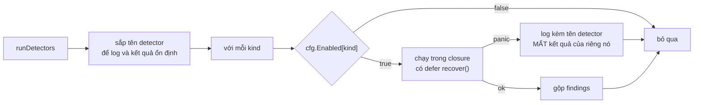

`runDetectors` nhận **registry làm tham số** chứ không đọc thẳng biến package `detectors`. Lý do: test cần thay một detector bằng hàm panic, và một test đổi trạng thái package sẽ rò rỉ sang test khác khi chạy song song. Bên gọi thật luôn truyền `detectors`.

### `vendor_outage` là ngoại lệ có chủ ý

Sáu detector còn lại chạy **mỗi lô một lần**. `vendor_outage` cần dữ liệu vượt phạm vi một lô **và** vượt phạm vi một event, nên scanner tích luỹ bộ đếm `map[source]*vendorStallCount` xuyên suốt lần quét, rồi gọi detector đó **đúng một lần** sau khi mọi event đã quét xong.

### Hai bất biến scanner phải bảo đảm

| Bất biến | Ai phụ thuộc | Hậu quả nếu sai |
|---|---|---|
| `AnalyticsFor` trả chuỗi **sắp theo ngày tăng dần** | `detectViewDuplicated` | cửa sổ trượt tính trung vị sai hoàn toàn |
| `CallbacksFor` trả **mới nhất trước**, rồi mới cắt còn 5 | `detectCallbackEmpty` | đếm chuỗi rỗng từ đầu sai đầu |

### Hai hạn chế đã chấp nhận

**`MissionsOf` nạp toàn bộ mission** vì `MissionRaw` không có trường tham chiếu event. Nếu mô hình dữ liệu về sau có liên kết đó thì sửa đúng chỗ này.

**`CallbacksFor` chạy thêm một truy vấn** đọc lại `contents` để lấy `link`, vì `contents-callback` khoá theo link chứ không theo mã content. Bỏ trống và để hai detector tầng crawl tự nạp sẽ làm chúng mất tính thuần — phương án tệ hơn.

---

## 6. Cổng loại trừ nhóm D

`shouldExpectReward` trả lời một câu duy nhất: **content này, ngày này, có được kỳ vọng sinh bản ghi thưởng không?**

Hai detector gate trên nó: `reward_missing` và `reward_lag`. Đây là module quan trọng nhất của cả tính năng.

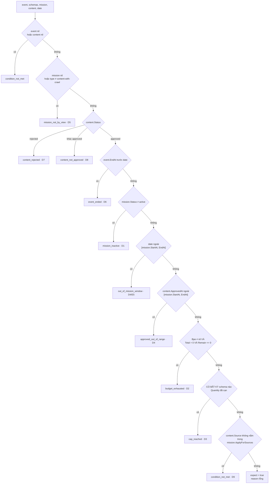

### Thứ tự là load-bearing

Nhánh trước **che** nhánh sau và đổi luôn lý do được báo. Ví dụ: nếu ngày đang xét nằm ngoài cửa sổ nhiệm vụ **và** ngày duyệt cũng ngoài cửa sổ, hàm sẽ báo `out_of_mission_window` chứ không phải `approved_out_of_range`, vì nhánh 5 đứng trước nhánh 6.

### Vì sao trả về lý do chứ không chỉ `bool`

Khi Ops nghi hệ thống bỏ sót, một dòng log ghi `"content X excluded: budget_exhausted"` là **bằng chứng kiểm chứng được**. Thiếu nó, module này là hộp đen không ai tin.

### Ba nhánh có chi tiết cần nhớ

**`Bpe == nil` KHÔNG phải là hết budget.**
Nhiều event không cấu hình budget. Hiểu nhầm sẽ loại trừ sai **toàn bộ** chúng, tức là `reward_missing` im lặng vĩnh viễn trên những event đó.

**Cap loại trừ khi CÓ BẤT KỲ schema nào cạn.**
Một event có thể mang nhiều `EventSchemaRaw` với `Quantity` khác nhau, và **không schema nào tham chiếu mission**. Không có cách nào biết schema nào chi phối content này. Nhận cả danh sách và loại trừ khi bất kỳ cái nào đã cạn — hướng bảo thủ, chấp nhận bỏ sót để không báo động giả.

**Hàm chịu được con trỏ nil ở mọi tham số.**
Nó chạy trong vòng lặp quét hàng chục nghìn content; một bản ghi dữ liệu cũ thiếu tham chiếu không được làm chết cả lần quét.

---

## 7. Bảy detector

Mọi detector đều là **hàm thuần**: không I/O, không `time.Now()`, nhận dữ liệu đã nạp sẵn qua `Scope`, trả `[]Finding` rỗng-không-nil khi không có gì.

### 7.1 `reward_missing` — case C1, mức cao

Có view trong dữ liệu ngày nhưng không sinh bản ghi thưởng tương ứng. Đây là case Nha khoa Parkway.

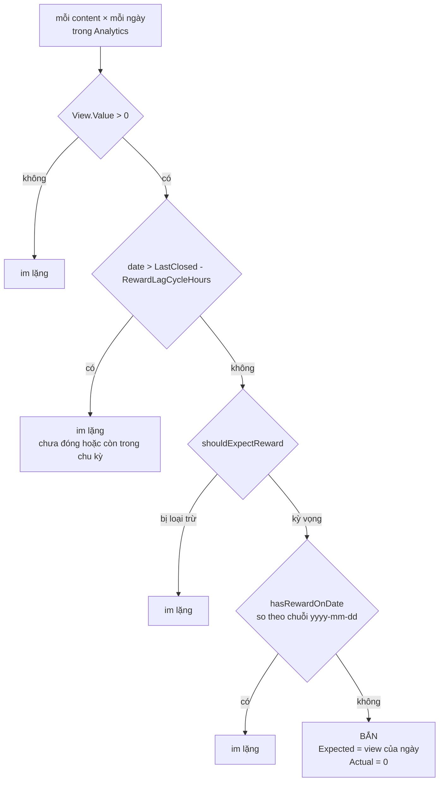

`hasRewardOnDate` so **theo ngày** chứ không theo thời điểm, vì reward và analytic-daily đều chốt theo mốc ngày và có thể lệch nhau vài giờ trong cùng một ngày.

### 7.2 `milestone_missing` — case E4, mức trung bình

Creator đã vượt ngưỡng mốc nhưng không có bản ghi thưởng mốc.

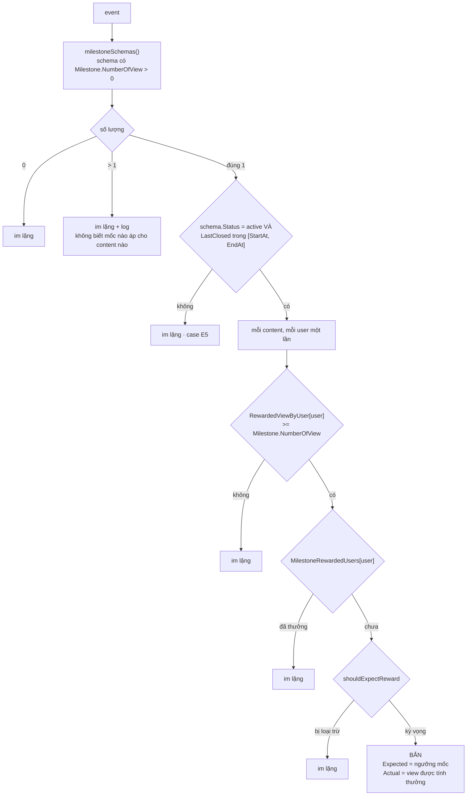

**Then chốt — dùng đúng loại chỉ số.**
Ngưỡng xét trên `RewardedViewByUser`, nguồn là `TotalViewPendingRewarded` của pipeline `GetTotalCashRewardByContent`. **Không phải** `content.Statistic.View.Total`.

Đây chính xác là case Phở Cung Đình: view hiển thị và view được tính thưởng là hai con số khác nhau một cách hợp lệ. So nhầm sẽ tạo báo động giả hàng loạt.

**Vì sao tra `MilestoneRewardedUsers` theo user chứ không theo content.**
Thưởng mốc được tạo với `Options: &EventRewardOpts{}` — **rỗng, không mang ContentID** (xem `internal/service/event_schema.go`). Mà `scope.Rewards` khoá theo `Options.ContentID`. Tra theo content sẽ **luôn** cho kết quả "chưa thưởng" và làm detector bắn vào mọi user vượt mốc. Đây là lỗi đã bị vòng review bắt và sửa.

**Vì sao không gọi `schema.IsValid()`.**
`IsValid()` đọc đồng hồ hệ thống, làm detector mất tính tất định và không test được. Thay bằng so trực tiếp với `scope.LastClosed`.

### 7.3 `reward_lag` — case C4/E3, mức trung bình

Cả một nhiệm vụ có view nhưng không quy đổi thành thưởng quá một chu kỳ.

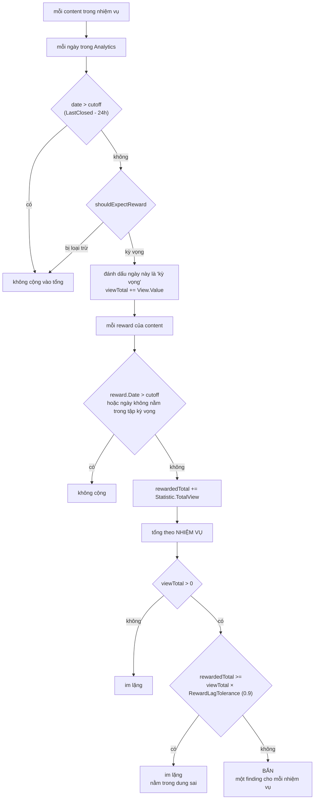

**Hai vế phải cùng tập ngày.**
Nếu chỉ gate vế view mà không gate vế reward, tử số và mẫu số đến từ hai tập ngày khác nhau và alert bắn oan. Vì vậy code dựng một `map[string]bool` các ngày kỳ vọng, rồi chỉ cộng reward của những ngày nằm trong tập đó.

**Vì sao có dung sai thay vì so tuyệt đối.**
Reward và analytic chốt lệch nhau vài giờ, làm tròn và trễ một phần là bình thường. Đòi `rewarded >= view` là đòi hai nguồn số liệu khớp tuyệt đối — điều không bao giờ xảy ra, và sẽ bắn alert mỗi ngày.

**Vì sao vẫn phải qua `shouldExpectReward`.**
Bản đầu tiên của detector này cố ý bỏ cổng loại trừ. Vòng review cuối chỉ ra: một nhiệm vụ đã kết thúc ba ngày trước với 500 view ghi nhận sẽ cho `viewTotal=500, rewardedTotal=0` và bắn alert **mỗi ngày, mãi mãi**. Đã sửa.

### 7.4 `view_duplicated` — case B2, mức cao

View của một ngày nhảy vọt bất thường so với chính content đó.

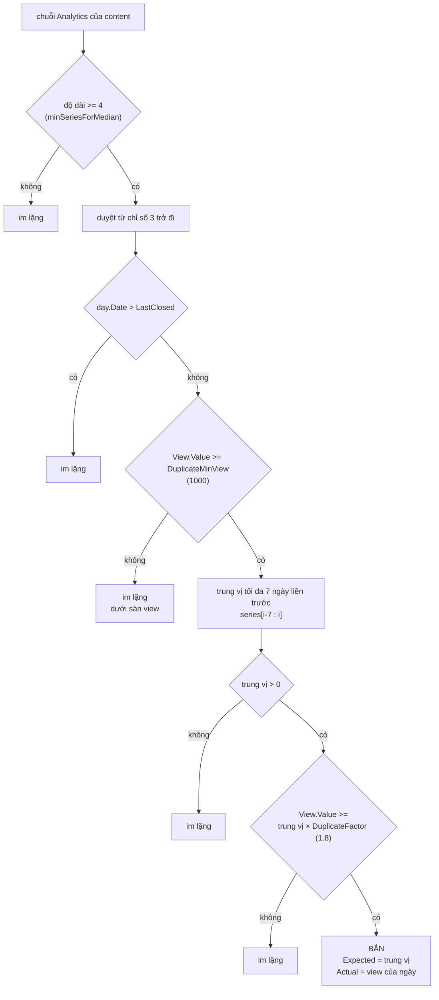

**Dùng trung vị, không dùng trung bình.**
Một ngày đã nhảy vọt sẽ kéo trung bình lên và **tự che chính nó**. Đây là bất biến có test riêng, được kiểm chứng bằng cách đổi sang trung bình và xác nhận test đỏ.

**Hạn chế đã biết, ghi thẳng trong comment của hàm.**
Detector này **không phân biệt được** content đang lên xu hướng với đếm trùng — tăng gấp đôi view trong một ngày là chuyện hoàn toàn bình thường với content viral. Nó là tín hiệu để người xem, không phải kết luận. Đây là detector nhiều khả năng phải hiệu chỉnh ngưỡng nhất và là **ứng viên số một để tắt riêng** nếu nhiễu.

### 7.5 `vendor_outage` — case A6, mức cao, dạng cụm

Nhiều content của nhiều user khác nhau, cùng nền tảng, cùng đứng view.

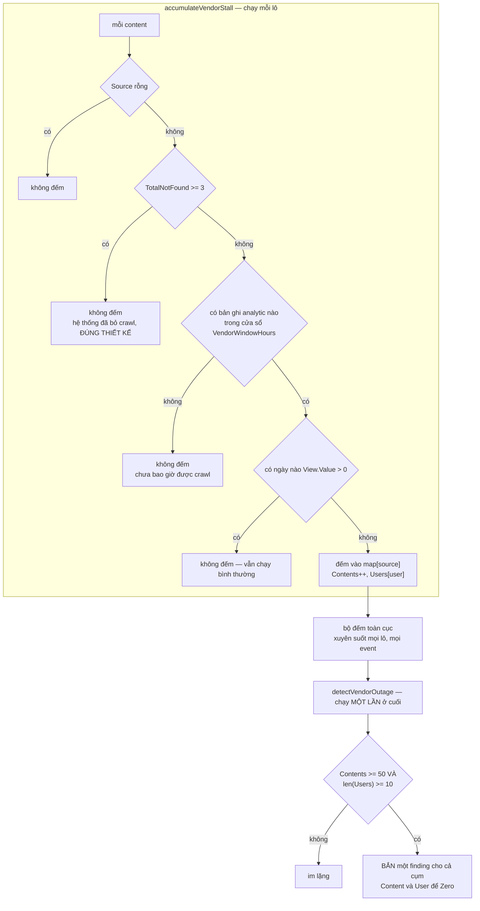

**Yêu cầu vượt CẢ HAI ngưỡng cùng lúc.**
Đây là điều phân biệt với case A4 — token một kênh hết hạn cũng làm nhiều content đứng, nhưng tất cả thuộc **một** user. Nếu chỉ xét số content, alert này sẽ bắn nhầm vào A4.

**Hai điều kiện loại trừ do vòng review cuối bổ sung.**
Ban đầu bộ đếm coi "không có bản ghi analytic nào" là đứng view. Nhưng content **chưa bao giờ được crawl** cũng cho ra map rỗng. Trên một campaign đã chạy lâu, lượng content approved-nhưng-chưa-crawl thường xuyên vượt ngưỡng 50/10, nên `vendor_outage` sẽ bắn ngay ngày đầu và mỗi ngày sau đó. Đã thêm hai điều kiện: phải **có ít nhất một bản ghi** trong cửa sổ, và phải **chưa bị bỏ crawl**.

### 7.6 `callback_empty` — case A2, mức thấp

Hệ thống vẫn crawl đều nhưng callback trả về không mang dữ liệu view.

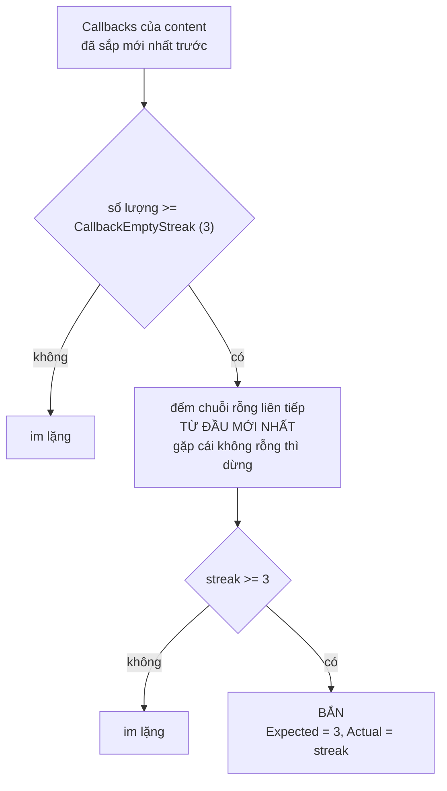

**Định nghĩa "rỗng"** (`isEmptyCallback`): `Information` rỗng, hoặc có `Information` nhưng **không có trường view nào** trong `view` / `views` / `playCount` / `play_count`.

Vòng review cuối đã truy: production chỉ ghi và đọc đúng khoá `view`. Ba khoá còn lại là dự phòng vô hại — chúng chỉ có thể làm hàm trả "không rỗng", tức là làm alert **im lặng hơn**, không thể gây báo động giả.

**Dấu hiệu phân biệt với case A1:** ở đây **vẫn có callback mới**. A1 thì không còn callback nào — đó là việc của `crawl_not_queued`.

### 7.7 `crawl_not_queued` — case A3, mức thấp

Content hợp lệ thuộc campaign đang chạy nhưng không có dấu vết crawl nào.

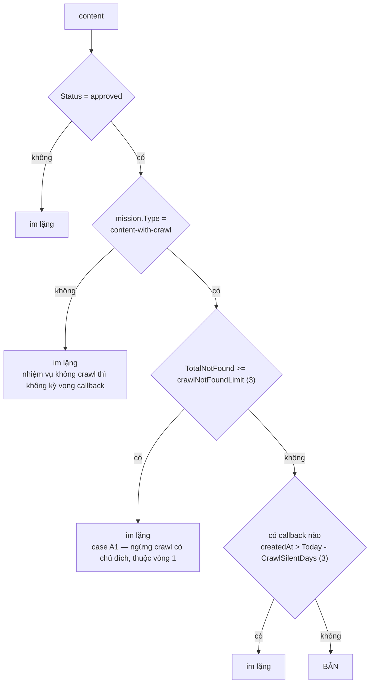

**Nhánh `TotalNotFound >= 3` là bắt buộc.**
Không có nó, **mọi** content đã bị đánh dấu crawl-failed sẽ bắn vào đây mỗi ngày, vĩnh viễn. Bất biến này được kiểm chứng bằng cách xoá nhánh và xác nhận test đỏ.

**Detector này neo vào `Today`, không phải `LastClosed`**, vì nó hỏi "có dấu vết crawl gần đây không", chứ không phải "ngày đó có bất thường không".

---

## 8. Gom báo cáo

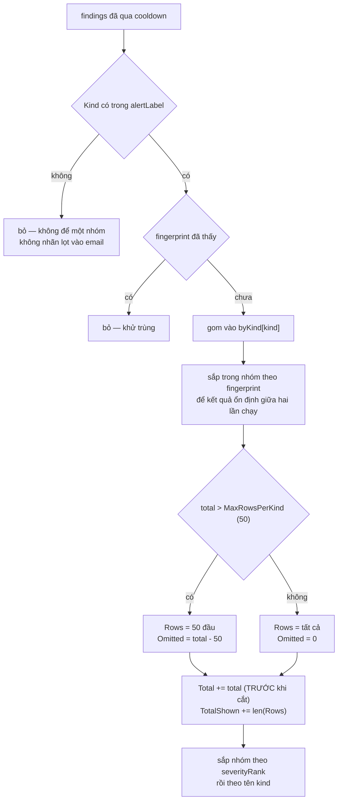

**Bất biến quan trọng nhất:** `Total` và `TotalFound` đếm **trước** khi cắt dòng, còn `TotalShown` và `len(Rows)` đếm **sau**. Khi có sự cố diện rộng, email chỉ hiển thị 50 dòng nhưng **con số thật phải sống sót** — đó mới là thứ nói cho admin biết mức độ nghiêm trọng.

Bất biến này được kiểm chứng bằng cách đổi `TotalFound += total` thành `TotalFound += len(rows)` và xác nhận test đỏ.

**Khử trùng chạy trước khi gom nhóm và đếm**, nên một finding trùng không thể thổi phồng `Total`.

---

## 9. Vân tay và khoảng lặng

Vân tay là **danh tính của một SỰ CỐ**, không phải của một lần phát hiện. Hai lần quét khác nhau thấy cùng một sự cố phải cho ra cùng một chuỗi.

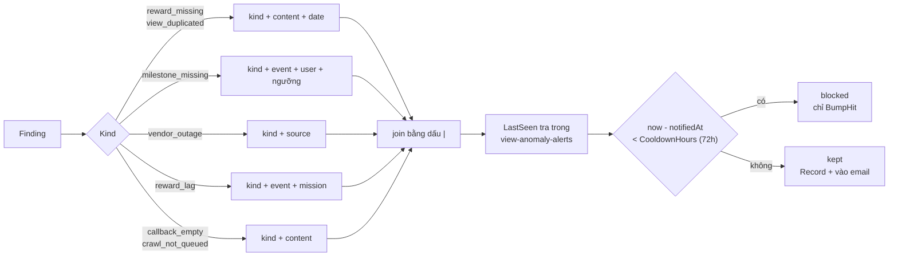

### Cố ý loại trừ `Expected`, `Actual`, `Detail`

Số liệu của một sự cố đang diễn ra vẫn thay đổi mỗi ngày. Nếu chúng lọt vào vân tay thì cooldown **không bao giờ khớp** và alert bắn lại mỗi ngày — đúng thứ cơ chế này sinh ra để chặn.

### Bốn kind không có ngày trong vân tay

| Kind | Có ngày | Vì sao |
|---|---|---|
| `reward_missing` | có | mỗi ngày thiếu thưởng là một sự cố riêng |
| `view_duplicated` | có | cú nhảy vọt thuộc về đúng một ngày |
| `milestone_missing` | **không** | vượt mốc là chuyện xảy ra một lần |
| `vendor_outage` | **không** | sự cố vendor ba ngày là MỘT sự cố |
| `reward_lag` | **không** | job thưởng hỏng là trạng thái kéo dài |
| `callback_empty` | **không** | trạng thái kéo dài |
| `crawl_not_queued` | **không** | trạng thái kéo dài |

`vendor_outage` và `reward_lag` ban đầu **có** ngày trong vân tay. Vòng review cuối chỉ ra: cả hai đặt `Date = scope.LastClosed`, mà giá trị đó tiến một ngày sau mỗi lần quét, nên vân tay đổi mỗi ngày và cooldown không bao giờ chặn được. Một sự cố vendor ba ngày gửi ba email giống hệt nhau. Đã sửa.

### `dateKey()` chuẩn hoá múi giờ

Xem lại [mục 3](#3-cửa-sổ-thời-gian). Nếu bỏ bước `.In(util.TimeLocationHCM)`, vân tay lưu **sai ngày vĩnh viễn** trong database — và sửa sau sẽ làm vô hiệu toàn bộ cooldown đang có.

### `HitCount` tăng cả khi bị chặn

Một sự cố kéo dài vẫn phải để lại dấu vết đếm được trong suốt khoảng lặng, nếu không nó biến mất khỏi dữ liệu. Đây là thứ trả lời được câu "sự cố này tồn tại bao lâu rồi" — câu hỏi mà cảnh báo kỳ đối soát hiện không trả lời được.

---

## 10. Gửi email

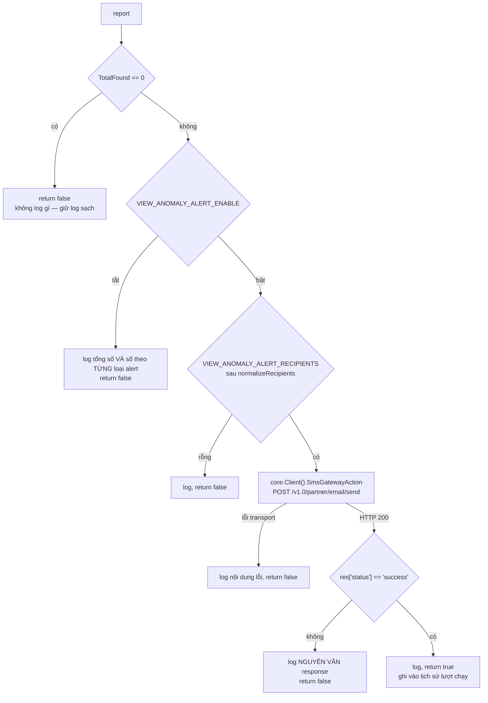

### Bắt buộc đọc status trong thân phản hồi

API AccessTrade trả **HTTP 200 kèm trạng thái thật nằm trong payload**. Tin vào mã transport thôi sẽ dẫn tới việc ghi log "đã gửi thành công" trong khi email chưa hề đi.

### Nhánh tắt phải log số theo từng loại alert

Đó là **toàn bộ đầu vào** của việc hiệu chỉnh ngưỡng. Nếu chỉ log tổng, không ai biết alert nào đang ồn.

### Hàm không bao giờ trả lỗi và không bao giờ panic

Chữ ký trả `bool` (đã gửi được hay chưa), không trả `error`. Mọi nhánh hỏng đều log rồi thoát êm. Lỗi ở tầng gửi không được rò ra ngoài về luồng quét.

### Đường gửi

| | |
|---|---|
| Hàm | `core.Client().SmsGatewayAction` |
| Endpoint | `constants.EmailSendEndpoint` = `/v1.0/partner/email/send` |
| Base URL, khoá | nhóm env `ACCESS_TRADE_SMS_*` |
| Xác thực | HMAC — `client-id`, `client-trace-no`, `client-request-time`, `client-signature` |
| Template | `AMBASSADOR_EMAIL_VIEW_ANOMALY_ALERT` — **chưa được AccessTrade cấp** |

Đây đúng cùng một đường với email OTP và với cảnh báo lệch kỳ đối soát.

### Cấu trúc `template_data` có hai cấp

```
{
  scanned_at, total_found, total_shown, suppressed, company, year,
  groups: [
    { kind, kind_label, severity, total, omitted,
      rows: [ { content_id, user_id, event_id, source, date,
                expected, actual, affected_contents, affected_users, detail } ] }
  ]
}
```

**Cần xác nhận với AccessTrade:** template bên đó có hỗ trợ **vòng lặp lồng nhau** không. Nếu chỉ nhận biến phẳng thì phải dựng sẵn chuỗi HTML — thay đổi gói gọn trong `buildViewAnomalyTemplateData`.

---

## 11. Lịch sử chạy job

Collection `view-anomaly-job-runs`, một bản ghi cho mỗi lượt chạy.

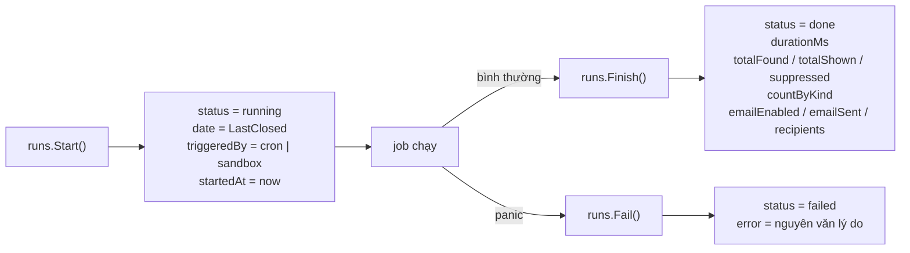

### Vì sao ghi ngay lúc bắt đầu

Một lượt chạy bị treo hoặc bị giết giữa chừng vẫn phải để lại dấu vết. Nếu chỉ ghi lúc kết thúc thì "không có bản ghi" vừa có nghĩa là **chưa chạy** vừa có nghĩa là **chạy rồi chết** — hai tình huống cần phân biệt.

### `emailEnabled` khác `emailSent`

- `emailEnabled` — trạng thái cờ env tại lúc chạy.
- `emailSent` — email có thực sự được AccessTrade tiếp nhận không.

Hai giá trị khác nhau khi cờ bật nhưng danh sách người nhận rỗng, hoặc khi API từ chối.

### `countByKind` là dữ liệu hiệu chỉnh ngưỡng

Đếm trên `Total` của nhóm (**trước** khi cắt dòng), vì số dòng hiển thị không nói lên mức độ ồn của một alert.

### Lỗi ghi lịch sử chỉ được bỏ qua

Lịch sử chạy là dữ liệu phụ trợ, không được phép chặn việc quét.

---

## 12. API sandbox

Chỉ tồn tại ở môi trường `develop`.

| Method | Đường dẫn | Việc |
|---|---|---|
| `POST` | `/api/admin/sandbox/view-anomaly/run` | kích hoạt quét, chạy nền, trả ngay |
| `GET` | `/api/admin/sandbox/view-anomaly/runs` | 20 lượt gần nhất, mới nhất trước |

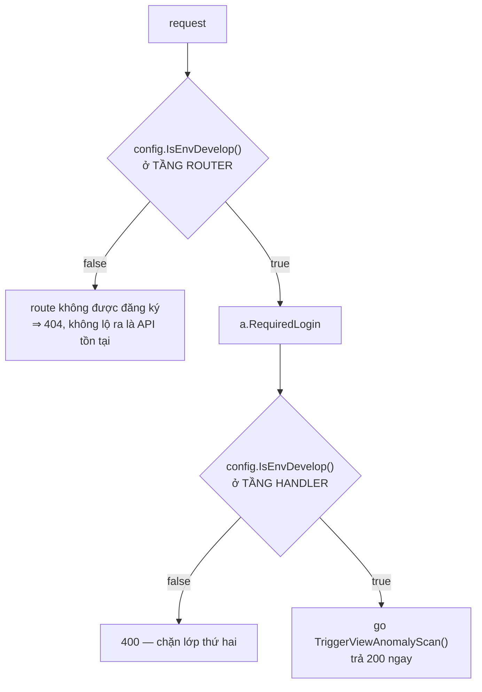

**Kiểm tra hai lớp là có chủ ý.** Tầng router không đăng ký route nên trả 404 chứ không phải 403 — không lộ ra rằng API có tồn tại. Tầng handler kiểm tra lại để một sửa nhầm ở router không mở API này ra production.

**Hạn chế đã biết:** nếu khoá chống chạy chồng đang bật, lượt bấm bị bỏ qua nhưng API **vẫn trả `200` kèm `triggered: true`**. Tester không biết là lượt bấm đã bị nuốt.

---

## 13. Cấu hình

### Biến môi trường — quyết định triển khai

```
VIEW_ANOMALY_ALERT_ENABLE=false
VIEW_ANOMALY_ALERT_RECIPIENTS=          # phân tách bằng dấu phẩy
```

Hai biến này **chỉ quyết định có gửi email hay không**. Job luôn quét và luôn ghi log.

Người nhận đi qua `normalizeRecipients` (dùng chung với cảnh báo đối soát): cắt khoảng trắng, hạ chữ thường, bỏ chuỗi rỗng, khử trùng giữ thứ tự.

### `common-configs` — tham số hiệu chỉnh

Bản ghi `name = view_anomaly_alert`, trường `Value` là `map[string]string`.

| Khoá | Mặc định | Dùng ở đâu |
|---|---|---|
| `lookbackDays` | 7 | cửa sổ nạp analytic và reward |
| `cooldownHours` | 72 | khoảng lặng chống bắn lặp |
| `maxRowsPerKind` | 50 | số dòng tối đa mỗi nhóm trong email |
| `vendorWindowHours` | 24 | cửa sổ xét đứng view |
| `vendorMinContents` | 50 | ngưỡng cụm vendor |
| `vendorMinUsers` | 10 | ngưỡng cụm vendor |
| `duplicateFactor` | 1.8 | bội số so với trung vị |
| `duplicateMinView` | 1000 | sàn view tối thiểu |
| `rewardLagCycleHours` | 24 | chu kỳ tính thưởng |
| `rewardLagTolerance` | 0.9 | tỉ lệ quy đổi còn coi là bình thường |
| `callbackEmptyStreak` | 3 | số callback rỗng liên tiếp |
| `crawlSilentDays` | 3 | số ngày im lặng crawl |
| `enabled.<kind>` | true | bật tắt từng alert độc lập |

**Giá trị rác, rỗng hoặc âm đều rơi về mặc định.** Ngưỡng bằng 0 nghĩa là bắt tất cả mọi thứ — tệ hơn nhiều so với chạy bằng mặc định.

**Mọi giá trị mặc định đều suy ra từ tài liệu case, chưa đối chiếu với dữ liệu thật lần nào.** Chúng tồn tại để job chạy được, không phải để tin.

### Quy trình bật gửi mail

1. Giữ `ENABLE=false`, chạy ít nhất 7 ngày.
2. Đếm phát hiện theo từng alert mỗi ngày từ log tiền tố `[ScanViewAnomaly]` hoặc từ `countByKind` trong `view-anomaly-job-runs`.
3. Đối chiếu tay 10 phát hiện của `reward_missing` và `milestone_missing` — đây là bài kiểm tra chất lượng duy nhất của `shouldExpectReward`.
4. Hiệu chỉnh ngưỡng bằng cách sửa `common-configs`, **không sửa mã, không deploy lại**.
5. Điền `RECIPIENTS`, đặt `ENABLE=true`.

Ứng viên tắt riêng đầu tiên nếu nhiễu: `enabled.view_duplicated = false`.

---

## 14. Collection đọc và ghi

| Collection | Quyền | Dùng để |
|---|---|---|
| `view-anomaly-alerts` | **ghi** | fingerprint, notifiedAt, hitCount — điều khiển cooldown |
| `view-anomaly-job-runs` | **ghi** | lịch sử lượt chạy |
| `contents` | đọc | phân trang cursor theo event |
| `content-analytic-daily` | đọc | chuỗi view theo ngày, cửa sổ 7 ngày |
| `event-rewards` | đọc | reward theo ngày + 2 aggregate luỹ kế chiến dịch |
| `contents-callback` | đọc | phản hồi crawl theo link, chặn 30 ngày |
| `events` | đọc | event đang hiệu lực |
| `event-schemas` | đọc | cổng loại trừ, cấu hình mốc |
| `missions` | đọc | cổng loại trừ |
| `common-configs` | đọc | ngưỡng |

### Index đã thêm

| Collection | Index | Vì sao |
|---|---|---|
| `contents` | `{event, status, _id}` | `ContentsPage` lọc `{event, status}` rồi range `_id` và **sort `_id`**. Index cũ `{event, status}` không phục vụ sort → Mongo sort trong bộ nhớ, lặp lại ở **mỗi trang** |
| `contents-callback` | `{link, createdAt}` | collection này trước đó **chỉ có `{createdAt}`**, không có index nào trên `link` — mà `link` mới là vế chọn lọc |
| `view-anomaly-alerts` | `{fingerprint}`, `{-notifiedAt}`, `{kind, -notifiedAt}` | tra cooldown |
| `view-anomaly-job-runs` | `{-startedAt}`, `{date}`, `{status}` | đọc lịch sử |

**Lưu ý triển khai:** `i.process` tạo index lúc service khởi động. Trên `contents` và `contents-callback` cỡ production nên tạo tay trước ở khung thấp điểm:

```js
db.contents.createIndex({ event: 1, status: 1, _id: 1 }, { background: true })
db["contents-callback"].createIndex({ link: 1, createdAt: 1 }, { background: true })
```

### Index chưa thêm — đo trên production rồi quyết

| Collection | Index đề xuất | Truy vấn | Mức |
|---|---|---|---|
| `event-rewards` | `{options.contentId, date}` | `RewardsFor` — index hiện tại đơn trường, mỗi content kéo về toàn bộ reward từ trước tới nay rồi lọc ngày trong bộ nhớ | vừa |
| `event-rewards` | `{event, statistic.totalCashMilestone}` | `MilestoneRewardedUsers` — phải đọc mọi reward của event để lọc ra một nhúm reward mốc | thấp |

---

## 15. Điểm mù đã biết

### Thời điểm hết budget

Hệ thống không có trường ghi lại lúc budget cạn, nên `shouldExpectReward` chỉ biết trạng thái **tại lúc quét**.

Hệ quả: một content không sinh thưởng vì **bug** trong khi budget còn, rồi budget cạn sau đó, sẽ bị loại trừ **sai** và không bao giờ được báo.

Đây là **bỏ sót im lặng**, không phải báo động giả — khó phát hiện hơn nhiều. Chỉ khắc phục được bằng cách bổ sung trường thời điểm hết budget.

### Case B1 — ghi đè dữ liệu trễ

Case **phổ biến nhất** trong toàn bộ danh mục 36 case vẫn không phát hiện được, vì không có lịch sử thay đổi số liệu để so. Đây là khoảng trống lớn nhất còn lại sau vòng 2.

### `callbackLookbackDays` khoá ngầm `CrawlSilentDays`

`CallbacksFor` chặn dưới 30 ngày bằng **hằng số cứng**, trong khi `CrawlSilentDays` chỉnh được qua `common-configs` và mặc định là 3.

Nếu ai đó nâng `CrawlSilentDays` vượt quá 30, `crawl_not_queued` sẽ **báo động giả**: một content có callback mới nhất 40 ngày trước vẫn nằm trong cửa sổ im lặng, nhưng truy vấn đã cắt mất bản ghi đó.

Cách vá: cận dưới lấy theo `max(30, 2 × CrawlSilentDays)`, hoặc chặn ngay lúc nạp cấu hình.

### `view_duplicated` không phân biệt viral với đếm trùng

Đã nêu ở [mục 7.4](#74-view_duplicated--case-b2-mức-cao).

### Cap loại trừ theo "bất kỳ schema nào"

Có thể loại trừ rộng hơn thực tế trên event nhiều schema — nhưng lệch về phía **im lặng**, đúng nguyên tắc thà bỏ sót còn hơn báo sai.

### API sandbox không báo khi bị khoá nuốt

Đã nêu ở [mục 12](#12-api-sandbox).

### Mã template email chưa được cấp

Cho tới khi AccessTrade cấp `AMBASSADOR_EMAIL_VIEW_ANOMALY_ALERT`, cảnh báo chỉ tồn tại dưới dạng dòng log và bản ghi trong `view-anomaly-job-runs`.

Nên bàn giao **cùng lúc** với `reconciliation_mismatch_email.html` — mã template của cảnh báo đối soát (12/08) tới nay cũng chưa có.
