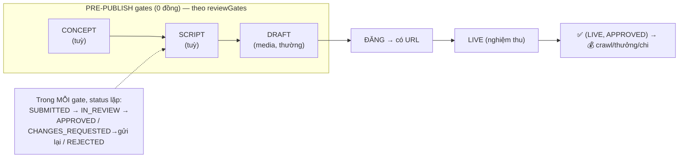

# Business Requirement — Vòng đời duyệt content pre-publish

> **Business-first.** Yêu cầu nghiệp vụ đã chốt, chưa phải code. Xem: **Cmd+Shift+V** (mermaid cần extension `bierner.markdown-mermaid`; không có vẫn đọc ASCII).
> **Mô hình đã chốt** ([brainstorm 2026-07-18](../../../../.bmad/brainstorm-content-submission-lifecycle-2026-07-18.md) + tinh chỉnh 2-tầng): **MỘT record = MỘT deliverable**, lifecycle biểu diễn bằng **2 tầng trực giao (GATE × STATUS)**, **media-agnostic**. Khớp cách ngành quản content generic + status workflow.

---

## BR-1 — ⭐ State = 2 TẦNG trực giao + media là thuộc tính

Không dùng một enum status phẳng khổng lồ (dễ explosion + dính "video"). Thay bằng **2 field trực giao** trên **cùng 1 record**:

| Tầng | Field | Giá trị | Vai trò |
|---|---|---|---|
| **1. Cổng duyệt** | `gate` | `CONCEPT · SCRIPT · DRAFT · LIVE` (có thứ tự) | đang ở checkpoint nào |
| **2. Trạng thái** | `status` | `SUBMITTED · IN_REVIEW · CHANGES_REQUESTED · APPROVED · REJECTED` | dùng lại cho **mọi** gate |
| **Thuộc tính** | `format` / asset type | `reel · story · post · carousel · video · image · text · …` | **KHÔNG** nằm trong state → workflow media-agnostic |

- **State thực = cặp `(gate, status)`.** VD `(SCRIPT, IN_REVIEW)`, `(DRAFT, CHANGES_REQUESTED)`, `(DRAFT, APPROVED)`, `(LIVE, APPROVED)`.
- **Thêm gate** (vd `STORYBOARD`) = +1 value tầng `gate`, tầng `status` **không đổi**. **Thêm loại media** (ảnh/carousel) = **0 thay đổi** workflow (chỉ khác `format`/asset).
- Vẫn **1 record** (không tách object) — chỉ tách status phẳng thành 2 chiều. "DRAFT" thay tên cũ "DEMO" vì content **không chỉ video**.

---

## BR-2 — Tầng GATE: chuỗi cổng duyệt (configurable)

Pre-publish ngoài đời là **nhiều tầng** (`Ý tưởng → Kịch bản → Nháp → Final`). Campaign chọn cần gate nào (`reviewGates`):

| Cấu hình | `reviewGates` | Dùng khi |
|---|---|---|
| Đơn giản | `[DRAFT]` | sản phẩm thường, micro-KOC |
| Chặt | `[SCRIPT, DRAFT]` | brand khó, booking giá cao |
| Rất chặt | `[CONCEPT, SCRIPT, DRAFT]` | pharma / tài chính / sức khoẻ |

`CONCEPT/SCRIPT/DRAFT` = **pre-publish** (0 đồng). `LIVE` = **post-publish** (nghiệm thu → tiền). **Vì sao có gate kịch bản trước nháp:** sửa script **rẻ**, quay lại **đắt** → bắt lỗi sớm.

**Mỗi gate gửi artifact tương ứng:**
| gate | artifact | duyệt gì |
|---|---|---|
| CONCEPT | mô tả ý tưởng/angle | hợp brand/brief? |
| SCRIPT | kịch bản/outline (text): hook, talking points bắt buộc, CTA | đủ yếu tố bắt buộc? claim an toàn? (trước khi sản xuất) |
| DRAFT | **gói content**: media nháp (file/**Drive**) + **caption + hashtag + #ad/Quảng cáo + mention/CTA + lịch đăng** | nội dung + phần chữ vs thể lệ |
| LIVE | **link platform** | khớp bản duyệt? live thật? đúng giờ? disclosure trên bài? |

> Disclosure #ad/"Quảng cáo" — **Luật QC VN 2025 bắt buộc, influencer chịu trách nhiệm** → bắt từ SCRIPT + DRAFT.

---

## BR-3 — Tầng STATUS: luật review + vòng lặp (dùng lại MỌI gate)

Trong **mỗi** gate, `status` chạy vòng đời giống hệt nhau:

```
SUBMITTED ─► IN_REVIEW ─► ┌─ APPROVED            → sang gate kế / (nếu LIVE) → 💰
   ▲                      ├─ CHANGES_REQUESTED    → creator sửa + gửi lại (revisionNo++) ─┐
   └──────────────────────┴─ REJECTED             → deliverable hỏng / đổi hướng           │
   └──────────────────────────────────────────────────────────────────────────────────────┘
```

- **Đạt** (`APPROVED`): qua gate → gate kế (hoặc được đăng nếu là gate DRAFT cuối / trả tiền nếu LIVE).
- **Cần sửa** (`CHANGES_REQUESTED`, mềm): + feedback → creator sửa + gửi lại → **về `SUBMITTED`**, `revisionNo++`, **cùng record** (bản mới + feedback cũ = lịch sử). Trần `maxRounds` mỗi gate (mặc định **2**); hết vòng → chỉ còn Đạt / Từ chối hẳn → escalate.
- **Từ chối hẳn** (`REJECTED`, cứng): deliverable hỏng (hoặc đổi hướng).

---

## BR-4 — Media-agnostic (nghĩ xa: không chỉ video)

Content có thể là **reel / story / post ảnh / carousel nhiều ảnh / video / livestream / text**. Workflow (gate × status) **không quan tâm** loại media:
- `format` khai ở brief (deliverable); mỗi asset có type riêng.
- Gate DRAFT nhận **1..N asset** bất kể loại (carousel = nhiều ảnh).
- Khác biệt media chỉ ở khâu **OpsHub AI phân tích** (video: speech-to-text/CV; ảnh: OCR/CV) — đó là việc của OpsHub, **không đụng** state machine.

→ Thêm loại content mới = thêm `format`, **không** đụng gate/status.

---

## BR-5 — State machine tổng (2 tầng)



ASCII (gate tiến + status lặp trong gate):
```
[brief] → DRAFT record
   gate = CONCEPT? → (status loop) → APPROVED ─┐
   gate = SCRIPT?  → (status loop) → APPROVED ─┤   (bỏ gate không cấu hình)
   gate = DRAFT    → (status loop) → APPROVED ─┘ → ĐĂNG → gate = LIVE
   gate = LIVE     → (status loop) → APPROVED → 💰 COMPLETED
   (bất kỳ gate: REJECTED cứng → deliverable hỏng)
```

---

## BR-6 — Ranh giới tiền (bất biến)
- Mọi gate **pre-publish** (CONCEPT/SCRIPT/DRAFT, mọi status) = **0 đồng**.
- Chỉ **`(LIVE, APPROVED)`** kích: content-metric → crawl → thưởng; booking → chi tiền nghiệm thu.

## BR-7 — Cờ & cấu hình
- `prePublishReview`: **false** → bỏ hết pre-publish gate, bắt đầu ~`(LIVE, ...)` (hành vi hiện tại). **true** → chạy theo `reviewGates`.
- `reviewGates` + `maxRounds`/gate: versioned theo campaign (grandfather).

## BR-8 — AI review = OpsHub (đã có)
- Mỗi gate DRAFT/SCRIPT gọi **OpsHub** lấy kết quả AI (đổi đầu vào theo gate/media). Người quyết cuối.

---

## Ánh xạ code (bước sau — chỉnh sau, rẻ)
- **1 `ContentSubmission` / deliverable.** Bỏ enum status phẳng → **2 field: `gate` (CONCEPT/SCRIPT/DRAFT/LIVE) + `status` (SUBMITTED/IN_REVIEW/CHANGES_REQUESTED/APPROVED/REJECTED)** + `format` (media, thuộc tính). Transition định nghĩa trên cặp `(gate, status)`.
- Artifact: SCRIPT=text · DRAFT=`ContentAsset` (1..N, mọi loại) · LIVE=`url`. `url` nullable tới khi đăng.
- Reward/crawl **chỉ ở `(LIVE, APPROVED)`**. Revision = re-submit cùng record (`revisionNo++`).
- **Sửa [ADR-0011]**: `kind` 2-object → **1-record, `gate × status`, media-agnostic**. Kéo theo `features/pre-publish-approval/*` + `features/booking`.

---
*Ghi 2026-07-18. Nguồn: meeting 0714 + research chuẩn ngành (content types + concept→script→rough-cut→final) + [brainstorm](../../../../.bmad/brainstorm-content-submission-lifecycle-2026-07-18.md).*
