# PRD: Hệ thống Quản lý Ngân sách Thử thách (Event Budget)

> **Phiên bản**: 1.1
> **Ngày tạo**: 2026-03-26
> **Cập nhật lần cuối**: 2026-03-27
> **Nhánh phát triển**: `feature/budget`
> **Trạng thái**: Đang phát triển

---

## 1. Tổng quan

### 1.1 Bối cảnh

Hệ thống Ambassador cho phép người dùng (publisher) tham gia các thử thách (Event) và nhận thưởng dựa trên hiệu suất nội dung (lượt xem, lượt thích, bình luận). Hiện tại, hệ thống chưa có cơ chế kiểm soát ngân sách chi tiêu cho từng thử thách, dẫn đến rủi ro chi vượt ngân sách dự kiến.

### 1.2 Mục tiêu

Xây dựng hệ thống quản lý ngân sách đa tầng (multi-level budget) cho thử thách, bao gồm:

- **Giới hạn ngân sách** ở 3 cấp độ: theo Event, theo User, theo Content
- **Kiểm soát chi tiêu realtime**: tự động cắt/chia nhỏ phần thưởng khi chạm ngưỡng ngân sách
- **Theo dõi milestone**: Admin tạo các mốc ngân sách để giám sát tiến độ chi tiêu
- **Tự động khoá Event**: khi vượt ngưỡng 95% hoặc 100%, hệ thống tự động chặn nộp nội dung và/hoặc chặn thưởng

### 1.3 Phạm vi

| Trong phạm vi | Ngoài phạm vi |
|---|---|
| Cấu hình budget 3 cấp (Event / User / Content) | ~~Gửi email cảnh báo budget~~ |
| Ước tính ngân sách trước khi tạo reward | ~~Thông báo push notification~~ |
| Chia nhỏ reward khi budget không đủ (Budget Split) | Dashboard báo cáo ngân sách (giai đoạn sau) |
| Khoá Event khi vượt ngưỡng | |
| Budget Campaign – mốc theo dõi milestone | |

---

## 2. Kiến trúc tổng thể

### 2.1 Sơ đồ kiến trúc

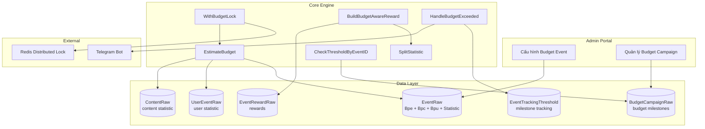

### 2.2 Luồng tổng thể

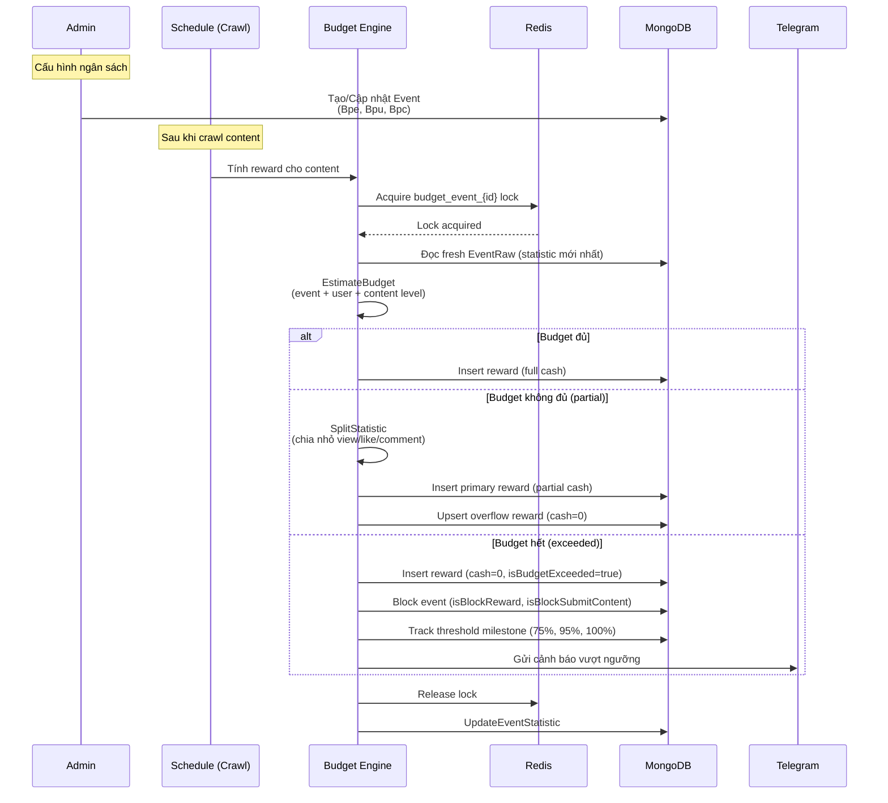

---

## 3. Chi tiết tính năng

### 3.1 Tính năng 1: Cấu hình ngân sách đa tầng (Multi-level Budget)

#### 3.1.1 Mô tả

Admin có thể thiết lập giới hạn ngân sách cho một Event ở 3 cấp độ. Hệ thống sẽ kiểm tra tất cả các cấp khi tạo reward và lấy giá trị nhỏ nhất (min) làm ngân sách khả dụng thực tế.

#### 3.1.2 Cấu trúc dữ liệu

Budget được lưu trực tiếp dưới dạng 3 field riêng biệt trên `EventRaw` (không dùng nested struct):

```go
// Trên EventRaw
Bpe *BudgetInfo `bson:"bpe,omitempty" json:"bpe,omitempty"` // Budget Per Event
Bpc float64     `bson:"bpc,omitempty" json:"bpc,omitempty"` // Budget Per Content
Bpu float64     `bson:"bpu,omitempty" json:"bpu,omitempty"` // Budget Per User

// BudgetInfo theo dõi chi tiêu realtime cho event-level budget
type BudgetInfo struct {
    Total       float64 `bson:"total" json:"total"`             // Tổng ngân sách (VND)
    Used        float64 `bson:"used" json:"used"`               // Đã dùng
    Remain      float64 `bson:"remain" json:"remain"`           // Còn lại
    UsedPercent float64 `bson:"usedPercent" json:"usedPercent"` // % đã dùng
}
```

**Quy ước**:
- `Bpe`: dùng `*BudgetInfo` để theo dõi Total/Used/Remain/UsedPercent
- `Bpc`, `Bpu`: chỉ là giá trị cap (float64), không cần tracking Used/Remain vì được tính realtime từ UserEvent/Content statistic
- Giá trị `0` = không giới hạn (unlimited)

#### 3.1.3 Cách tính ngân sách khả dụng

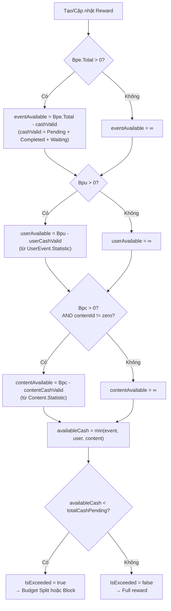

#### 3.1.4 Quy tắc validation (Admin API)

| # | Quy tắc | Mô tả |
|---|---|---|
| V1 | Bpc và Bpu phải nhỏ hơn Bpe | Nếu `Bpe > 0`: `Bpc <= Bpe` và `Bpu <= Bpe`, nếu không trả lỗi 400 |
| V2 | Tất cả budget field đều optional | Admin có thể chỉ set Bpe, hoặc chỉ set Bpc, hoặc kết hợp tuỳ ý |
| V3 | Chặn thay đổi budget khi đã có reward | Nếu event đã setup budget (Bpe/Bpc/Bpu > 0) VÀ có reward (trừ rejected) → chặn update bất kỳ budget field nào |

#### 3.1.5 Use Cases

| UC | Actor | Mô tả | Kết quả |
|---|---|---|---|
| UC-1.1 | Admin | Tạo Event với Bpe = 50,000,000 VND | Khi tổng chi tiêu Event đạt 50tr → tự động block |
| UC-1.2 | Admin | Đặt Bpu = 1,000,000 VND | Mỗi user chỉ được nhận tối đa 1tr từ Event |
| UC-1.3 | Admin | Đặt Bpc = 200,000 VND | Mỗi content chỉ được thưởng tối đa 200k |
| UC-1.4 | Admin | Không set Bpe (= 0) | Không giới hạn ngân sách Event (unlimited) |
| UC-1.5 | Admin | Kết hợp cả 3 cấp | Hệ thống lấy min(event, user, content) |
| UC-1.6 | Admin | Set Bpc = 300k nhưng Bpe = 200k | Lỗi 400: Bpc phải nhỏ hơn Bpe |
| UC-1.7 | Admin | Cố thay đổi Bpc khi event đã có reward | Lỗi 400: Không thể thay đổi budget khi đã có reward |

---

### 3.2 Tính năng 2: Budget Split – Chia nhỏ phần thưởng

#### 3.2.1 Mô tả

Khi ngân sách khả dụng nhỏ hơn tiền thưởng dự kiến nhưng vẫn > 0, hệ thống **chia nhỏ reward** thành 2 phần:

- **Primary Reward**: phần nằm trong ngân sách (có cash > 0)
- **Overflow Reward**: phần vượt ngân sách (cash = 0, đánh dấu `isBudgetExceeded = true`)

#### 3.2.2 Thuật toán Split Statistic

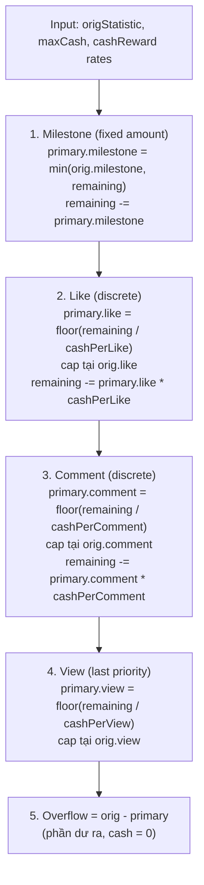

**Thứ tự ưu tiên** khi chia ngân sách: Milestone → Like → Comment → View

#### 3.2.3 Overflow Upsert (chống duplicate)

Khi update reward đã tồn tại và budget exceeded, hệ thống **upsert** overflow doc thay vì luôn tạo mới:

1. Tìm overflow doc hiện có bằng filter: cùng `user`, `schema._id`, `contentId`, `date`, `status`, `isBudgetExceeded=true`, `_id != primaryReward._id`
2. Nếu tìm thấy → `UpdateOne` stats mới vào overflow doc cũ
3. Nếu không tìm thấy → `InsertOne` overflow doc mới
4. Skip tạo overflow nếu overflow stats đều = 0 (không có dữ liệu tràn)

#### 3.2.4 Use Cases

| UC | Tình huống | Kết quả |
|---|---|---|
| UC-2.1 | Reward = 500k, Available = 500k | 1 reward 500k (full) |
| UC-2.2 | Reward = 500k, Available = 300k | Primary: 300k + Overflow: 0đ (isBudgetExceeded) |
| UC-2.3 | Reward = 500k, Available = 0 | 1 reward 0đ (isBudgetExceeded) |
| UC-2.4 | Update reward: old 200k → new 500k, Available = 100k | Capped tại 300k, upsert overflow cho phần dư |
| UC-2.5 | Crawl lần 2 cùng content (đã có overflow) | Update overflow doc cũ, không tạo duplicate |

---

### 3.3 Tính năng 3: Budget Lock – Đồng bộ ngân sách

#### 3.3.1 Mô tả

Sử dụng **Redis Distributed Lock** (Mutex) để đảm bảo tính nguyên tử (atomicity) khi kiểm tra và trừ ngân sách. Tránh race condition khi crawl nhiều platform (TikTok, Facebook, YouTube) đồng thời cho cùng một Event.

#### 3.3.2 Luồng xử lý

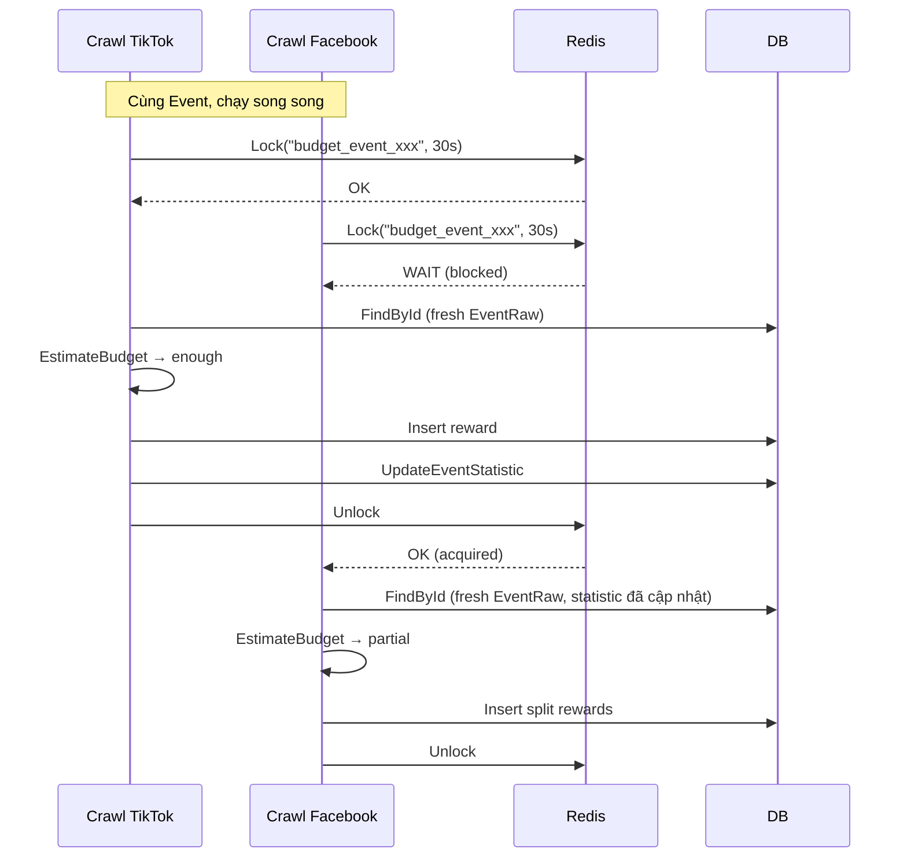

#### 3.3.3 Use Cases

| UC | Tình huống | Kết quả |
|---|---|---|
| UC-3.1 | 2 crawl chạy đồng thời | Lock serialize → không chi vượt |
| UC-3.2 | Lock timeout (30s) | Lock tự giải phóng, crawl tiếp lỗi sẽ retry lần sau |
| UC-3.3 | Lock fail | Log lỗi, reward không được tạo (an toàn) |

---

### 3.4 Tính năng 4: Auto Block Event – Khoá tự động

#### 3.4.1 Mô tả

Khi chi tiêu Event vượt ngưỡng, hệ thống tự động:

1. **Đạt 75%**: Ghi nhận milestone tracking (chỉ log)
2. **Đạt 95%**: Khoá nộp nội dung mới (`isBlockSubmitContent = true`)
3. **Đạt 100%**: Khoá cả nộp nội dung và thưởng (`isBlockReward = true`)
4. **Gửi cảnh báo Telegram** khi vượt 100% và không đủ tiền thanh toán

#### 3.4.2 Luồng xử lý

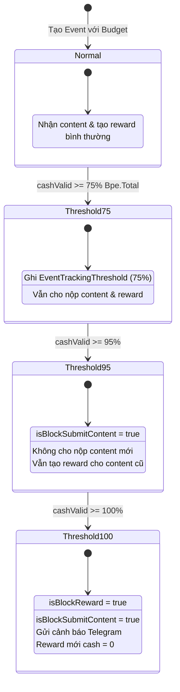

#### 3.4.3 Cấu trúc dữ liệu tracking

```go
type EventTrackingThresholdRaw struct {
    ID        primitive.ObjectID  // Định danh
    Event     primitive.ObjectID  // Event liên kết
    Threshold float64             // Mốc phần trăm (75, 95, 100)
    CreatedAt time.Time
    UpdatedAt time.Time
}
```

#### 3.4.4 Use Cases

| UC | Tình huống | Hành vi hệ thống |
|---|---|---|
| UC-4.1 | Event budget 10tr, chi tiêu đạt 7.5tr (75%) | Ghi milestone, tiếp tục hoạt động bình thường |
| UC-4.2 | Chi tiêu đạt 9.5tr (95%) | Block nộp content mới, reward vẫn chạy cho content cũ |
| UC-4.3 | Chi tiêu đạt 10tr (100%) | Block tất cả, reward mới = 0đ, gửi Telegram |
| UC-4.4 | Bpe = 0 (không giới hạn) | Không check threshold, không block |

---

### 3.5 Tính năng 5: Budget Campaign – Mốc theo dõi ngân sách

#### 3.5.1 Mô tả

Admin tạo các **mốc theo dõi ngân sách** (Budget Campaign) cho từng Event. Mỗi mốc có một giá trị `threshold` (VND). Khi tổng chi tiêu Event đạt hoặc vượt mốc, hệ thống tự động đánh dấu mốc đó là `completed`. Mục đích: giúp admin theo dõi tiến độ chi tiêu Event theo các milestone tuỳ chỉnh.

> **Lưu ý**: Tính năng này **KHÔNG** bao gồm gửi email cảnh báo. Chỉ tracking milestone thuần tuý.

#### 3.5.2 Cấu trúc dữ liệu

```go
type BudgetCampaignRaw struct {
    ID           primitive.ObjectID   `bson:"_id"`
    Name         string               `bson:"name"`          // Tên mốc: "Mốc 100 triệu"
    SearchString string               `bson:"searchString"`  // Chuỗi không dấu
    Event        primitive.ObjectID   `bson:"event"`         // Liên kết Event
    Threshold    float64              `bson:"threshold"`     // Ngưỡng (VND)
    Status       string               `bson:"status"`        // inactive | active | completed
    CompletedAt  time.Time            `bson:"completedAt"`   // Thời điểm đạt ngưỡng
    CreatedAt    time.Time            `bson:"createdAt"`
    UpdatedAt    time.Time            `bson:"updatedAt"`
}
```

#### 3.5.3 Vòng đời trạng thái

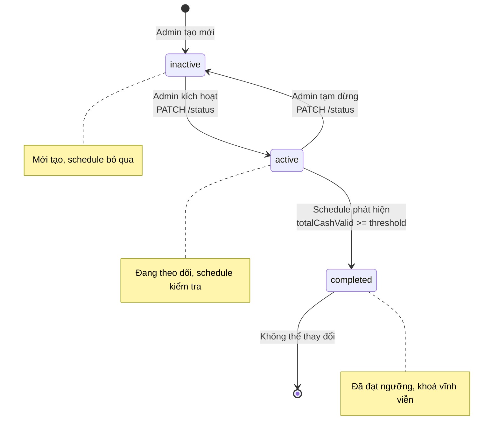

#### 3.5.4 Luồng Admin CRUD

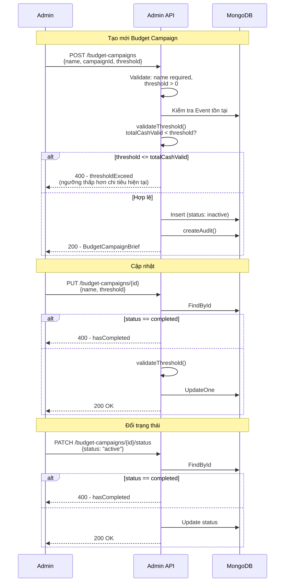

#### 3.5.5 Luồng Schedule kiểm tra ngưỡng

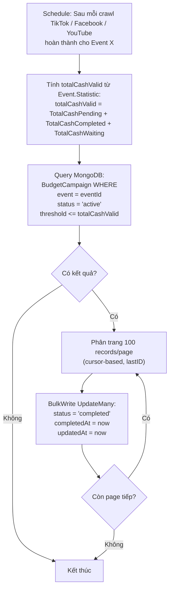

#### 3.5.6 Use Cases

| UC | Actor | Mô tả | Kết quả |
|---|---|---|---|
| UC-5.1 | Admin | Tạo mốc "50 triệu" cho Event A | BudgetCampaign (status: inactive) |
| UC-5.2 | Admin | Kích hoạt mốc "50 triệu" | status: active, schedule bắt đầu theo dõi |
| UC-5.3 | System | Event A chi tiêu đạt 60tr | Mốc "50 triệu" → completed, completedAt ghi nhận |
| UC-5.4 | Admin | Cố sửa mốc đã completed | Lỗi 400: hasCompleted |
| UC-5.5 | Admin | Tạo mốc threshold = 30tr nhưng Event đã chi 40tr | Lỗi 400: thresholdExceed |
| UC-5.6 | Admin | Tạo 3 mốc: 50tr, 100tr, 200tr | 3 BudgetCampaign riêng biệt, completed theo thứ tự |
| UC-5.7 | Admin | Tạm dừng mốc đang active | status: inactive, schedule bỏ qua |

#### 3.5.7 Admin API Endpoints

| Method | Endpoint | Mô tả |
|---|---|---|
| `POST` | `/budget-campaigns` | Tạo mốc ngân sách mới |
| `GET` | `/budget-campaigns` | Danh sách mốc (filter theo eventId, status) |
| `GET` | `/budget-campaigns/:id` | Chi tiết mốc |
| `PUT` | `/budget-campaigns/:id` | Cập nhật mốc (chỉ khi chưa completed) |
| `PATCH` | `/budget-campaigns/:id/status` | Đổi trạng thái (inactive ↔ active) |

#### 3.5.8 Error Codes

| Code | Constant | Mô tả |
|---|---|---|
| 1801 | `BudgetCampaignKeyCampaignIDIsRequired` | campaignId bắt buộc |
| 1802 | `BudgetCampaignKeyThresholdIsRequired` | threshold bắt buộc |
| 1804 | `BudgetCampaignKeyThresholdExceed` | ngưỡng thấp hơn chi tiêu hiện tại |
| 1805 | `BudgetCampaignKeyNotFound` | không tìm thấy budget campaign |
| 1806 | `BudgetCampaignKeyHasCompleted` | budget đã completed, không thể sửa |

---

## 4. Cấu trúc dữ liệu tổng hợp

### 4.1 Quan hệ dữ liệu

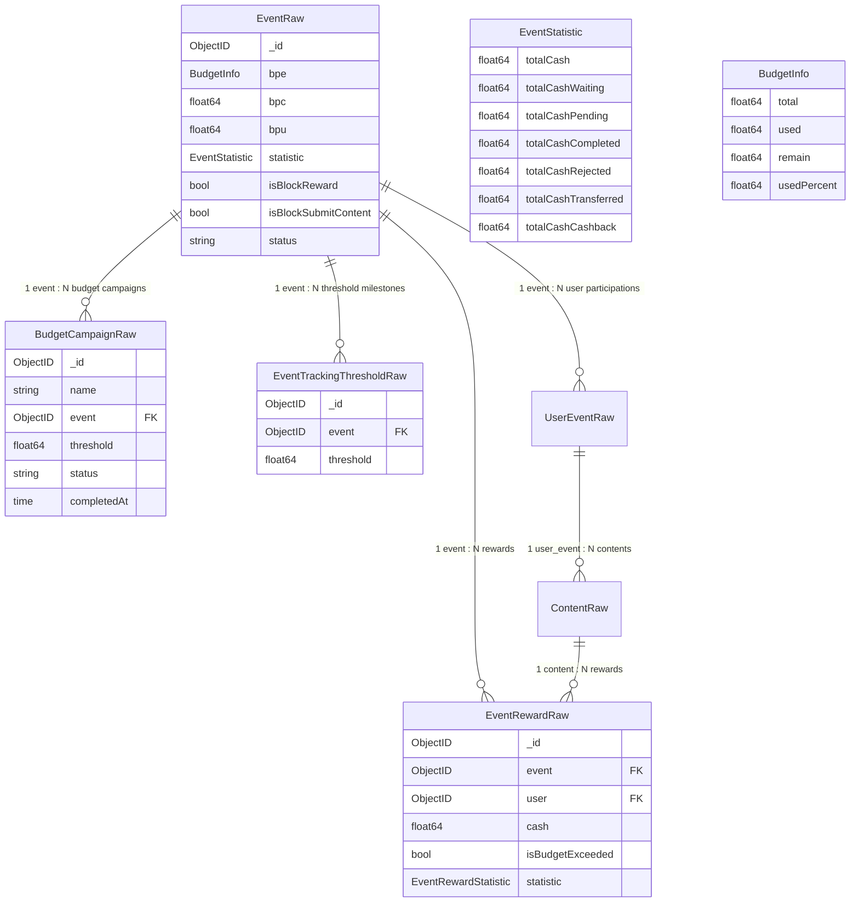

### 4.2 Công thức tính toán

| Giá trị | Công thức | Ý nghĩa |
|---|---|---|
| `totalCashValid` | `TotalCashPending + TotalCashCompleted + TotalCashWaiting` | Tổng chi tiêu hợp lệ (bỏ qua rejected, transferred, cashback) |
| `eventAvailable` | `Bpe.Total - totalCashValid` | Ngân sách Event còn lại |
| `userAvailable` | `Bpu - userCashValid` | Ngân sách User còn lại |
| `contentAvailable` | `Bpc - contentCashValid` | Ngân sách Content còn lại |
| `availableCash` | `min(event, user, content)` | Ngân sách khả dụng thực tế |
| `percentUsed` | `(totalCashValid / Bpe.Total) * 100` | Phần trăm sử dụng |

---

## 5. Luồng end-to-end

### 5.1 Kịch bản hoàn chỉnh

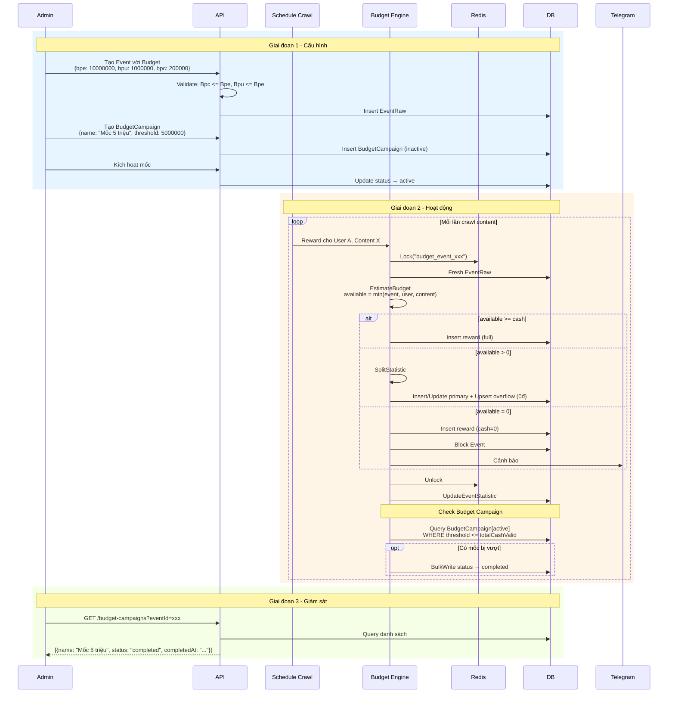

---

## 6. Các file cần triển khai

### 6.1 Files đã triển khai (branch `feature/budget`)

| File | Trạng thái | Mô tả |
|---|---|---|
| `internal/model/mg/event.go` | Hoàn thành | `BudgetInfo` struct, `Bpe`/`Bpc`/`Bpu` fields, `GetTotal()` method |
| `internal/service/event.go` | Hoàn thành | `EstimateBudget`, `WithBudgetLock`, `HandleBudgetExceeded`, `UpdateEventStatistic`, `CombineBudgetEstimates` |
| `internal/service/event_schema.go` | Hoàn thành | `buildBudgetAwareReward`, `splitStatistic`, overflow upsert logic |
| `internal/model/mg/event_tracking_threshold.go` | Hoàn thành | Model tracking milestone (75%, 95%, 100%) |
| `pkg/admin/handler/event.go` | Hoàn thành | Validation: Bpc/Bpu < Bpe, budget fields optional |
| `pkg/admin/handler/event_budget.go` | Hoàn thành | Dedicated budget update endpoint (`PUT /:id/budget`) |
| `pkg/admin/service/event.go` | Hoàn thành | Block budget change khi có reward, set Bpe/Bpc/Bpu trong create/update |
| `pkg/admin/model/request/event.go` | Hoàn thành | `Bpe`, `Bpc`, `Bpu` fields trong `EventUpsertBody` |
| `pkg/admin/model/response/event.go` | Hoàn thành | `Bpe *BudgetInfo`, `Bpc float64`, `Bpu float64` trong response |
| `internal/locale/event.go` | Hoàn thành | Error keys: `EventKeyBlockReward`, `EventKeyCannotChangeBudgetWithRewards`, `EventKeyBpcOrBpuMustBeLessThanBpe` |
| `internal/service/budget_split_test.go` | Hoàn thành | Unit tests cho `splitStatistic` |
| `admin/src/pages/event/components/overview.tsx` | Hoàn thành | Input Bpc, Bpu trong form tạo/sửa event |
| `admin/src/pages/event/detail/components/tabs/overview/index.tsx` | Hoàn thành | Hiển thị Bpe.Total trong overview detail |

### 6.2 Files cần triển khai thêm (Budget Campaign)

| File | Hành động | Mô tả |
|---|---|---|
| `internal/model/mg/budget_campaign.go` | Tạo mới | Model BudgetCampaignRaw |
| `internal/module/database/mongodb/dao/budget_campaign.go` | Tạo mới | DAO cho collection |
| `internal/module/database/mongodb/collection.go` | Sửa | Thêm collection name |
| `pkg/admin/model/request/budget_campaign.go` | Tạo mới | Request bodies (Create, Update, ChangeStatus) |
| `pkg/admin/model/response/budget_campaign.go` | Tạo mới | Response (Brief, Detail) |
| `pkg/admin/service/budget_campaign.go` | Tạo mới | CRUD service |
| `pkg/admin/handler/budget_campaign.go` | Tạo mới | HTTP handlers |
| `internal/service/budget.go` | Tạo mới | `CheckThresholdByEventID` |
| `pkg/public/service/schedule.go` | Sửa | Gọi `CheckThresholdByEventID` sau crawl |
| Router file | Sửa | Đăng ký routes `/budget-campaigns` |

---

## 7. Rủi ro và biện pháp giảm thiểu

| # | Rủi ro | Mức độ | Biện pháp |
|---|---|---|---|
| R1 | Race condition khi nhiều crawl đồng thời | Cao | Redis Distributed Lock với TTL 30s |
| R2 | Lock timeout → reward không được tạo | Trung bình | Crawl lần sau sẽ tạo lại (idempotent check qua rewardCheck) |
| R3 | Statistic chưa được cập nhật khi check budget | Trung bình | `WithBudgetLock` reload fresh EventRaw từ DB |
| R4 | Budget Campaign không có retry nếu BulkWrite lỗi | Thấp | Crawl lần sau sẽ check lại (query active + threshold <= totalCash) |
| R5 | ~~Overflow reward tạo nhiều record cash=0~~ | ~~Đã fix~~ | Overflow doc được upsert thay vì luôn tạo mới. Tìm doc cũ bằng filter (`isBudgetExceeded + _id != primary`), update nếu có, insert nếu chưa có |
| R6 | Admin tạo threshold quá nhiều mốc → query chậm | Thấp | Cursor-based pagination, chỉ query status = active |

---

## 8. Quyết định thiết kế

| # | Quyết định | Lý do |
|---|---|---|
| D1 | Dùng `min(event, user, content)` thay vì check tuần tự | Đơn giản, đảm bảo không vượt bất kỳ cấp nào |
| D2 | Split reward thay vì reject toàn bộ | Tối ưu trải nghiệm user, vẫn nhận được phần trong ngân sách |
| D3 | Thứ tự split: Milestone → Like → Comment → View | Milestone là giá trị cố định, view thay đổi nhiều nhất nên để cuối |
| D4 | `completed` là trạng thái cuối cùng (không thể revert) | Đảm bảo mỗi mốc chỉ được xử lý đúng 1 lần |
| D5 | Bỏ tính năng gửi email cảnh báo (Alert) | Đơn giản hoá, sử dụng Telegram thay thế cho cảnh báo realtime |
| D6 | `cashValid` bỏ qua Rejected, Transferred, Cashback | Chỉ tính tiền đang/sẽ chi, không tính tiền đã thu hồi |
| D7 | Dùng 3 field riêng biệt (Bpe/Bpc/Bpu) thay vì nested struct `EventBudget` | Linh hoạt hơn khi update từng field, Bpe dùng `*BudgetInfo` để track Used/Remain, Bpc/Bpu chỉ cần float64 đơn giản |
| D8 | Upsert overflow thay vì luôn InsertOne | Tránh tạo duplicate overflow doc mỗi lần crawl update reward |
| D9 | Chặn thay đổi budget khi đã có reward | Tránh mất đồng bộ giữa budget và reward đã tính, đảm bảo tính toàn vẹn dữ liệu |
| D10 | Budget fields optional, không bắt buộc nhập cùng lúc | Admin có thể chỉ giới hạn event-level mà không cần set per-user/per-content |

---

## 9. Thuật ngữ

| Thuật ngữ | Định nghĩa |
|---|---|
| **Event** | Thử thách / chương trình mà user tham gia để nhận thưởng |
| **Bpe** | Budget Per Event – Tổng ngân sách cho toàn bộ Event (`*BudgetInfo` với Total/Used/Remain/UsedPercent) |
| **Bpu** | Budget Per User – Ngân sách tối đa cho mỗi user trong Event (float64) |
| **Bpc** | Budget Per Content – Ngân sách tối đa cho mỗi content (float64) |
| **Reward** | Phần thưởng tính cho user dựa trên hiệu suất content |
| **Budget Split** | Cơ chế chia nhỏ reward khi ngân sách không đủ trả full |
| **Overflow Reward** | Phần reward vượt ngân sách (cash = 0, dùng để tracking) |
| **Budget Campaign** | Mốc theo dõi ngân sách do Admin tạo |
| **Threshold** | Ngưỡng (VND hoặc %) để trigger hành động |
| **cashValid** | Tổng chi tiêu hợp lệ = Pending + Completed + Waiting |
| **Budget Lock** | Redis Mutex lock để serialize budget operations |
