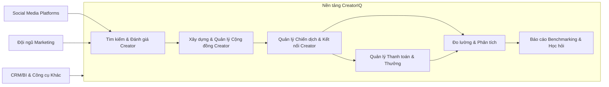

# Tóm tắt điều hành 

CreatorIQ là một nền tảng quản lý chiến dịch marketing qua người ảnh hưởng (influencer/creator marketing) hướng đến các thương hiệu và tổ chức quy mô lớn. Nền tảng này cung cấp hệ thống tổng thể để **tìm kiếm, lựa chọn, quản lý quan hệ, triển khai chiến dịch, thanh toán và đo lường hiệu quả** người ảnh hưởng. Người dùng chủ yếu là các tập đoàn toàn cầu và công ty lớn (trong các ngành hàng tiêu dùng, bán lẻ, công nghệ, du lịch, giải trí…) cũng như các agency marketing【1†L65-L73】【35†L75-L84】. CreatorIQ được thành lập năm 2014 bởi Igor Vaks và đã gọi vốn tổng cộng khoảng 90 triệu USD【6†L83-L87】. Công ty từng mua lại nền tảng phân tích influencer Tribe Dynamics (2021)【2†L61-L64】 và liên tục bổ sung đối tác (đối tác chính thức của TikTok Marketing từ 2022【5†L18-L20】). Hiện CreatorIQ có hơn 1.200 khách hàng toàn cầu và hơn 22.000 chiến dịch mỗi năm【3†L155-L163】【35†L81-L85】. 

Về sản phẩm, CreatorIQ cung cấp **hệ sinh thái đầy đủ các mô-đun**: từ tìm kiếm và đánh giá creator (Discovery, Evaluation), quản lý cộng đồng creator (Community Insights, CRM creator), tổ chức và theo dõi chiến dịch (Campaign Management), đến hệ thống thanh toán cho creator (Pay/Incentives) và công cụ phân tích báo cáo (Measurement, BenchmarkIQ, SafeIQ)【9†L17-L25】【22†L756-L763】. Nền tảng cho phép tích hợp dữ liệu creator với hệ thống nội bộ của doanh nghiệp (CRM, BI, kho dữ liệu…) thông qua API hai chiều (được gọi là ExchangeIQ)【41†L147-L156】【41†L149-L158】. CreatorIQ nhấn mạnh mức độ bảo mật và tuân thủ cao: tuân thủ GDPR/CCPA, mã hóa dữ liệu đầu cuối, chính sách quản lý truy cập nghiêm ngặt và đạt tỷ lệ uptime 99.9%【35†L153-L162】【35†L178-L186】.  

Về chi phí, CreatorIQ sử dụng **hợp đồng doanh nghiệp (enterprise)**, không công khai giá niêm yết. Các báo cáo bên ngoài ước tính chi phí thường vào khoảng **2.500 – 5.000 USD một tháng trở lên** (tương đương ~$30.000–60.000 USD/năm) với hợp đồng dài hạn【17†L115-L120】. Mức giá này cao hơn đáng kể so với các nền tảng nhỏ hơn như Upfluence hay Aspire (thường 2.000 USD/tháng trở lên)【17†L127-L130】【42†L770-L773】. Vì vậy, CreatorIQ chủ yếu nhắm tới **thương hiệu lớn, tổ chức toàn cầu** có ngân sách và nhu cầu phức tạp. Các công ty khác, đặc biệt doanh nghiệp vừa và nhỏ, thường cần cân nhắc chi phí khi lựa chọn CreatorIQ hoặc tìm giải pháp thay thế phù hợp. 

Về cạnh tranh, CreatorIQ thuộc nhóm giải pháp doanh nghiệp (mid-high enterprise) trong thị trường influencer marketing, cạnh tranh với Traackr (tập trung phân tích influencer ở quy mô toàn cầu), Upfluence, Aspire, GRIN… Mỗi nền tảng có điểm mạnh riêng: ví dụ, CreatorIQ nổi bật ở khả năng tích hợp mạnh, báo cáo chi tiết, hệ sinh thái quy mô; Upfluence/GRIN có thế mạnh về thương mại điện tử (Shopify/Amazon); Aspire hướng tới thương hiệu DTC và tích hợp Shopify; Traackr chuyên sâu phân tích mạng lưới creator và đo lường thương hiệu. Các so sánh trên G2 và báo cáo ngành cho thấy mức độ hài lòng chung cao cho cả CreatorIQ và các đối thủ (đều trên ~4.5/5), song CreatorIQ có lợi thế về tính năng phong phú và hỗ trợ doanh nghiệp toàn cầu【17†L75-L83】【22†L756-L763】, trong khi các điểm yếu thường là giá cao, giao diện phức tạp, hiệu năng tải dữ liệu thỉnh thoảng chậm【22†L764-L773】【12†L440-L449】. 

Các nghiên cứu điển hình (case study) do CreatorIQ công bố cho thấy nền tảng này đã giúp thương hiệu tăng đáng kể các chỉ số kinh doanh. Ví dụ, một nhà bán lẻ lớn đã nhân đôi doanh thu kỹ thuật số (2x digital revenue) nhờ tập trung tối ưu chiến lược creator marketing với CreatorIQ【26†L74-L82】. Thương hiệu mỹ phẩm L’Occitane đạt **EMV tăng hơn 900%** (Earned Media Value) trong một năm【31†L252-L260】. Thương hiệu BeautyStat (mỹ phẩm) cũng tăng EMV từ 257 nghìn USD lên 1,3 triệu USD chỉ trong 5 tháng (tăng ~406%)【34†L262-L270】. Những kết quả này phản ánh lợi ích khi sử dụng CreatorIQ để theo dõi và tối ưu liên tục chiến dịch influencer. Tuy nhiên, người dùng cũng phàn nàn về một số hạn chế như giao diện có độ phức tạp cao, tìm kiếm influencer đôi khi cho kết quả không phù hợp, và tốn thời gian xử lý dữ liệu lớn【22†L764-L773】【12†L440-L449】. 

Cuối cùng, xét đến thị trường Việt Nam, CreatorIQ có thể phù hợp với **các doanh nghiệp lớn, thương hiệu toàn cầu** hoặc các tập đoàn Việt có chiến lược đa kênh quốc tế. Các công ty vừa và nhỏ hoặc chiến dịch cục bộ có thể thấy chi phí cao và tính năng vượt quá nhu cầu. Doanh nghiệp Việt cần cân nhắc việc tích hợp CreatorIQ với hệ thống hiện có (CRM, BI nội địa), tuân thủ quy định bảo vệ dữ liệu cá nhân Việt Nam, và nghiên cứu liệu các mạng xã hội/chương trình influencer tại Việt (ví dụ TikTok Việt, nền tảng video trong nước) có được CreatorIQ hỗ trợ. Đề xuất chung là, đối với doanh nghiệp Việt Nam quy mô lớn, CreatorIQ có thể mang lại lợi ích mạnh mẽ nếu được triển khai bài bản (có đào tạo, tích hợp phù hợp, đo lường ROI rõ ràng), còn với doanh nghiệp nhỏ hơn, có thể xem xét giải pháp thay thế với chi phí thấp hơn. 

# 1. Giới thiệu công ty 

CreatorIQ được sáng lập năm 2014 bởi Igor Vaks (CEO)【6†L83-L87】, đặt trụ sở chính tại Los Angeles (Mỹ). Công ty đã gọi vốn qua nhiều vòng, tổng cộng khoảng **90 triệu USD** tính đến 2021【6†L83-L87】【2†L61-L64】. Ngoài ra, CreatoriQ đã thực hiện một số thương vụ mua lại để mở rộng khả năng phân tích và hệ sinh thái; tiêu biểu là việc mua lại nền tảng phân tích influencer Tribe Dynamics (tháng 9/2021)【2†L61-L64】. Về nhân sự, Igor Vaks vẫn giữ vai trò người sáng lập (board member), trong khi CEO hiện tại (2024) là Chris Harrington – cựu lãnh đạo Adobe/Omniture, được thuê vào năm 2024【3†L155-L163】. Jon Namnath (đồng sáng lập Tribe Dynamics) từng giữ vị trí Giám đốc Phát triển và Giám đốc điều hành tạm quyền【3†L155-L163】. 

CreatorIQ đã mở rộng nhanh chóng, hiện tự hào có hơn **1.200 thương hiệu và agency toàn cầu** sử dụng nền tảng【3†L155-L163】. Các khách hàng lớn bao gồm tập đoàn tiêu dùng (Consumer Packaged Goods) và bán lẻ đa quốc gia như *Unilever, Nestlé, CVS, Sephora, Wella*, cùng các thương hiệu nổi tiếng *Airbnb, Disney, Calvin Klein, AB InBev, H&M*【1†L65-L73】【35†L81-L90】. Công ty cũng phục vụ nhiều agency quảng cáo/marketing hàng đầu như Dentsu, Burson-Marsteller,…【35†L81-L90】. Triển vọng phát triển được minh chứng qua các vòng gọi vốn: đầu năm 2021 công ty huy động thêm 40 triệu USD từ các nhà đầu tư cũ (TVC, Kayne Private 등)【6†L83-L87】， nâng tổng vốn lên ~80 triệu. Sang 9/2021 CreatorIQ tiếp tục huy động thêm, nâng tổng vốn lên ~90 triệu USD【2†L61-L64】. 

Song song với tăng trưởng khách hàng, CreatorIQ mở rộng quy mô nhân lực và địa lý. Báo chí quốc tế cho biết công ty có khoảng 250 nhân viên trên toàn cầu (năm 2021)【2†L61-L64】, và có văn phòng ở các thành phố lớn: London, Washington D.C., Vancouver, Chicago, Sydney, Delhi, Kharkiv, HCM…【6†L83-L88】. Vào tháng 1/2022, CreatorIQ được TikTok chọn làm “Marketing Partner chính thức” (giải pháp SaaS kết nối với Creator Marketplace của TikTok)【5†L18-L20】, cho thấy mức độ hợp tác cao với nền tảng mạng xã hội hiện đại. 

Tóm lại, **lịch sử phát triển** của CreatorIQ là từ một startup VC cấp cao trở thành nền tảng influencer toàn cầu: niêm yết hoạt động từ 2014, huy động các vòng vốn hàng chục triệu USD, mở rộng bằng mua lại công ty đối thủ (Tribe Dynamics) và liên kết chiến lược (TikTok), dưới sự điều hành của ban lãnh đạo dày dặn kinh nghiệm. Công ty hiện chiếm thị phần đáng kể tại phân khúc cao cấp của thị trường influencer marketing.

# 2. Tổng quan sản phẩm 

**2.1. Kiến trúc và chức năng chính.** CreatorIQ được thiết kế như một hệ thống toàn diện (all-in-one platform) cho mọi giai đoạn của chiến dịch creator marketing. Dưới đây là các mô-đun/cụm tính năng chính (có thể minh họa bằng sơ đồ dòng chảy):

- **Tìm kiếm & Đánh giá (Discovery/Evaluation):** CreatorIQ lưu trữ hàng chục triệu hồ sơ người sáng tạo (bao gồm influencer, KOL) trên các nền tảng lớn (Instagram, YouTube, TikTok, Facebook, Pinterest…)【22†L764-L773】. Hệ thống cung cấp công cụ lọc và đề xuất bằng AI để tìm ra những creator phù hợp với chiến dịch (theo chỉ số nhân khẩu học, hoạt động xã hội, liên kết với thương hiệu, v.v.). Nội dung người sáng tạo được phân tích theo nhiều khía cạnh (độ tương tác, chất lượng content, mức độ phù hợp thương hiệu).  

- **Quản lý quan hệ & Cộng đồng (Relationship/CRM):** Sau khi tuyển chọn, CreatorIQ cung cấp “mạng lưới cộng đồng” và công cụ CRM để tổ chức, theo dõi tương tác với nhóm creator đã chọn. Người dùng có thể phân loại creator thành các danh sách, gán người phụ trách, lưu ghi chú, xem lịch sử giao tiếp và nội dung đã đăng. Các tính năng này giúp duy trì mối quan hệ lâu dài với creator chứ không chỉ thực hiện chiến dịch một lần.

- **Quản lý chiến dịch (Campaign Management):** Mỗi chiến dịch influencer có thể được tạo và theo dõi trong hệ thống. CreatorIQ cho phép gửi “brief” (hướng dẫn), phê duyệt ý tưởng và nội dung từ creator (các bản mẫu trước khi đăng), tự động theo dõi lượt tương tác thực tế. Tích hợp trực tiếp với API mạng xã hội giúp “đánh dấu” (tag) chiến dịch trong bài đăng và tự động thu thập số liệu tương tác thời gian thực. Tính năng lập workflow đảm bảo mọi bước (từ lựa chọn đến đăng bài) được lưu lại và báo cáo, tạo thành quy trình có thể tái sử dụng cho các chiến dịch sau.

- **Thanh toán & Thưởng (Payments/Incentives):** CreatorIQ Pay là mô-đun giúp thanh toán an toàn cho creator theo nhiều phương thức (chuyển khoản quốc tế, thẻ quà tặng, mã affiliate, v.v.) và đảm bảo tuân thủ quy định thuế/TNCN. Hệ thống có tích hợp chuẩn PCI để bảo mật thông tin thanh toán【35†L200-L209】. Nhiều công ty cho biết CreatorIQ giúp tự động hoá quy trình chi trả, giảm sai sót và tiết kiệm thời gian【12†L477-L481】.

- **Phân tích & Báo cáo (Analytics/Measurement):** CreatorIQ thu thập và tổng hợp dữ liệu chiến dịch vào dashboard báo cáo. Người dùng có thể xem số lượt xem, tương tác, giá trị Earned Media Value (EMV), và so sánh với KPI ban đầu. Module **BenchmarkIQ** cho phép so sánh hiệu quả với đối thủ cạnh tranh trong ngành, còn **SafeIQ** đảm bảo giám sát nội dung về tính an toàn thương hiệu (loại bỏ rủi ro nhạy cảm)【10†L4-L6】【22†L766-L773】. Các báo cáo này giúp đội ngũ marketing hiểu chiến dịch nào hiệu quả nhất và học hỏi cho tương lai.  

- **Tích hợp & API (Integrations/API):** CreatorIQ có API (gọi chung là ExchangeIQ) để đồng bộ hoá dữ liệu với các hệ thống nội bộ hoặc công cụ phân tích bên ngoài【41†L149-L158】. Ví dụ, doanh nghiệp có thể đẩy kết quả chiến dịch vào CRM hoặc công cụ Business Intelligence để tính toán ROI tổng thể hoặc kết hợp số liệu bán hàng. CreatorIQ cũng tích hợp sẵn với các nền tảng phổ biến (Shopify, Google Analytics, Dentsu Sprinklr,…), tạo thành một hệ sinh thái gắn kết nhằm loại bỏ silo dữ liệu【41†L114-L122】【41†L149-L158】.

**2.2. Tóm tắt tính năng cốt lõi:** Nói chung, CreatorIQ nhắm đến việc trở thành “hệ điều hành” cho marketing qua creator. Nền tảng giúp doanh nghiệp từ **tìm kiếm** creator tiềm năng, **xác minh** và lựa chọn, **mời hợp tác**, **theo dõi thực thi chiến dịch**, đến **đánh giá kết quả**. Các tính năng chính bao gồm:

- **Database lớn và AI**: Hỗ trợ lọc và đề xuất dựa trên dữ liệu xã hội và AI.
- **Workflow chuẩn hoá**: Các bước tác nghiệp (brief, phê duyệt, đăng bài, báo cáo) được tự động hoá và chuẩn hoá.
- **Tích hợp đầu cuối**: Hệ thống bao gồm cả tính năng thanh toán, theo dõi luật thuế và an toàn dữ liệu.
- **Báo cáo chuyên sâu**: Từ theo dõi chiến dịch cụ thể đến so sánh đa chiến dịch và đối thủ (benchmarking).
- **Chứng chỉ bảo mật & tuân thủ**: Đạt chuẩn ISO 27001, tuân thủ GDPR/CCPA, mã hoá dữ liệu toàn diện【35†L153-L162】【35†L178-L186】.  

# 3. Mô hình giá 

CreatorIQ không công khai bảng giá – đây là sản phẩm **hướng doanh nghiệp**, giá cả được đàm phán theo từng hợp đồng. Theo các ước tính bên thứ ba, **tầm giá tiêu chuẩn** của CreatorIQ là **khoảng 2.500–5.000 USD mỗi tháng** (hợp đồng một năm) cho các gói cơ bản, và có thể tăng lên tùy theo quy mô/chức năng nâng cao【17†L115-L120】. Ví dụ, một nguồn ước lượng cho biết giá khởi điểm rơi vào khoảng **35.000 USD/năm**【42†L663-L669】. Các báo cáo khác cũng cho rằng CreatorIQ thường đòi tối thiểu vài chục ngàn USD mỗi năm cho doanh nghiệp trung bình đến lớn【17†L115-L120】【42†L663-L669】. 

So sánh với các đối thủ:
- **Traackr**: cũng hướng doanh nghiệp toàn cầu, không công khai giá cụ thể. Một bài phân tích đề cập mức cam kết tối thiểu vào khoảng **25.000 USD/năm**【45†L389-L392】 (có thể cao hơn tùy qui mô).
- **Upfluence**: gói cơ bản thường bắt đầu ~**2.000 USD/tháng**【42†L770-L773】, cộng thêm 399 USD/tháng cho tính năng thanh toán (có thể tắt nếu chỉ tặng quà). Tổng ~24.000 USD/năm.
- **Aspire (AIM / AspireIQ)**: chủ yếu cho thương hiệu DTC và tích hợp Shopify. Giá bắt đầu khoảng **2.000 USD/tháng** trở lên, tương đương >24.000 USD/năm【17†L127-L130】.
- **GRIN**: gói cơ bản cũng bắt đầu ở mức **~2.200 USD/tháng**, có các bậc nâng cao lên đến >10.000 USD/tháng tùy số lượng creator quản lý【17†L121-L124】.
- **Các đối thủ nhỏ hơn (Klear, Julius, Heepsy...)** có giá thấp hơn nhưng cũng tương ứng ít tính năng hơn.  

Như vậy, CreatorIQ nằm ở phân khúc **cao cấp (enterprise)**, đắt hơn đáng kể so với các giải pháp nhắm vào doanh nghiệp nhỏ hoặc thương hiệu thương mại điện tử. Do đó, rào cản về giá là điểm cần lưu ý: doanh nghiệp Việt nhỏ/ vừa có thể thấy khó tiếp cận do chi phí. CreatorIQ không có gói dùng thử miễn phí và thường yêu cầu cam kết hợp đồng dài hạn (không có gói tháng linh hoạt)【22†L772-L774】. Trong báo cáo so sánh, điểm yếu của CreatorIQ cũng được nêu là “**Không có gói tháng linh hoạt**”【22†L772-L774】, phản ánh điều kiện hợp đồng cố định.

# 4. Đối tượng khách hàng và ngành nghề mục tiêu 

CreatorIQ tập trung vào các khách hàng doanh nghiệp lớn và tổ chức toàn cầu, đặc biệt là những ngành có chiến dịch quảng bá rộng rãi qua mạng xã hội và influencer. Dưới đây là các đối tượng/ ngành chính:  

- **Tập đoàn hàng tiêu dùng (CPG), Bán lẻ & Thời trang**: Các hãng mỹ phẩm, thời trang, thực phẩm, nước giải khát (ví dụ: L’Oréal, Unilever, Nestlé, L’Occitane…) có chương trình influencer marketing ở quy mô toàn cầu. CreatorIQ được sử dụng để quản lý nhất quán các chiến dịch tại nhiều khu vực khác nhau【28†L73-L82】.
- **Giải trí & Truyền thông**: Các studio phim, công ty game, truyền hình, đội thể thao… vốn sử dụng mạng xã hội để tiếp cận khán giả. Ví dụ, khách hàng của CreatorIQ bao gồm Disney, nhãn hiệu thể thao ESPN…【1†L65-L73】.
- **Du lịch & Lữ hành**: Các thương hiệu du lịch, hãng hàng không, khách sạn (ví dụ Airbnb) cũng cần quản lý đối tác influencer trên quy mô lớn.
- **Công nghệ & Phần mềm**: Các công ty công nghệ (như Google, Adobe, Logitech, Dell…) sử dụng influencer để truyền thông thương hiệu. Các bài phỏng vấn khách hàng cho thấy công ty công nghệ cũng ưu tiên “mối quan hệ lâu dài với creator” khi áp dụng CreatorIQ【28†L109-L118】.
- **Agencies và Agency Networks**: Nhiều agency quảng cáo và tiếp thị (đa quốc gia) sử dụng CreatorIQ để phục vụ khách hàng. Ví dụ, Dentsu, Burson-Marsteller… được nhắc đến trong tài liệu【35†L81-L90】. CreatorIQ cũng thích hợp cho công ty media buying kết hợp với marketing đa kênh.  

Tóm lại, **thị trường mục tiêu** của CreatorIQ là những công ty có chương trình influencer marketing phức tạp, đa vùng địa lý, yêu cầu quản lý tập trung và đo lường chuyên sâu. Nó ít phù hợp hơn với các nhóm nhỏ hoặc doanh nghiệp mới bắt đầu do chi phí và độ phức tạp của nền tảng. Cũng cần lưu ý rằng CreatorIQ có khả năng mở rộng toàn cầu (với nhiều văn phòng và hỗ trợ đa ngôn ngữ), nên các thương hiệu có tầm nhìn quốc tế sẽ có lợi thế lớn khi sử dụng nó.

# 5. Cạnh tranh trên thị trường 

CreatorIQ thuộc phân khúc **Enterprise Influencer Marketing Platform**. Ngoài các nền tảng đã đề cập (Traackr, Upfluence, Aspire, GRIN), còn có một số đối thủ khác như Klear, Julius, Creator.co, Impact, #paid, v.v. Tuy nhiên, để so sánh cơ bản, ta điểm qua các đối thủ chính:

| **Nền tảng**      | **Tính năng chính**                                                                                   | **Giá (tham khảo)**                                          | **Điểm mạnh**                                                             | **Điểm yếu**                                                           |
|-------------------|-------------------------------------------------------------------------------------------------------|--------------------------------------------------------------|---------------------------------------------------------------------------|------------------------------------------------------------------------|
| **CreatorIQ**     | Tìm kiếm/đánh giá creator; Quản lý quan hệ (CRM); Quản lý chiến dịch; Thanh toán creator; Phân tích & báo cáo (Benchmark, SafeIQ)【9†L17-L25】. | Doanh nghiệp, đàm phán riêng (khoảng 2.500–5.000 USD/tháng)【17†L115-L120】 | – Tính năng toàn diện, tích hợp sâu với mạng xã hội và hạ tầng marketing【22†L756-L763】; báo cáo phân tích mạnh; hệ thống thanh toán và compliance tốt.   – Đội ngũ hỗ trợ/sucess chuyên nghiệp. | – Chi phí cao; **khó sử dụng** cho người mới do giao diện phức tạp (đường cong học tập cao)【22†L769-L773】.   – Cơ sở dữ liệu creator ~20 triệu người còn nhỏ so với đối thủ lớn【22†L764-L772】, nên tìm kiếm đôi khi ra kết quả không phù hợp.   – Đôi khi chậm khi tải dữ liệu lớn【22†L769-L773】【12†L440-L449】. |
| **Traackr**       | Quản lý mạng lưới influencer (global influencer network); Phân tích sức mạnh influencer; Giám sát thương hiệu và benchmarking cạnh tranh. | Enterprise, theo báo giá riêng (ít nhất ~$25.000/năm【45†L389-L392】)                | – Chuyên sâu về phân tích mạng lưới influencer toàn cầu, đo lường ROI phức tạp; lập chỉ số KPI riêng (Reach, Resonance, Relevance).   – Thích hợp cho các thương hiệu coi trọng phân tích chiến lược, đo lường thương hiệu nâng cao. | – Giá rất cao, tối thiểu từng năm lớn.   – Giao diện thường phàn nàn khó dùng với người mới.   – Hạn chế khi triển khai cho chiến dịch đơn lẻ (tập trung phân tích chương trình dài hạn). |
| **Upfluence**     | Khám phá influencer với AI; CRM influencer; Quản lý chiến dịch + tự động outreach; Tích hợp Shopify/Amazon (affiliate); Phân tích chiến dịch. | Bắt đầu ~2.000 USD/tháng (24.000 USD/năm)【42†L770-L773】; có gói enterprise tùy chỉnh. | – Tích hợp mạnh với thương mại điện tử (Shopify, Amazon), hỗ trợ chương trình affiliate.   – Tìm kiếm influencer với nhiều tiêu chí (còn bao gồm phân tích xu hướng mạng xã hội).   – Quản lý chiến dịch tốt, có AI hỗ trợ outreach. | – Giao diện và tính năng phức tạp (một số đánh giá phàn nàn hệ thống ban đầu hơi rối)【42†L779-L784】.   – Giá vẫn cao so với SMB (mặc dù thấp hơn CreatorIQ).   – Phân tích chuyên sâu không bằng CreatorIQ/Traackr. |
| **Aspire (AIM)**  | Kết nối influencer qua công cụ integrated với Shopify; Quản lý chiến dịch, CRM; Phân tích cơ bản; Hỗ trợ agency. | Bắt đầu ~2.000 USD/tháng hoặc hơn【17†L127-L130】. | – Tích hợp tốt với kênh bán lẻ (Shopify) và thương mại điện tử, dễ dùng cho thương hiệu DTC.   – Giao diện thân thiện, dễ thiết lập.   – Có gói cài đặt nhanh, tập trung vào thương hiệu vừa. | – Ít tính năng nâng cao so với CreatorIQ (ví dụ báo cáo đối thủ hạn chế).   – Phù hợp SME hơn, không mạnh về phân tích chuyên sâu.   – Hạn chế về hỗ trợ đa thị trường (chủ yếu cho thương hiệu bán trực tuyến). |
| **GRIN**          | Quản lý chiến dịch influencer & affiliate; CRM influencer; Tích hợp Shopify; Thư viện content (UGC); Phân tích cơ bản. | Bắt đầu ~$2.200 USD/tháng, có mức cao hơn (tùy số lượng creator)【17†L121-L124】. | – Tốt cho nhãn hàng e-commerce (Shopify); quản lý quà tặng và affiliate tích hợp sẵn.   – Hỗ trợ cao cho content UGC, nhãn hiệu có content do người dùng tạo.   – Được đánh giá cao về quản lý chiến dịch cho ecommerce. | – Một số phàn nàn về lỗi kỹ thuật, độ ổn định chưa cao (theo G2)【17†L121-L124】.   – Không phù hợp với doanh nghiệp lớn có yêu cầu báo cáo đa kênh phức tạp.   – Ít số liệu phân tích so với CreatorIQ. |

*Lưu ý:* Trên đây là so sánh mang tính tổng quan. Thực tế mỗi nền tảng có nhiều cấp độ và tùy chọn bổ sung. Giá tham khảo lấy từ các nguồn phân tích độc lập【17†L115-L124】【42†L770-L773】 và có thể thay đổi theo từng thời điểm.

# 6. Nghiên cứu điển hình và khách hàng tiêu biểu 

Các case study do CreatorIQ công bố thường nhấn mạnh **kết quả định lượng** khi sử dụng nền tảng. Dưới đây là một số ví dụ tiêu biểu: 

- **Bán lẻ lớn – Tăng 2x doanh thu kỹ thuật số:** Một nhà bán lẻ toàn cầu (giấu tên) cho biết nhờ CreatorIQ, **hiệu suất chiến dịch tăng lên rõ rệt**, kết quả cuối cùng là **nhân đôi doanh thu digital** của họ【26†L74-L82】. Các vấn đề ban đầu của khách hàng gồm chọn đúng influencer, quản lý thanh toán, xây dựng chương trình truyền thông bán lẻ; CreatorIQ cung cấp giải pháp tập trung và tự động hoá, giúp họ làm việc hiệu quả hơn. Lời chứng thực: “Nếu CFO nói không dùng CreatorIQ, tôi sẽ phải tăng gấp đôi số nhân sự… Tôi không thể tưởng tượng điều đó có thể xảy ra” (Giám đốc Affiliate & Partner Marketing, trích dẫn【26†L89-L92】).

- **L’Occitane en Provence – Tăng EMV 900%:** L’Occitane (thương hiệu mỹ phẩm) phối hợp với agency GateMaker cho ra chiến dịch influencer trên CreatorIQ. Kết quả: **Earned Media Value (EMV) hàng năm tăng hơn 900%** so với năm trước【31†L252-L260】 (từ mức thấp lên trên ~70 triệu USD năm 2023 theo đồ thị). Cụ thể, cộng đồng influencer tăng 300% chỉ trong một năm【31†L252-L260】. Bà Lindsey Serfas (Marketing L’Occitane Mỹ) nhận xét CreatorIQ giúp “đo đạc chính xác hiệu suất nội dung” và giao diện dễ sử dụng【31†L243-L250】. Biểu đồ dưới minh hoạ sự bùng nổ EMV của L’Occitane:

【46†embed_image】 *Hình: Đồ thị tăng trưởng **Earned Media Value** (EMV) của L’Occitane en Provence từ 2021–2023. Chỉ số EMV tăng hơn 900% từ 2022 sang 2023【31†L252-L260】.*

- **BeautyStat (skincare) – Tăng EMV 406%:** Thương hiệu mỹ phẩm BeautyStat (Hoa Kỳ) tập trung vào chương trình quà tặng (gifting). Sau 5 tháng từ tháng 10/2023 đến 02/2024, họ tăng thứ hạng EMV trong ngành lên **135 bậc** và EMV tăng từ **257 nghìn USD lên 1,3 triệu USD**【34†L262-L270】. Tỷ lệ tương tác và duy trì creator cũng được cải thiện (retention ~79%). Quản lý Influencer của BeautyStat cho biết việc sử dụng CreatorIQ “phân tích một cách dữ liệu” đã giúp họ tăng trưởng nhanh chóng. Đồ thị dưới đây thể hiện mức tăng EMV:

【47†embed_image】 *Hình: Đồ thị tăng trưởng **EMV** của BeautyStat (8/2023–2/2024). EMV tăng từ $257k lên $1.3M trong 5 tháng【34†L262-L270】 (tăng ~406%).*

- **Công ty điện tử toàn cầu – Tập trung hoá dữ liệu:** Một công ty công nghệ thiết bị điện tử lớn (giấu tên) gặp khó khăn khi các nhóm marketing toàn cầu làm việc rời rạc. Với CreatorIQ, họ có “một nguồn dữ liệu duy nhất” để quản lý từ khâu tìm creator đến báo cáo cuối cùng【28†L121-L125】【28†L160-L168】. Trưởng bộ phận Creator Partnerships của công ty nhấn mạnh: “Quan trọng là phải có nền tảng tập trung làm một nguồn dữ liệu chung… nó giúp chúng tôi nhanh chóng ra quyết định.”【28†L121-L125】【28†L160-L168】. Nhóm này dùng CreatorIQ trong mọi bước và cho biết “đây là điều đầu tiên chúng tôi nhìn vào và cũng là điều cuối cùng” khi đánh giá chiến dịch【28†L160-L168】. 

Ngoài ra, CreatorIQ cung cấp nhiều case study khác (thời trang, game, phi lợi nhuận, v.v.). Các **khách hàng tiêu biểu** của CreatorIQ (ngoài những trường hợp trên) gồm: Unilever, Nestlé, CVS, Calvin Klein, Walt Disney, H&M, Airbnb…【1†L65-L73】【35†L81-L90】. Ứng dụng đa ngành này cho thấy CreatorIQ linh hoạt trong nhiều lĩnh vực, đặc biệt là FMCG, bán lẻ, chăm sóc sức khỏe, công nghệ và giải trí. Tuy nhiên, cần lưu ý rằng các case study được công bố thường do đội marketing của CreatorIQ quản lý, nên người dùng cần cân nhắc đánh giá song song với nguồn bên ngoài. 

# 7. Bảo mật dữ liệu và tuân thủ 

CreatorIQ đặt yếu tố **bảo mật và tuân thủ** làm trọng tâm. Trang “Trust” của công ty khẳng định họ cung cấp tiêu chuẩn cao nhất về bảo mật, quyền riêng tư và tuân thủ cho hơn 1.200 thương hiệu lớn【35†L73-L81】. Một số điểm chính về dữ liệu: 

- **Chính sách bảo mật:** CreatorIQ tuân thủ **GDPR (EU)** và **CCPA (California)** cho dữ liệu cá nhân【35†L153-L161】. Họ phân loại rõ ràng giữa dữ liệu công khai (public data về creator) và dữ liệu riêng tư (PII) của khách hàng, mã hoá tất cả dữ liệu lưu trữ và truyền tải【35†L153-L161】. Tất cả dữ liệu người dùng (như profile creator, thông tin chiến dịch, doanh thu liên quan) được mã hoá cả khi truyền và khi lưu trữ【35†L165-L174】.  

- **Tuân thủ pháp lý và ISO:** Hãng đạt chứng chỉ **ISO 27001** (cấu trúc bảo mật thông tin chuẩn quốc tế) và có chính sách quản trị nội bộ chặt chẽ. CreatorIQ tiến hành kiểm tra xâm nhập mạng định kỳ và quét lỗ hổng hàng ngày【35†L165-L174】. Tính năng **Governance** của nền tảng cũng yêu cầu phân quyền người dùng chi tiết, xác thực đa yếu tố (2FA) và SAML SSO nếu cần【35†L188-L196】. Uptime được cam kết 99.9% với hệ thống dự phòng và backup hàng ngày【35†L178-L186】. 

- **An toàn thương hiệu (Brand Safety):** CreatorIQ cung cấp các công cụ giám sát an toàn thương hiệu (SafeIQ) để lọc nội dung và creator không phù hợp. Nền tảng mã hoá kênh giao tiếp giữa thương hiệu và creator, bảo vệ thông tin nhạy cảm (briefs, hợp đồng, thanh toán)【35†L200-L209】. Họ cũng áp dụng AI để đánh giá độ phù hợp của content với giá trị thương hiệu. Ngoài ra, quy trình thanh toán qua CreatorIQ Pay tuân thủ PCI DSS, đảm bảo an toàn tài chính cho creator và thương hiệu. 

Tóm lại, CreatorIQ đáp ứng nhiều yêu cầu an ninh và bảo vệ dữ liệu hiện hành (GDPR/CCPA, ISO, PCI). Tuy nhiên, doanh nghiệp Việt Nam cần tự đánh giá về yêu cầu pháp lý trong nước: hiện nay Việt Nam đã có luật về an ninh mạng, và dự kiến ban hành luật bảo vệ dữ liệu cá nhân. Khi triển khai CreatorIQ tại Việt Nam, cần cân nhắc việc tuân thủ các quy định nội địa (ví dụ lưu trữ dữ liệu trong lãnh thổ nếu luật yêu cầu) và chính sách chia sẻ dữ liệu cá nhân với bên thứ ba. Không có thông tin công khai về khả năng hỗ trợ của CreatorIQ đối với các quy định này, nên doanh nghiệp nên làm việc trực tiếp với đội ngũ CreatorIQ để hiểu rõ. 

# 8. Hạn chế nền tảng và phản hồi người dùng 

Mặc dù nhận được đánh giá cao về tính năng và hỗ trợ khách hàng, CreatorIQ cũng gặp phải một số **phản hồi tiêu cực** từ người dùng hiện tại, chủ yếu qua các trang đánh giá như G2 và Capterra. Các **hạn chế, than phiền thường gặp** bao gồm: 

- **Giao diện phức tạp, khó học:** Nhiều người dùng mới nhận xét CreatorIQ “đường cong học tập cao”【22†L769-L773】. Giao diện với nhiều menu và chức năng có thể gây choáng khi lần đầu sử dụng. Một số ý kiến cho rằng thao tác bulk (chọn nhiều creator) đôi khi hoạt động không trơn tru, hoặc việc xuất báo cáo phức tạp. So với các nền tảng nhỏ hơn (ví dụ Aspire), CreatorIQ đôi khi thiếu sự trực quan và đơn giản cho người ít kinh nghiệm.
- **Hiệu năng – Cập nhật dữ liệu chậm:** Có nhiều ý kiến cho biết dữ liệu (ví dụ số liệu tương tác bài đăng) không được cập nhật tức thì. Một khách hàng phàn nàn rằng “nền tảng chậm, mất tới 24 giờ mới có toàn bộ số liệu”【12†L438-L447】. Việc này gây khó khăn khi cần báo cáo kịp thời cho khách hàng. Tình trạng đôi khi hệ thống bị treo, xử lý hàng loạt (bulk actions) lâu… cũng được nhắc đến.
- **Công cụ tìm kiếm creator chưa tối ưu:** Mặc dù CreatorIQ có cơ sở dữ liệu lớn, một số đánh giá cho rằng kết quả tìm kiếm “không chính xác” hoặc không có nhiều creator ở các ngách cụ thể. Capterra nhận xét “Khám phá influencer không tốt bằng các nền tảng khác”【15†L933-L938】. Điều này có thể do chất lượng dữ liệu hoặc bộ lọc chưa phù hợp với từng ngữ cảnh.
- **Xử lý thanh toán – thiếu thông báo lỗi:** Một vài user báo cáo lỗi khi thanh toán cho creator nhưng không nhận được thông báo (ví dụ: “thanh toán bị lỗi mà tôi không biết”【12†L477-L481】). Mặc dù CreatorIQ Pay tự động hóa quy trình, nhưng nếu có lỗi, thông báo chưa rõ ràng với người dùng. (Đa phần người dùng khác đều khen tính năng thanh toán thuận tiện).
- **Hỗ trợ khách hàng:** Đa số đánh giá nhấn mạnh đội ngũ CS/success của CreatorIQ tốt và nhanh nhạy【12†L803-L813】, nhưng cũng có ít ý kiến phản ánh về việc **hợp đồng và chính sách**. Ví dụ, một phản hồi trên Capterra cho rằng công ty thay đổi quyết định về hợp đồng mà không giải thích rõ ràng (nhưng đó là trường hợp cá biệt và chủ yếu liên quan khâu sales/hợp đồng【15†L807-L815】). 

Nhìn chung, **điểm mạnh** của CreatorIQ theo đánh giá người dùng là khả năng **tích hợp toàn diện và phân tích mạnh** (nhiều người nhận xét “CreatorIQ là nền tảng chính cho cả chiến dịch và báo cáo”【13†L685-L693】) và **hỗ trợ khách hàng tốt**【12†L803-L813】. **Điểm yếu** nổi bật nhất là **chi phí** và **độ phức tạp của hệ thống**. Một báo cáo so sánh nhận xét rằng CreatorIQ có mặt mạnh ở tích hợp, nhưng “chi phí đắt và tốn thời gian onboarding” (đặc biệt nếu khách hàng nhỏ)【42†L763-L772】. Một phân tích khác lưu ý CreatorIQ không có gói trả theo tháng và là “miễn phí cho doanh nghiệp vừa và nhỏ”【22†L772-L774】 (ngụ ý chi phí ngưỡng lớn). 

Kết luận, doanh nghiệp khi xem xét CreatorIQ cần đánh giá kỹ về yêu cầu về đội ngũ sử dụng: nếu có nguồn lực kỹ thuật và marketing bài bản (kể cả hỗ trợ từ team CIQ), nền tảng sẽ đem lại giá trị lớn. Còn nếu nguồn lực hạn chế, họ nên lường trước khâu đào tạo và có thể cân nhắc giải pháp thay thế nhẹ nhàng hơn cho giai đoạn đầu.

# 9. Triển khai và đo lường hiệu quả

**Triển khai (Onboarding)**: Do tính toàn diện, khâu triển khai CreatorIQ thường yêu cầu **hợp tác chặt chẽ** giữa đội ngũ CreatorIQ và khách hàng. Công ty cung cấp chuyên viên CS (Customer Success) hướng dẫn, lên kế hoạch đào tạo (training) cho đội marketing và IT nội bộ. Theo một số báo cáo, việc triển khai có thể kéo dài vài tuần đến vài tháng (4–6 tuần không phải hiếm) để đồng bộ dữ liệu lịch sử và thiết lập quy trình【42†L749-L752】. Do đó, doanh nghiệp cần tính toán chi phí thời gian và nhân lực liên quan. Để tối ưu, họ thường tạo “nguồn dữ liệu kế thừa” (import historical data) ngay từ đầu【41†L128-L138】 và đặt KPI rõ ràng (ví dụ số lượng creator, EMV, ROI).

**Tích hợp (Integration)**: CreatorIQ tích hợp với nhiều hệ thống thông tin bên trong doanh nghiệp. Quan trọng nhất là tích hợp dữ liệu từ kênh xã hội (Facebook, TikTok, YouTube qua API) vào CreatorIQ, đồng thời đẩy kết quả (analytics, EMV, chi tiêu) về CRM hoặc BI. Tính năng ExchangeIQ hỗ trợ đồng bộ hai chiều: nhập số liệu cũ và xuất báo cáo tổng hợp ra CSV, Google Sheets hay BI tools【41†L128-L138】【41†L149-L158】. Việc tích hợp tốt sẽ giúp doanh nghiệp tránh việc “đứng giữa nhiều dashboard riêng lẻ” khi đo lường (vấn đề nhắc đến trong báo cáo phân tích【39†L131-L140】). Để đạt điều này, cần:
- **Đội IT/CNTT phối hợp:** Kết nối API và đảm bảo dữ liệu chạy ổn định. 
- **Chính sách dữ liệu:** Xác định rõ creator data nào được chia sẻ, ai có quyền truy cập, tuân thủ quy định.
- **Tích hợp giao diện người dùng (UI):** Nếu cần, đồng bộ CreatorIQ vào portal nội bộ để các bên liên quan (PM, PR, agency) có thể truy cập.

**Đào tạo (Training)**: Do tính năng đa dạng, doanh nghiệp nên đào tạo chuyên sâu cho nhóm marketing và cả bộ phận kế toán (thanh toán). CreatorIQ thường tổ chức hướng dẫn sử dụng từng module (Discovery, Campaign, Analytics), giúp người dùng hiểu quy trình. Một số doanh nghiệp đánh giá cao đội support của CreatorIQ, sẵn sàng tư vấn chiến lược và hỗ trợ triển khai【12†L803-L813】.

**Đo lường ROI:** CreatorIQ hỗ trợ đo lường nhiều chỉ số ROI của influencer marketing, ví dụ:
- **EMV (Earned Media Value):** Giá trị ước tính của lượt tiếp cận/engagement thương hiệu kiếm được qua creator. Nhiều case study sử dụng EMV để báo cáo (như L’Occitane, BeautyStat)【31†L252-L260】【34†L262-L270】.
- **SMM (Shared Media Metric) hay Affiliate:** Tổng doanh thu/giao dịch từ chiến dịch (đặc biệt khi tích hợp affiliate/Shopify).
- **KPIs thuê bao, traffic, nhận biết:** Kết hợp số liệu từ nền tảng khác (Google Analytics, social ads).
CreatorIQ cho phép kết hợp các dữ liệu này và tạo báo cáo tổng hợp. Doanh nghiệp cần xác định metric ban đầu rõ ràng và so sánh sau chiến dịch (ví dụ “tăng bao nhiêu % followers”, “bao nhiêu đơn hàng đến từ affiliate” vs yêu cầu ban đầu).

**Các chỉ số ROI thông dụng:** Ngoài EMV, có khái niệm **SMV (Shared Media Value)** hay **MAV (Media Amplification Value)** mà CreatorIQ đề xuất tính theo giá trị tổ chức trả cho nội dung nếu tính theo CPM/PPC. (Hướng dẫn của CreatorIQ đề cập “tính ROI thông qua SMV của bài đăng”【38†L10-L13】). Thực tế, doanh nghiệp Việt nên đo cả KPI marketing (like, reach, awareness) và KPI kinh doanh (traffic, sales) để đánh giá đầy đủ.

Nói chung, để đạt ROI cao nhất từ CreatorIQ, doanh nghiệp cần:
- Lên kế hoạch chiến dịch rõ ràng (mục tiêu, ngân sách).
- Sử dụng đầy đủ các tính năng của hệ thống (kể cả brand safety, phân tích cạnh tranh).
- Luôn nhập dữ liệu đầy đủ (đặc biệt là chi phí, quà tặng) để báo cáo chính xác.
- Đào tạo nhân sự vận hành và phân tích báo cáo, tránh lãng phí dữ liệu.

# 10. Khả năng áp dụng tại thị trường Việt Nam và khuyến nghị

CreatorIQ là nền tảng toàn cầu mạnh mẽ, nhưng khi đưa vào môi trường Việt Nam, cần xem xét một số đặc điểm địa phương:

- **Quy mô thị trường:** Hầu hết doanh nghiệp Việt Nam (SMEs) có ngân sách nhỏ, nên **chi phí cao của CreatorIQ** là một trở ngại lớn. CreatorIQ phù hợp với các công ty lớn đã triển khai influencer marketing bài bản (như Vinamilk, FPT, Viettel, các tập đoàn đa quốc gia có chi nhánh tại VN) hơn là startup hay shop nhỏ. Một số công ty lớn Việt có thể cân nhắc dùng CreatorIQ để quản lý chiến dịch toàn cầu (nếu họ hợp tác với đối tác nước ngoài).
- **Địa phương hoá nền tảng:** CreatorIQ chủ yếu tập trung tích hợp với các mạng xã hội quốc tế (Facebook, TikTok toàn cầu, YouTube, Instagram). Tại Việt Nam, cần kiểm tra việc hỗ trợ các mạng xã hội địa phương hoặc ứng dụng phổ biến (như Zalo, TikTok Việt). Hiện chưa rõ CreatorIQ có khả năng quét dữ liệu TikTok theo khu vực hay chỉ thông qua TikTok Creator Marketplace (chưa mở rộng cho creator Việt?).
- **Hệ sinh thái thanh toán:**  CreatorIQ Pay hỗ trợ thanh toán quốc tế, nhưng doanh nghiệp VN cần xác minh liệu có hỗ trợ thanh toán qua ngân hàng nội địa hay bằng ví nội địa. Nếu khách hàng influencer chủ yếu ở VN, tính năng này có thể chưa tương thích (hiện tài liệu không nêu rõ hỗ trợ TPBank, Momo, v.v.). 
- **Luật pháp & tuân thủ:** CreatorIQ có tiêu chuẩn cao về GDPR/CCPA, nhưng Việt Nam có luật An ninh Mạng và đang xây dựng luật Dữ liệu cá nhân. DN VN phải đảm bảo việc lưu trữ dữ liệu tuân thủ quy định (có thể yêu cầu lưu tại máy chủ trong nước). CreatorIQ lưu trữ đám mây (AWS) toàn cầu nên cần kiểm tra mặt này. Ngoài ra, nếu DN thực hiện chiến dịch quảng cáo đa kênh, cần tuân thủ quy định quảng cáo và chi trả cho KOL (có thể liên quan đến thuế, giấy phép). 
- **Nguồn lực và culture:** Nhiều công ty VN quen quản lý influencer qua đơn vị agency hoặc bằng Excel, ít khi đo lường chuyên sâu. Việc áp dụng CreatorIQ đòi hỏi thay đổi văn hoá tổ chức: từ quản lý rời rạc sang hệ thống tập trung. Các công ty có bộ phận Digital Marketing hoặc Agency nước ngoài có thể thích nghi nhanh hơn.  

**Khuyến nghị:** 
- **Đánh giá chi phí – lợi ích:** DN nên so sánh CreatorIQ với nhu cầu thực tế. Nếu chiến dịch influencer ở tầm quốc gia hoặc APAC, CreatorIQ có thể cải thiện hiệu quả, nhưng phải chắc chắn lượng ngân sách đủ lớn (tương đương nhiều chục ngàn USD/năm). Doanh nghiệp nhỏ hơn có thể xem xét các giải pháp khác như Upfluence (có tích hợp Shopify), Aspire hoặc nền tảng thuần Việt (nếu có) để tiết kiệm chi phí.
- **Hợp tác với Agency/Đối tác có kinh nghiệm:** Nếu có kế hoạch dùng CreatorIQ, DN nên làm việc với agency hoặc chuyên gia đã có kinh nghiệm với nền tảng này, để triển khai hiệu quả và đào tạo nhanh. 
- **Triển khai thử nghiệm (pilot):** Có thể bắt đầu với một chiến dịch nhỏ hoặc một mảng (ví dụ influencer marketing cho một sản phẩm cụ thể), theo dõi EMV và KPI, trước khi mở rộng toàn diện. CreatorIQ cho phép import dữ liệu chiến dịch cũ, nên VN có thể tận dụng thông tin đã có để đánh giá hiệu quả thực tế.
- **Tăng cường tích hợp dữ liệu:** Để tận dụng tối đa CreatorIQ, DN VN nên chuẩn bị tích hợp CreatorIQ với hệ thống hiện tại (ví dụ ERP, CRM nội địa) nếu cần báo cáo kinh doanh chi tiết. Nếu không, ít nhất cũng tích hợp với Google Analytics để đo lường traffic/sales từ chiến dịch.
- **Đánh giá nhà cung cấp địa phương:** Thị trường Việt Nam có các công ty cung cấp giải pháp influencer marketing trong nước; DN cũng nên khảo sát xem có nền tảng nào thích hợp với ngôn ngữ, quy định VN hơn hay không. Ví dụ, một số agency ở VN phát triển công cụ nội bộ hoặc áp dụng CRM influencer riêng theo nhu cầu khách hàng.

Tóm lại, CreatorIQ mang lại giải pháp rất mạnh cho doanh nghiệp Việt Nam nếu đủ nguồn lực và nhu cầu toàn cầu. Với các DN lớn có chiến lược vươn ra thị trường quốc tế hoặc hợp tác với đối tác nước ngoài, CreatorIQ có thể nâng tầm chiến lược influencer. Với doanh nghiệp nhỏ và chiến dịch thuần Việt, nên cân nhắc kỹ về chi phí-hướng dẫn và có thể ưu tiên giải pháp thay thế phù hợp hơn. 

**Kết luận:** CreatorIQ là nền tảng đầu bảng cho quản lý chương trình influencer ở quy mô toàn cầu. Nó cung cấp mọi công cụ cần thiết để tổ chức, đo lường và tối ưu hóa hoạt động với người sáng tạo. Tuy nhiên, độ phức tạp và mức giá cao buộc doanh nghiệp phải có chiến lược dài hạn và đầu tư phù hợp. Trong bối cảnh Việt Nam, CreatorIQ rất phù hợp với các doanh nghiệp quy mô lớn và chiến dịch liên quốc gia; còn với doanh nghiệp nhỏ hơn, nên cân nhắc giải pháp vừa tầm hơn.

