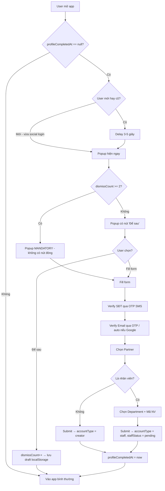
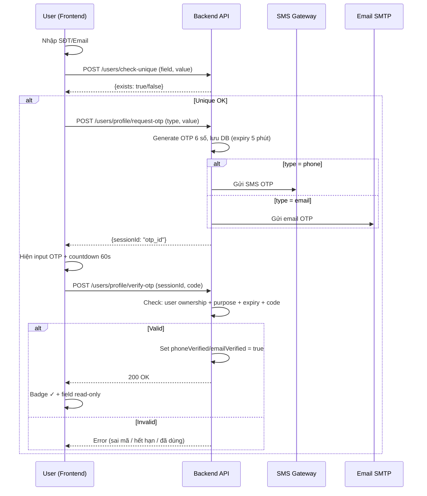
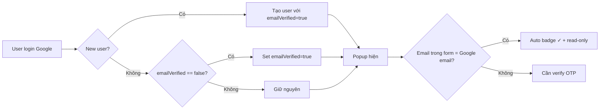
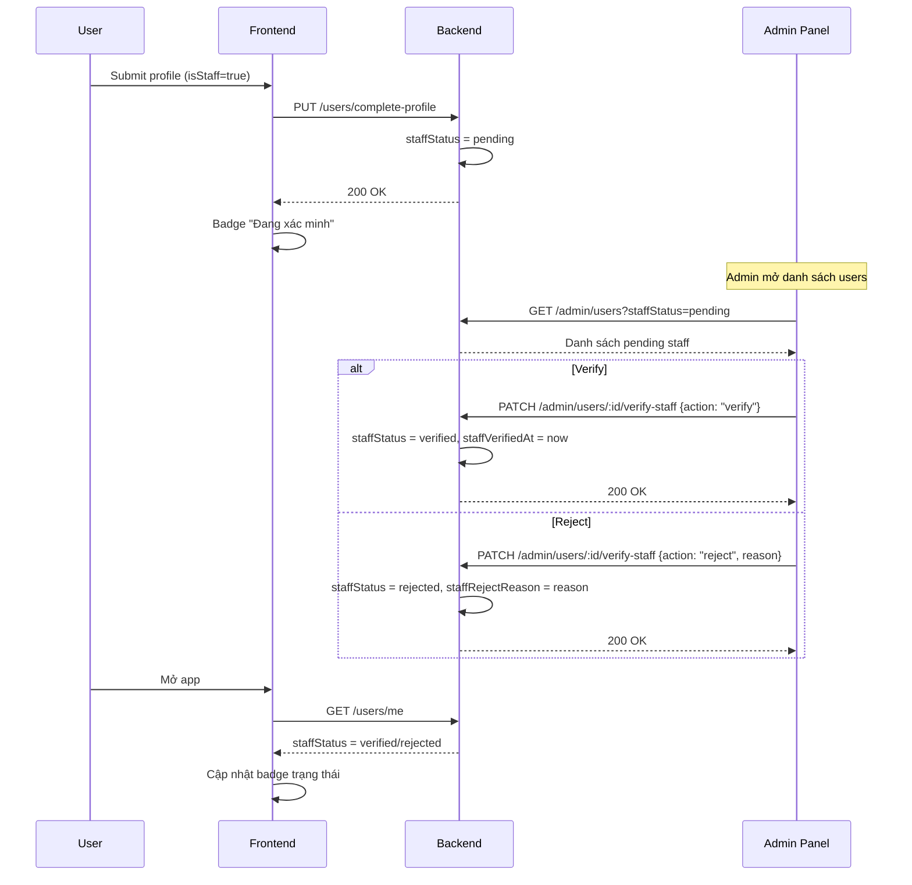
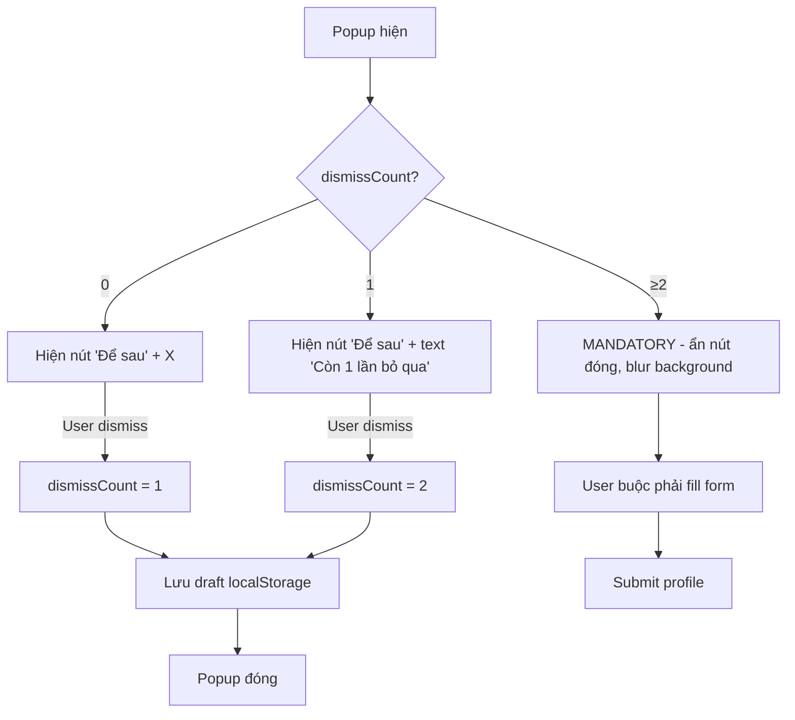
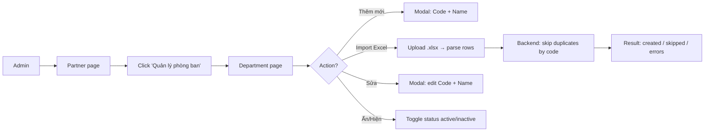

# PRD: Đăng ký và Phân nhóm Tài khoản — V1

**Project:** Gen-Green Registration & Account Grouping
**Date:** 2026-04-12
**Version:** 1.0
**Status:** Draft
**Demo:** `demo-gen-green` → `/dang-ky-phan-nhom`

---

## 1. Executive Summary

Thu thập đầy đủ thông tin profile cho tất cả creator Gen-Green (họ tên, SĐT, email) và phân loại tài khoản thành 2 nhóm: **CBNV** (cán bộ nhân viên Vin) và **Creator bên ngoài**. CBNV khai thêm nơi làm việc + mã nhân viên, admin verify async.

V1 tập trung vào **user tự khai + admin manual verify**. Chưa có employee registry hay import pipeline (xem V2).

---

## 1b. Flow Diagrams

### Luồng tổng quan — User Registration & Grouping

### Luồng OTP Verification (SĐT / Email)

### Luồng Google Email Auto-Verify

### Luồng Staff Verification (Admin)

### Luồng Progressive Urgency (Popup dismiss)

### Luồng Admin Department Management

---

## 2. Business Objectives

| # | Objective | Success Metric |
|---|-----------|----------------|
| 1 | Thu thập SĐT + email cho tất cả creator | >80% creator có đầy đủ SĐT + email trong 30 ngày |
| 2 | Phân loại CBNV vs bên ngoài | Admin filter được theo phân loại trên dashboard |
| 3 | Thu thập nơi làm việc cho CBNV | Admin filter được theo cơ sở (57 cơ sở, 6 nhóm) |
| 4 | Không ảnh hưởng conversion đăng ký | Tỷ lệ hoàn tất form > 70% |

---

## 3. User Personas

| Persona | Nhu cầu |
|---------|---------|
| **Creator (existing)** | Popup cập nhật không quá phiền, cho "Để sau" vài lần |
| **Creator (new)** | Đăng ký nhanh bằng social login, bổ sung thông tin sau |
| **CBNV** | Khai nơi làm việc + mã NV dễ dàng, dropdown tìm nhanh |
| **Admin** | Xem phân loại trên table, verify mã NV |

---

## 4. Functional Requirements

### EPIC-001: Popup cập nhật thông tin

#### FR-001: Trigger popup cho user cũ

**Priority:** Must Have

**Description:**
User đã có tài khoản, thiếu SĐT/email/phân loại → hiện popup "Cập nhật thông tin" khi mở app.

**Acceptance Criteria:**
- [ ] Popup hiện nếu `profile_completed_at` = null
- [ ] Delay 3-5 giây sau khi vào app (cho user thấy dashboard trước)
- [ ] Pre-fill data có sẵn (tên, email từ social login)

---

#### FR-002: Trigger popup cho user mới

**Priority:** Must Have

**Description:**
User đăng nhập bằng TikTok/Google lần đầu → tạo account → hiện popup ngay.

**Acceptance Criteria:**
- [ ] Popup hiện ngay sau social login thành công
- [ ] Pre-fill tên + email từ social login data
- [ ] User ignore → `profile_completed_at` vẫn null → lần sau = trigger popup

---

#### FR-003: Progressive urgency

**Priority:** Must Have

**Description:**
Popup cho phép "Để sau" 2 lần. Lần thứ 3 trở đi = mandatory (không có nút đóng).

**Acceptance Criteria:**
- [ ] Lần 1-2: có nút "Để sau" + nút X
- [ ] Lần 2: text "Còn 1 lần bỏ qua"
- [ ] Lần 3+: không có nút đóng, blur content phía sau
- [ ] `dismiss_count` persist qua sessions

---

### EPIC-002: Form profile

#### FR-004: Form bước 1 — Thông tin cơ bản

**Priority:** Must Have

**Description:**
Form thu thập: Họ tên, SĐT, Email (required cho tất cả), Toggle "Tôi là nhân viên". SĐT và Email cần verify trước khi submit.

**Acceptance Criteria:**
- [ ] Họ tên: text, required, pre-fill từ social
- [ ] SĐT: text, required, inline validate format (10 số, bắt đầu 0)
- [ ] Email: text, required, inline validate format, pre-fill từ social
- [ ] Toggle nhân viên: default OFF
- [ ] SĐT trùng user khác → inline error (check độc lập)
- [ ] Email trùng user khác → inline error (check độc lập)
- [ ] SĐT phải verify qua OTP trước submit (xem FR-004a)
- [ ] Email phải verify qua OTP trước submit (xem FR-004b)
- [ ] Nếu email = email từ Google login → auto-verified, không cần OTP
- [ ] Khi login bằng Google → email tự động verified ngay lúc login (không cần đợi popup)

---

#### FR-004a: Verify SĐT qua OTP

**Priority:** Must Have

**Description:**
User nhập SĐT → nhấn "Gửi mã" → nhận OTP qua SMS → nhập OTP → SĐT verified.

**Acceptance Criteria:**
- [ ] Nút "Gửi mã" bên cạnh field SĐT, chỉ active khi format hợp lệ + chưa verify
- [ ] Gửi OTP 6 số qua SMS đến SĐT đã nhập
- [ ] Hiện field nhập OTP bên dưới (4-6 số)
- [ ] OTP hợp lệ → SĐT marked verified (badge ✓ xanh)
- [ ] OTP sai → inline error "Mã OTP không đúng"
- [ ] OTP có hiệu lực 5 phút kể từ khi gửi
- [ ] Cooldown 60 giây giữa các lần gửi — hiện countdown "Gửi lại sau Xs"
- [ ] SĐT đã verify → field SĐT read-only + badge ✓, ẩn nút "Gửi mã"
- [ ] User sửa SĐT khi chưa verify → reset trạng thái verify

---

#### FR-004b: Verify Email qua OTP

**Priority:** Must Have

**Description:**
User nhập email → nhấn "Gửi mã" → nhận OTP qua email → nhập OTP → email verified. Nếu email trùng với email Google login → auto-verified.

**Acceptance Criteria:**
- [ ] Nếu email = email từ Google login → tự động verified, không cần OTP
- [ ] Login bằng Google → `email_verified = true` ngay lúc login (new user + existing user)
- [ ] Email auto-verified → hiện badge ✓ + read-only (không cho sửa)
- [ ] Email khác Google → nút "Gửi mã" bên cạnh
- [ ] Gửi OTP 6 số qua email
- [ ] Flow nhập OTP giống FR-004a
- [ ] OTP hợp lệ → email marked verified
- [ ] Email đã verify → field read-only + badge ✓, không cho update
- [ ] User sửa email khi chưa verify → reset trạng thái verify

---

#### FR-005: Form bước 2 — Thông tin nhân viên

**Priority:** Must Have

**Description:**
Khi toggle "Tôi là nhân viên" = ON → hiện 2 field: Nơi làm việc (searchable select, dynamic theo partner) + Mã nhân viên.

**Acceptance Criteria:**
- [ ] Slide animation khi toggle ON/OFF
- [ ] Nơi làm việc: searchable dropdown, departments dynamic từ API theo partner đã chọn
- [ ] Phải chọn partner trước khi chọn nơi làm việc
- [ ] Mã nhân viên: text, required khi toggle ON, min 3 ký tự
- [ ] Toggle OFF → clear employee fields

---

#### FR-006: Searchable select cho nơi làm việc

**Priority:** Must Have

**Description:**
Component dropdown searchable hiển thị danh sách departments (flat list) của partner. Data dynamic từ API `GET /departments?partnerId=xxx`. Mỗi department có `code` + `name`. Admin quản lý danh sách departments per partner (xem EPIC admin).

**Acceptance Criteria:**
- [ ] Hiển thị departments flat list `[{_id, code, name}]` từ API
- [ ] Search box filter theo code + tên department
- [ ] Click ngoài → đóng dropdown
- [ ] Hiển thị tên department khi đã chọn
- [ ] Loading state khi đang fetch từ API
- [ ] Disabled nếu chưa chọn partner

---

#### FR-007: Submit + lưu profile

**Priority:** Must Have

**Description:**
Submit form → validate → kiểm tra SĐT + email đã verify → lưu profile → set `profile_completed_at`.

**Acceptance Criteria:**
- [ ] Validate tất cả required fields trước submit
- [ ] **SĐT phải verified** trước khi submit → nếu chưa verify → error "Vui lòng xác minh số điện thoại"
- [ ] **Email phải verified** trước khi submit → nếu chưa verify → error "Vui lòng xác minh email"
- [ ] Lưu `account_type` = staff/creator
- [ ] Nếu staff → `staff_status` = "pending"
- [ ] Set `profile_completed_at` = now → popup không hiện nữa
- [ ] Nếu staff → hiển thị badge "Đang xác minh"

---

#### FR-008: Persist partial input

**Priority:** Should Have

**Description:**
User dismiss popup giữa chừng → lưu draft vào localStorage → restore khi popup mở lại.

**Acceptance Criteria:**
- [ ] Save draft on dismiss
- [ ] Restore draft khi popup reopen
- [ ] Clear draft sau submit thành công

---

### EPIC-003: Staff verification

#### FR-009: Admin verify mã nhân viên

**Priority:** Must Have

**Description:**
Admin xem danh sách user có `staff_status = pending`. Verify hoặc reject.

**Acceptance Criteria:**
- [ ] Admin thấy danh sách pending: tên, mã NV, nơi LV
- [ ] Nút Verify → `staff_status = verified`, `staff_verified_at = now`
- [ ] Nút Reject → `staff_status = rejected`
- [ ] Reject có thể kèm lý do (optional)

---

#### FR-010: Notification khi verify/reject

**Priority:** Should Have

**Description:**
User nhận thông báo khi admin verify hoặc reject mã NV.

**Acceptance Criteria:**
- [ ] Verified → "Mã nhân viên đã được xác minh ✓"
- [ ] Rejected → "Mã nhân viên không hợp lệ. Vui lòng kiểm tra lại"
- [ ] In-app notification + badge trên profile

---

#### FR-011: Chỉnh sửa profile sau submit

**Priority:** Should Have

**Description:**
User vào Settings sửa được thông tin. Email/SĐT đã verified → read-only. Đổi nơi LV / mã NV → reset `staff_status` → pending.

**Acceptance Criteria:**
- [ ] Settings page hiển thị profile hiện tại
- [ ] Editable: tên, toggle nhân viên, nơi LV, mã NV
- [ ] **Email đã verified → read-only** + badge ✓, không cho sửa
- [ ] **SĐT đã verified → read-only** + badge ✓, không cho sửa
- [ ] Đổi nơi LV hoặc mã NV → reset staff_status = pending
- [ ] Nếu SĐT/email chưa verified (edge case) → cho sửa + yêu cầu verify lại

---

## 5. Non-Functional Requirements

### NFR-001: Performance — Popup load

**Priority:** Must Have

Popup render < 200ms. Grouped dropdown mở < 100ms (departments load khi chọn partner, cache trong state).

### NFR-002: Mobile UX

**Priority:** Must Have

Popup = full-screen bottom sheet trên mobile. Grouped dropdown scrollable. Keyboard không che input fields.

### NFR-003: Data validation

**Priority:** Must Have

SĐT: regex `^0\d{9}$`. Email: basic format check. Mã NV: min 3 ký tự. Tất cả validate inline on blur.

### NFR-004: Unique constraint

**Priority:** Must Have

SĐT và email phải unique **độc lập** trên toàn hệ thống — check từng field riêng, không phải cặp. Check realtime khi user blur field (debounce 500ms). Nếu SĐT đã tồn tại ở user khác → inline error. Nếu email đã tồn tại ở user khác → inline error.

---

## 6. Data Model

### 6.1 User (mở rộng)

| Field | Type | Description |
|-------|------|-------------|
| `profile_completed_at` | datetime, nullable | Null = popup hiện |
| `dismiss_count` | int, default 0 | Số lần dismiss |
| `account_type` | `creator` \| `staff` | Phân nhóm |
| `regist_partner` | ObjectID, ref Partner | Partner user chọn khi đăng ký |
| `department` | ObjectID, ref Department, nullable | Nơi làm việc (CBNV) |
| `department_name` | string, nullable | Denormalized tên department |
| `employee_code` | string, nullable | Mã nhân viên |
| `staff_status` | `pending` \| `verified` \| `rejected`, nullable | Trạng thái xác minh NV |
| `staff_verified_at` | datetime, nullable | Thời điểm verify NV |
| `phone_verified` | bool, default false | SĐT đã verify chưa |
| `phone_verified_at` | datetime, nullable | Thời điểm verify SĐT |
| `email_verified` | bool, default false | Email đã verify chưa |
| `email_verified_at` | datetime, nullable | Thời điểm verify email |

### 6.2 Department (mới)

| Field | Type | Description |
|-------|------|-------------|
| `_id` | ObjectID | Primary key |
| `partner` | ObjectID, ref Partner | Thuộc partner nào |
| `code` | string, unique per partner | Mã định danh department |
| `name` | string | Tên cơ sở / phòng ban |
| `status` | `active` \| `inactive` | Trạng thái |
| `created_at` | datetime | Ngày tạo |
| `updated_at` | datetime | Ngày cập nhật |

**Lưu ý:** Existing `Phone.Verified` + `UserSocialLoginEmail.Verified` đã có trong user model. Registration verify tách biệt, dùng field mới `phone_verified` / `email_verified`.

---

## 7. Epics & Traceability

| Epic | FRs | Stories (est.) | Priority |
|------|-----|----------------|----------|
| EPIC-001: Popup trigger | FR-001 → FR-003 | 3-4 | Must Have |
| EPIC-002: Form profile + verify | FR-004 → FR-008 (incl. FR-004a, FR-004b) | 7-9 | Must Have |
| EPIC-003: Staff verification | FR-009 → FR-011 | 3-4 | Must Have |

**Tổng:** 3 epics · 13 FRs · 4 NFRs · 13-17 stories

---

## 8. Prioritization

| Priority | FRs | NFRs |
|----------|-----|------|
| Must Have | 10 | 4 |
| Should Have | 3 | 0 |

---

## 9. Out of Scope (V1)

- Employee registry (danh sách nhân viên chính thức từ HR)
- Import pipeline nhân viên (upload Excel danh sách NV từ HR) — *lưu ý: admin import danh sách department/cơ sở nằm trong scope V1*
- Auto-match / auto-verify từ registry
- Luồng điều chuyển công tác / nghỉ việc tự động
- Form đăng ký truyền thống (thay đổi auth flow)
- Multi-select nơi làm việc

→ Xem [PRD V2](prd-registration-v2-2026-04-12.md) cho các features trên.

---

## 10. Timeline

| Phase | Thời gian | Nội dung |
|-------|-----------|----------|
| Phase 1 | 2 ngày | Backend: Department model + Admin CRUD/Import |
| Phase 2 | 3 ngày | Backend: Profile completion APIs + OTP verify |
| Phase 3 | 2.5 ngày | Admin: Department page + User filters + Staff verify |
| Phase 4 | 4 ngày | Frontend: Popup + Form + OTP + GroupedSelect |
| Phase 5 | 1 ngày | Settings edit + Notifications |
| **Tổng** | **~8-9 ngày** | Backend + Admin + Frontend có thể chạy parallel |
