# VCreator Global Platform

### Nền tảng KOC Management đa quốc gia

**Phiên bản:** 1.0 · **Ngày:** 2026-03-03 · **Đối tượng:** Business Stakeholders, Partners

---

> **5,148h** tổng effort · **4 modules** chính · **3 phases** triển khai · **Đa quốc gia** từ ngày đầu
>
> *Platform được thiết kế để mở rộng bằng cấu hình — thêm quốc gia mới mà không cần code lại.*

---

## Mục Lục

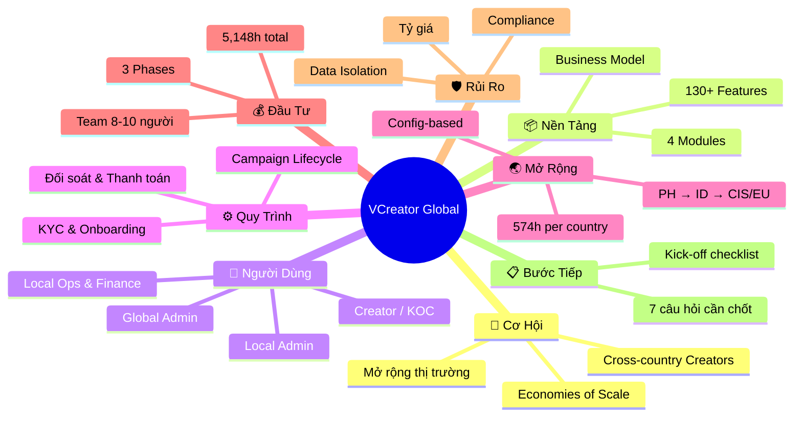

---

## 1. Cơ Hội — Vì Sao Cần VCreator Global?

### Bài toán hiện tại

VCreator **đang hoạt động tại Việt Nam** — kết nối Brands với Creators (KOC) trên TikTok, Facebook, Instagram, YouTube...

**Quy trình:**

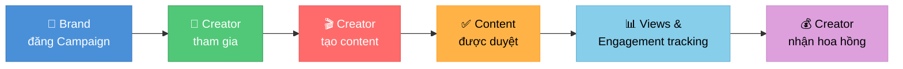

### 5 lý do mở rộng Global

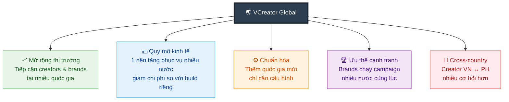

### So sánh: Hiện tại vs Global

| | **VCreator VN (hiện tại)** | **VCreator Global (mới)** |
|---|---|---|
| **Phạm vi** | Chỉ Việt Nam | Đa quốc gia (PH, ID, CIS, EU...) |
| **Thêm nước mới** | Build lại từ đầu | Cấu hình — không code lại |
| **Tài khoản Creator** | 1 nước | 1 tài khoản dùng mọi nước |
| **Dữ liệu** | Chung | Tách biệt hoàn toàn giữa các nước |
| **Tiền tệ** | VND | Đa tiền tệ (₱, ₫, Rp, $...) |
| **Ngôn ngữ** | Tiếng Việt | Đa ngôn ngữ (Filipino, EN, VN...) |
| **Brands** | Campaign 1 nước | Campaign nhiều nước cùng lúc |

> **Quyết định quan trọng:** Xây hệ thống **hoàn toàn mới** (không nâng cấp source cũ) — thiết kế cho quy mô toàn cầu ngay từ đầu. Tuy nhiên, **tận dụng ~37% effort** từ source code cũ cùng tech stack.

---

## 2. Nền Tảng — VCreator Global là gì?

### Business Model

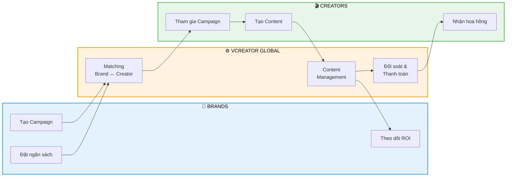

### 4 Modules chính

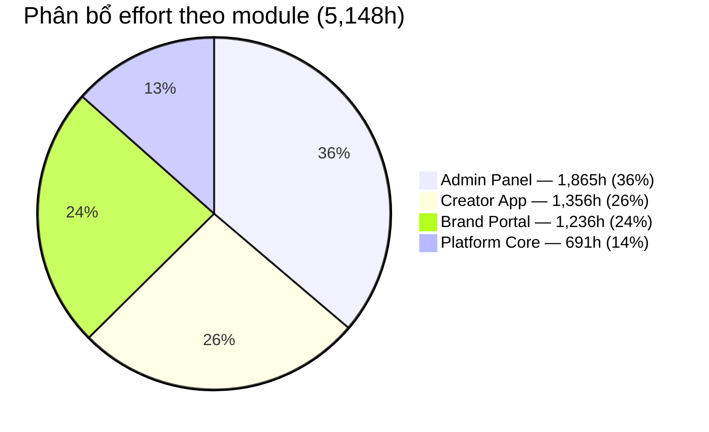

| Module | Giờ | Vai trò |
|---|---|---|
| **Platform Core** | 691h (14%) | Nền tảng chung: đa quốc gia, đa ngôn ngữ, tỷ giá, thuế, hạ tầng |
| **Creator App** | 1,356h (26%) | Cho Creator: đăng ký, KYC, campaign, content, thu nhập, rút tiền |
| **Admin Panel** | 1,865h (36%) | Cho vận hành: duyệt content, đối soát, thanh toán, quản lý, báo cáo |
| **Brand Portal** | 1,236h (24%) | Cho Brands: tạo campaign, budget, analytics, ROI tracking |

---

## 3. Người Dùng — Ai Sử Dụng Hệ Thống?

### Cấu trúc tổ chức

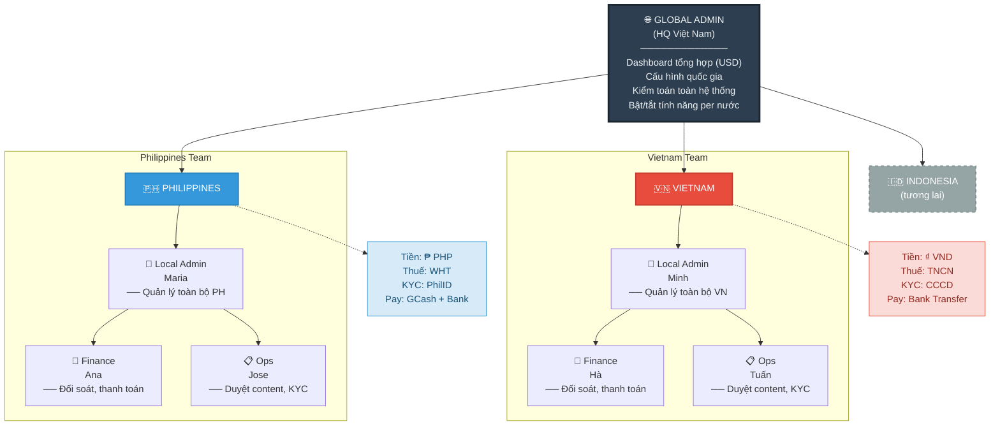

> **Nguyên tắc #1 — Data Isolation:** Đội PH **không thể** xem data VN và ngược lại. Chỉ Global Admin xem tổng hợp — mọi hành động đều ghi log.

### Hành trình Creator

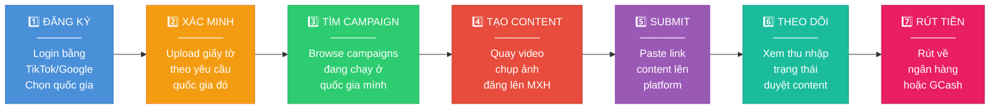

**Điểm đặc biệt ở Global:**
- **1 tài khoản dùng cho tất cả quốc gia** — login 1 lần, switch giữa các nước
- Mỗi quốc gia có **profile riêng**: giấy tờ KYC, tài khoản ngân hàng, thu nhập, thuế
- Thu nhập hiển thị bằng **tiền tệ địa phương** (₱ cho Philippines, ₫ cho Việt Nam)
- Giao diện **đa ngôn ngữ**: Filipino, Tiếng Việt, English

### Ma trận vai trò & quyền hạn

| Chức năng | Creator | Local Ops | Local Finance | Local Admin | Global Admin |
|---|:---:|:---:|:---:|:---:|:---:|
| Tạo content & submit | ✅ | | | | |
| Xem thu nhập & rút tiền | ✅ | | | | |
| Duyệt content | | ✅ | | ✅ | ✅* |
| Duyệt KYC | | ✅ | | ✅ | ✅* |
| Đối soát & thanh toán | | | ✅ | ✅ | ✅* |
| Quản lý Campaign | | | | ✅ | ✅* |
| Quản lý Team & Role | | | | ✅ | ✅* |
| Cấu hình quốc gia | | | | | ✅ |
| Dashboard tổng hợp | | | | | ✅ |
| Kiểm toán toàn hệ thống | | | | | ✅ |

> *\* Global Admin "vào vai Local" → bắt buộc nhập lý do, mọi hành động được ghi log.*

---

## 4. Quy Trình — Hệ Thống Hoạt Động Như Thế Nào?

### Campaign Lifecycle

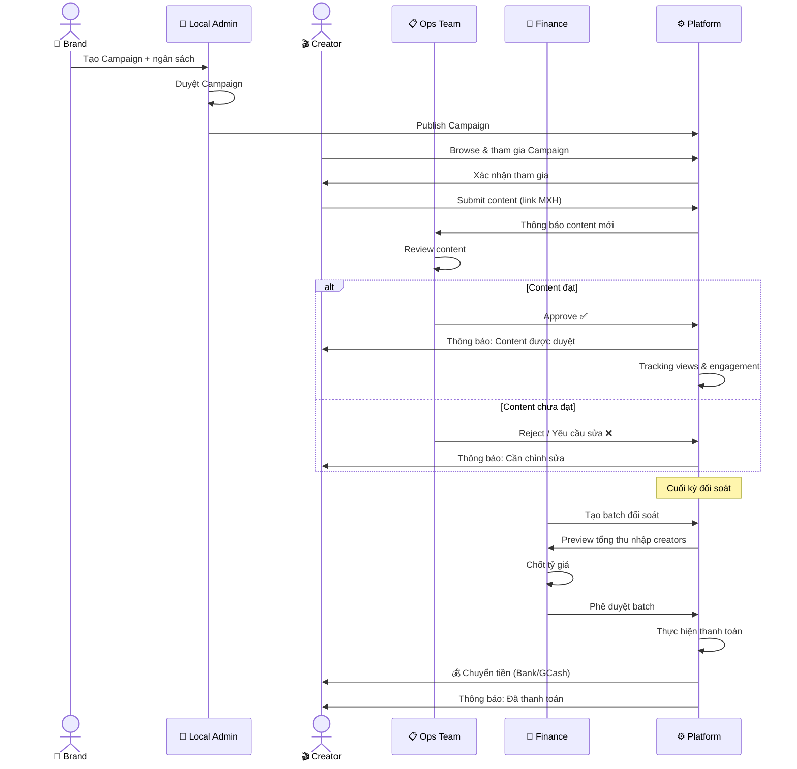

> **Takeaway:** Toàn bộ quy trình từ Brand tạo campaign → Creator nhận tiền diễn ra trên cùng 1 platform, với nhiều lớp kiểm duyệt đảm bảo chất lượng.

### Quy trình Đối soát & Thanh toán

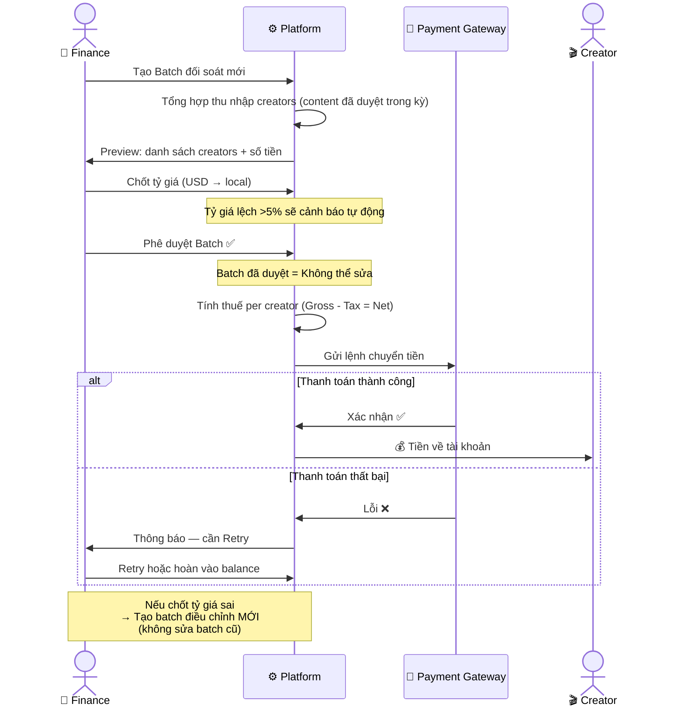

> **Takeaway:** Minh bạch tài chính — mọi con số rõ ràng, tỷ giá chốt cố định, batch đã duyệt không thể sửa (nếu sai → tạo batch điều chỉnh mới).

### 3 nguyên tắc thiết kế cốt lõi

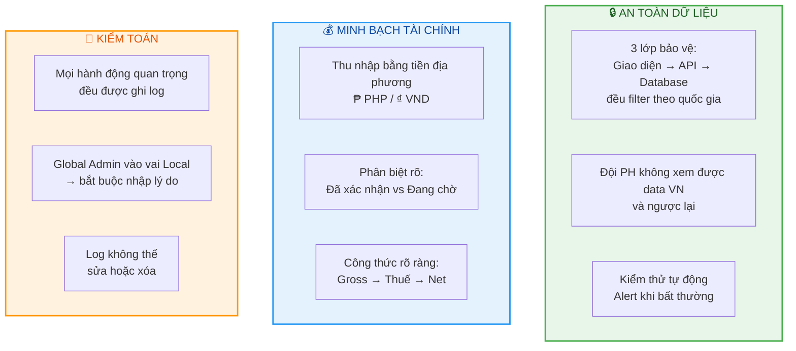

---

## 5. Mở Rộng — Thêm Quốc Gia Bằng Cấu Hình

Đây là **điểm mạnh lớn nhất** của VCreator Global: thêm quốc gia mới **không cần code lại** — chỉ cần cấu hình.

### Quy trình thêm quốc gia mới

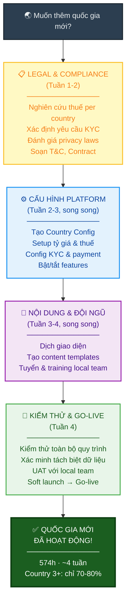

### Phân bổ effort thêm quốc gia mới (574h)

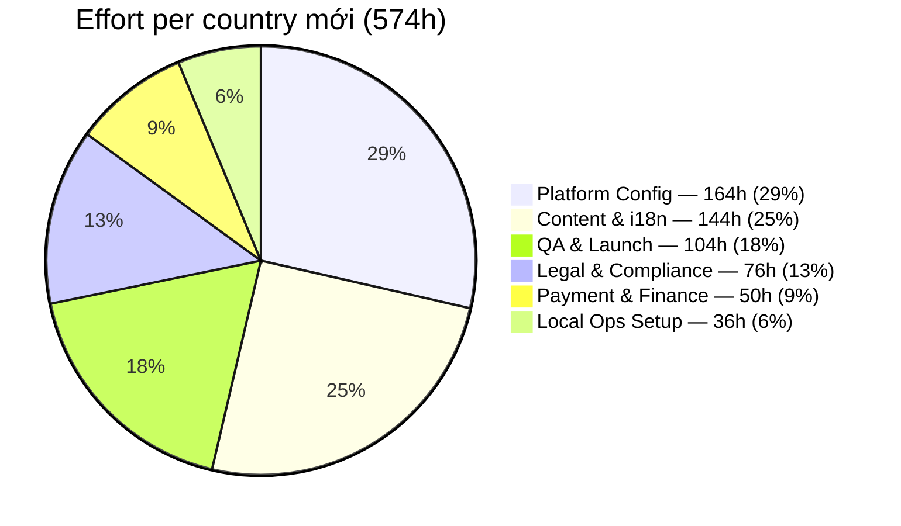

### Lộ trình mở rộng

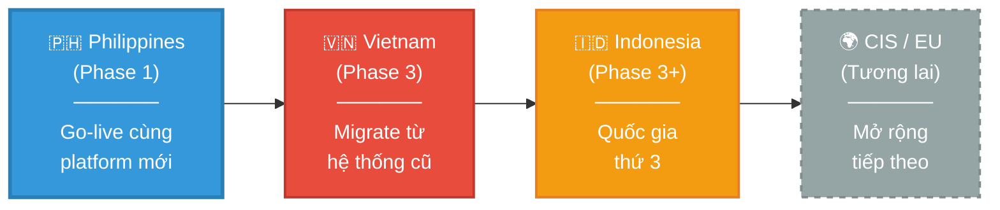

> **Takeaway:** Mỗi quốc gia mới = **574h effort + 4 tuần timeline**. Country thứ 3+ chỉ cần ~70-80% nhờ kinh nghiệm và templates từ các nước trước. **Scale mà không cần code lại.**

---

## 6. Đầu Tư — Effort, Timeline, Team

### Tổng quan effort

| Hạng mục | Build mới | Giảm nhờ reuse | **Còn lại** | **% giảm** |
|---|---:|---:|---:|---:|
| Backend | 2,820h | -1,109h | **1,711h** | 39% |
| Frontend | 2,524h | -879h | **1,645h** | 35% |
| QC/Test | 918h | -372h | **546h** | 41% |
| PM | 736h | -221h | **515h** | 30% |
| SA | 494h | -166h | **328h** | 34% |
| BA | 448h | -154h | **294h** | 34% |
| DevOps | 80h | -24h | **56h** | 30% |
| Design | 88h | -35h | **53h** | 40% |
| **TỔNG** | **8,108h** | **-2,960h** | **5,148h** | **~37%** |

> **Tiết kiệm ~37%** nhờ tận dụng source code cũ cùng tech stack (Go/Echo + React/UmiJS + MongoDB).

### Phân bổ theo role

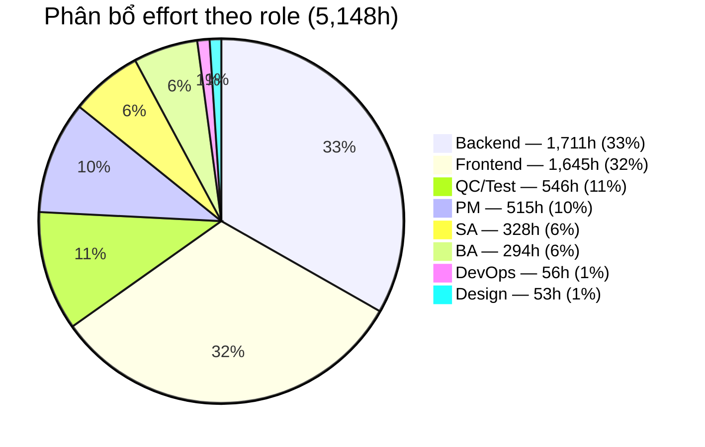

### Timeline — 3 Phases

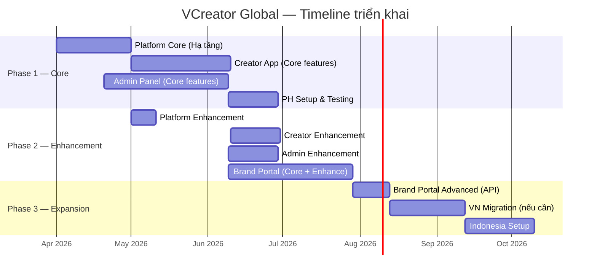

> **Note:** Timeline minh họa dựa trên team ~10 người. Ngày bắt đầu thực tế tùy thuộc thời điểm kick-off.

### Phân bổ effort theo Phase

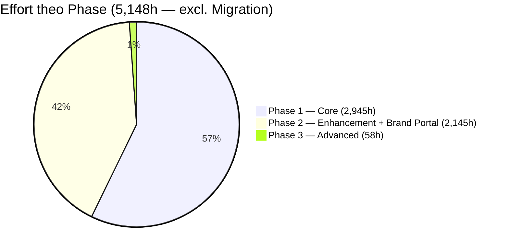

| Phase | Nội dung | Giờ | % |
|---|---|---:|---:|
| **Phase 1 (Core)** | Platform Core + Creator + Admin → **PH Go-live** | 2,945h | 57% |
| **Phase 2 (Enhancement)** | Enhancement (1,328h) + Brand Portal (817h core) | 2,145h | 42% |
| **Phase 3 (Advanced)** | Brand Portal Advanced — API/Webhook | 58h | 1% |
| *Migration (tách riêng)* | *VN data migration — chỉ khi cần* | *136h* | *—* |

> **Note:** Brand Portal tổng 1,236h được chia: 817h Phase 2A core + 361h Phase 2B enhancement + 58h Phase 3 advanced.

### So sánh Team Size & Timeline

| Scenario | Team | BE | FE | Timeline | Ghi chú |
|---|---|---|---|---|---|
| **A. Team hiện tại** | 8 người | BE×2 | FE×2 | ~5.3 tháng | Khả thi, nhưng kéo dài |
| **B. Tăng nhẹ** | 10 người | BE×3 | FE×3 | ~3.6 tháng | **Cân bằng chi phí & tốc độ** |
| **C. Giữ D+85** | 8-9 người | BE×2.5 | FE×2 | ~4.25 tháng | Chỉ cần thêm 0.5 BE |

> **Khuyến nghị:** Scenario B (10 người, 3.6 tháng) — tối ưu giữa chi phí và tốc độ ra thị trường.

---

## 7. Rủi Ro & Giải Pháp

### Ma trận rủi ro

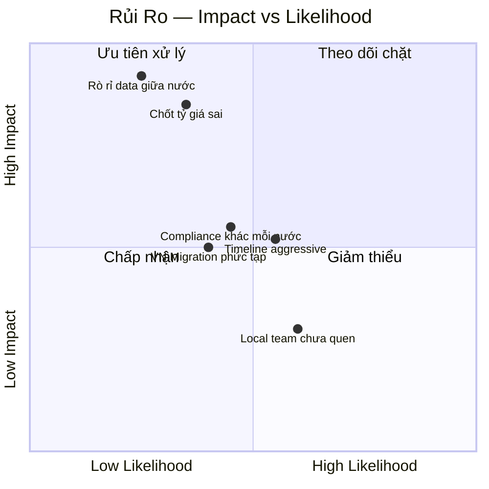

### Chi tiết rủi ro & giải pháp

| # | Rủi ro | Mức độ | Giải pháp |
|---|---|---|---|
| 1 | **Rò rỉ data giữa quốc gia** | 🔴 Cao | 3 lớp bảo vệ: UI + API + Database filter. Kiểm thử tự động. Alert bất thường. |
| 2 | **Chốt tỷ giá sai** | 🔴 Cao | Tự kiểm tra rate (lệch >5% → cảnh báo). Preview trước khi chốt. Sai → batch điều chỉnh mới. |
| 3 | **Timeline aggressive** | 🟡 TB | Chia phase rõ ràng. Phase 1 = 57% (core). Phase 2 = features bổ sung. |
| 4 | **Compliance khác mỗi nước** | 🟡 TB | Country Config cho phép cấu hình riêng. Research compliance TRƯỚC khi phát triển. |
| 5 | **VN Migration** | 🟡 TB | Để SAU PH go-live (Phase 3). Chạy song song 2 hệ thống. |
| 6 | **Local team chưa quen** | 🟢 Thấp | Admin panel đa ngôn ngữ. Hướng dẫn in-app. Training materials mỗi nước. |

---

## 8. Bước Tiếp Theo

### Câu hỏi cần Business chốt trước khi phát triển

| # | Câu hỏi | Ảnh hưởng | Trạng thái |
|---|---|---|---|
| 1 | **Partner Admin riêng?** Có cần role cho partner manager (chỉ xem data brand mình)? | Hệ thống phân quyền | ⬜ Chưa chốt |
| 2 | **Quy trình duyệt đối soát?** Finance tạo batch → ai phê duyệt? | Quy trình tài chính | ⬜ Chưa chốt |
| 3 | **MFA bắt buộc?** Xác thực 2 lớp cho admin, đặc biệt Finance & Global Admin? | Bảo mật | ⬜ Chưa chốt |
| 4 | **KYC có thể hoãn?** Creator browse/join trước, KYC khi rút tiền? | Tỷ lệ đăng ký mới | ⬜ Chưa chốt |
| 5 | **Phương thức thanh toán PH?** GCash, bank, hay cả hai? Vendor nào? | Rút tiền PH | ⬜ Chưa chốt |
| 6 | **Admin panel mobile?** Ops cần duyệt content trên mobile/tablet? | Scope thiết kế | ⬜ Chưa chốt |
| 7 | **Tech stack?** Tiếp tục Go + React hay stack khác? | Toàn bộ effort dev | ⬜ Chưa chốt |

### Lộ trình kick-off đề xuất

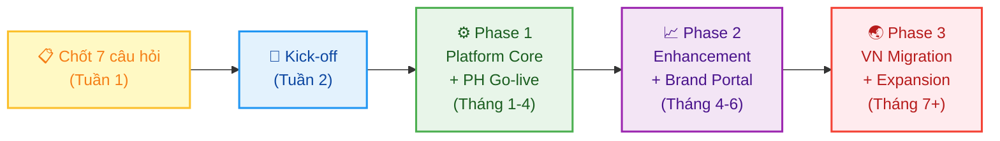

---

## Phụ Lục

### A. Tài liệu chi tiết

| Tài liệu | Nội dung | File |
|---|---|---|
| **Báo giá Platform Core** | 19 tính năng nền tảng | `baogia/PlatformCore.csv` |
| **Báo giá Creator** | 42 tính năng Creator | `baogia/Creator.csv` |
| **Báo giá Admin** | 69 tính năng Admin | `baogia/Admin.csv` |
| **Báo giá Brand Portal** | 50+ tính năng Brand | `baogia/Brand.csv` |
| **Báo giá New Country** | 29 tasks per country mới | `baogia/NewCountry.csv` |
| **Chi tiết Reuse Savings** | Phân tích ~37% giảm effort | `baogia/ReuseSavings.csv` |
| **Tổng hợp Summary** | Overview toàn bộ effort | `baogia/Summary.csv` |

### B. Glossary — Thuật ngữ

| Thuật ngữ | Giải thích |
|---|---|
| **KOC** | Key Opinion Creator — người sáng tạo nội dung có ảnh hưởng |
| **Campaign** | Chiến dịch quảng cáo do Brand tạo, Creator tham gia |
| **KYC** | Know Your Customer — xác minh danh tính |
| **Đối soát** | Reconciliation — quy trình kiểm tra và xác nhận thu nhập |
| **Data Isolation** | Phân tách dữ liệu — đảm bảo mỗi nước chỉ thấy data của mình |
| **Feature Flags** | Bật/tắt tính năng cho từng quốc gia mà không cần thay đổi code |
| **Batch** | Lô thanh toán — nhóm nhiều khoản thanh toán xử lý cùng lúc |
| **WHT** | Withholding Tax — thuế khấu trừ tại nguồn (áp dụng ở Philippines) |
| **UAT** | User Acceptance Testing — kiểm thử chấp nhận bởi người dùng thực tế |

---

*Tài liệu được tạo dựa trên phân tích brainstorming, kiến trúc kỹ thuật, và báo giá chi tiết.*
*Ngày tạo: 2026-03-03 · Phiên bản: 1.0*
*Source: VCreator-Global-Project-Overview.md + Summary.csv + NewCountry.csv*
