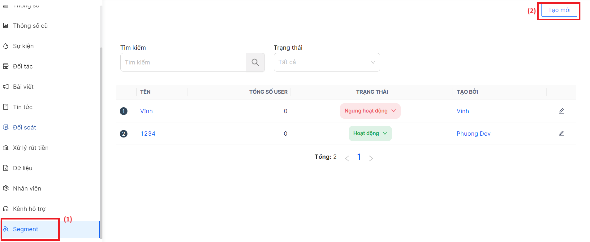
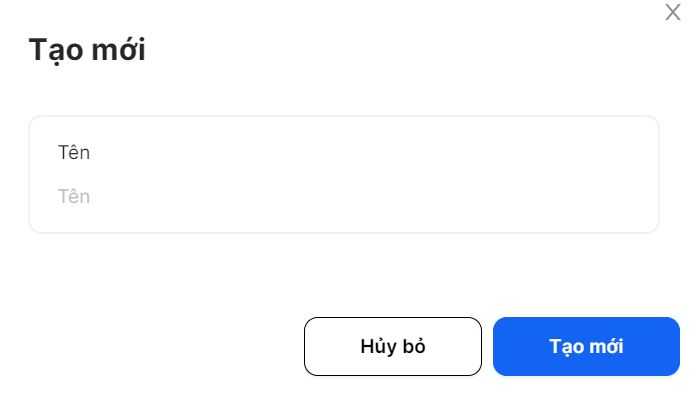
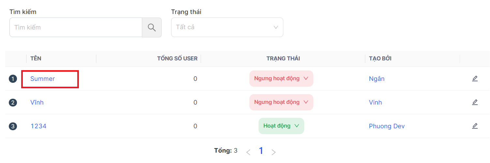
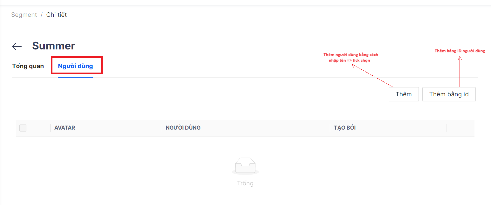
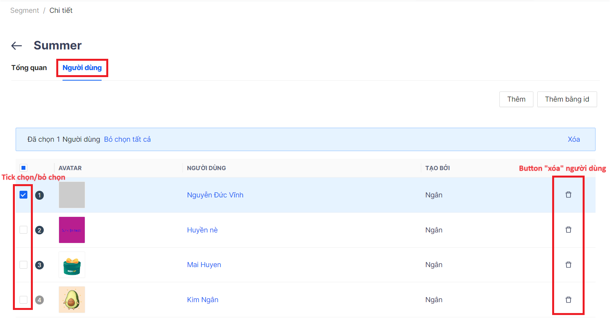

# Segment

Trang Segment dùng để tạo nhóm người dùng, được hưởng các quyền lợi thưởng hoặc tin tức đối với nhóm này

- **Bước 1:** Vào trang chủ Segment ⇒ Nhấn ***“Tạo mới”***
    
    
    
- **Bước 2:** Tạo tên Segment ⇒ Nhấn ***“Tạo mới”***
    
    
    
- **Bước 3:** Nhấn vào chi tiết Segment vừa tạo
    
    
    
- **Bước 4:** Thêm/xóa người dùng
    - Thêm: nhập tên người dùng và tick chọn ⇒ Nhấm ***“Thêm”***
    - Thêm bằng ID: nhập ID của người dùng (có thể nhập cùng lúc nhiều ID ⇒ Nhấn ***“Thêm”***
        
        
        
    - Xóa người dùng
        
        
        
- **Bước 5:** Cập nhật trạng thái hiển thị
    
    